# Experiments Gallery

A compact, image-first overview of the experiments in **py-mathx-lab**.

  <a href="e001.html" class="gallery-card">
    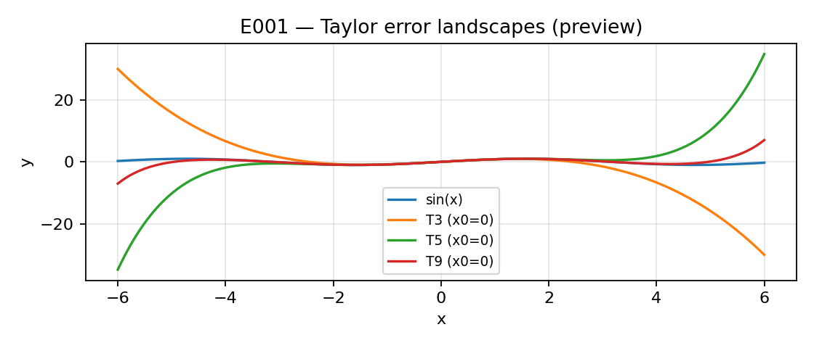
    

      <h3>E001 — Taylor error landscapes</h3>
      
Truncation error, convergence behavior, and error landscapes for Taylor approximations.

      

        analysis
        quantitative-exploration
        visualization
        taylor
      

    

  </a>

  <a href="e002.html" class="gallery-card">
    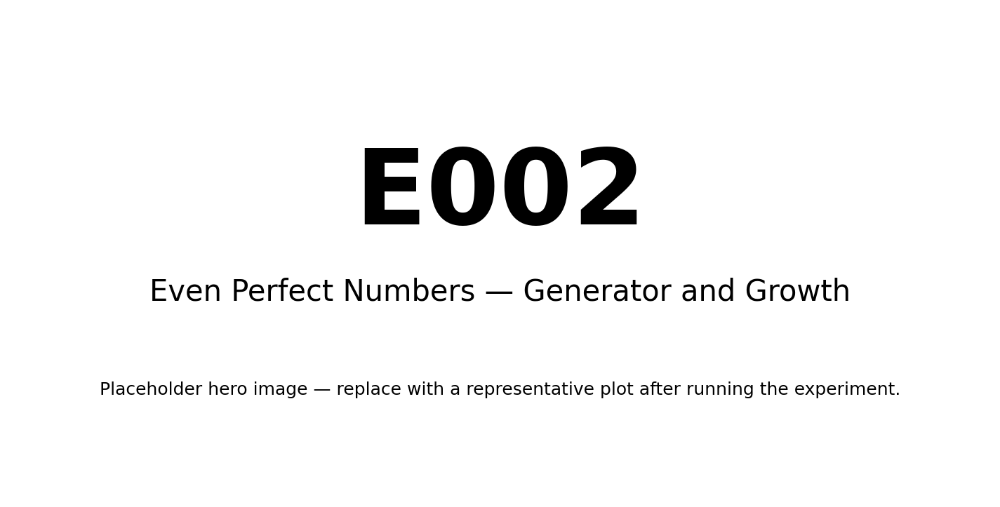
    

      <h3>E002 — Perfect numbers</h3>
      
Explore perfect numbers via the sum-of-divisors function and the Euclid–Euler characterization.

      

        number-theory
        quantitative-exploration
        visualization
        perfect
      

    

  </a>

  <a href="e003.html" class="gallery-card">
    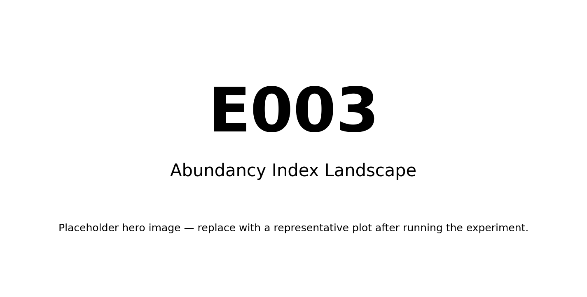
    

      <h3>E003 — Abundancy index</h3>
      
Study the abundancy index σ(n)/n and how it separates number classes.

      

        number-theory
        quantitative-exploration
        visualization
        classification
      

    

  </a>

  <a href="e004.html" class="gallery-card">
    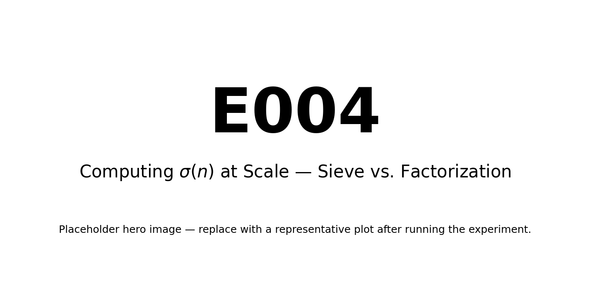
    

      <h3>E004 — Sum-of-divisors (sigma)</h3>
      
Compute σ(n), test multiplicativity, and explore divisor-sum structure.

      

        number-theory
        quantitative-exploration
        sigma
      

    

  </a>

  <a href="e005.html" class="gallery-card">
    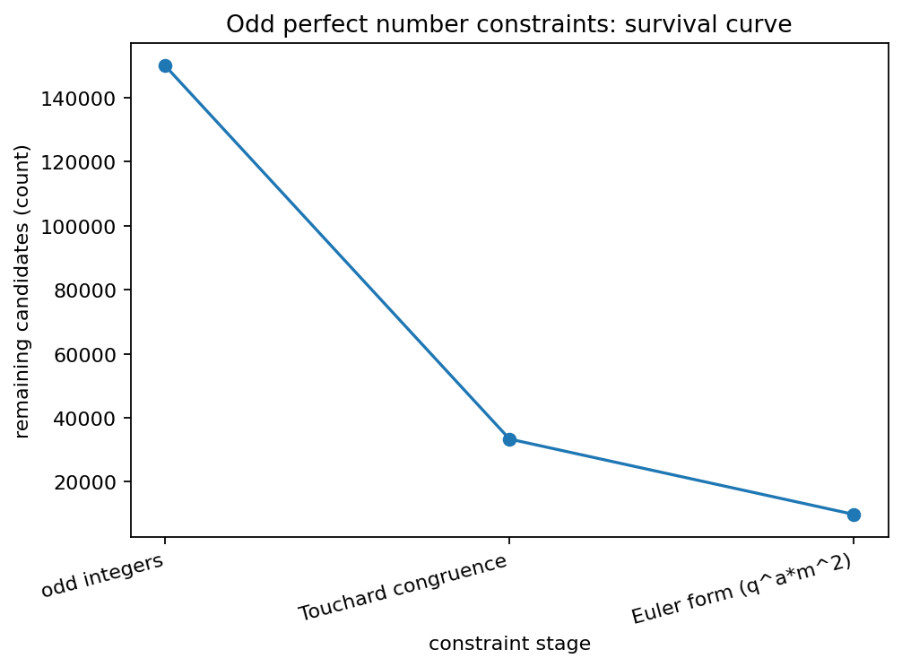
    

      <h3>E005 — Odd perfect numbers</h3>
      
Constraints, known results, and computational checks related to odd perfect numbers.

      

        number-theory
        counterexample-search
        visualization
        open-problems
      

    

  </a>

  <a href="e006.html" class="gallery-card">
    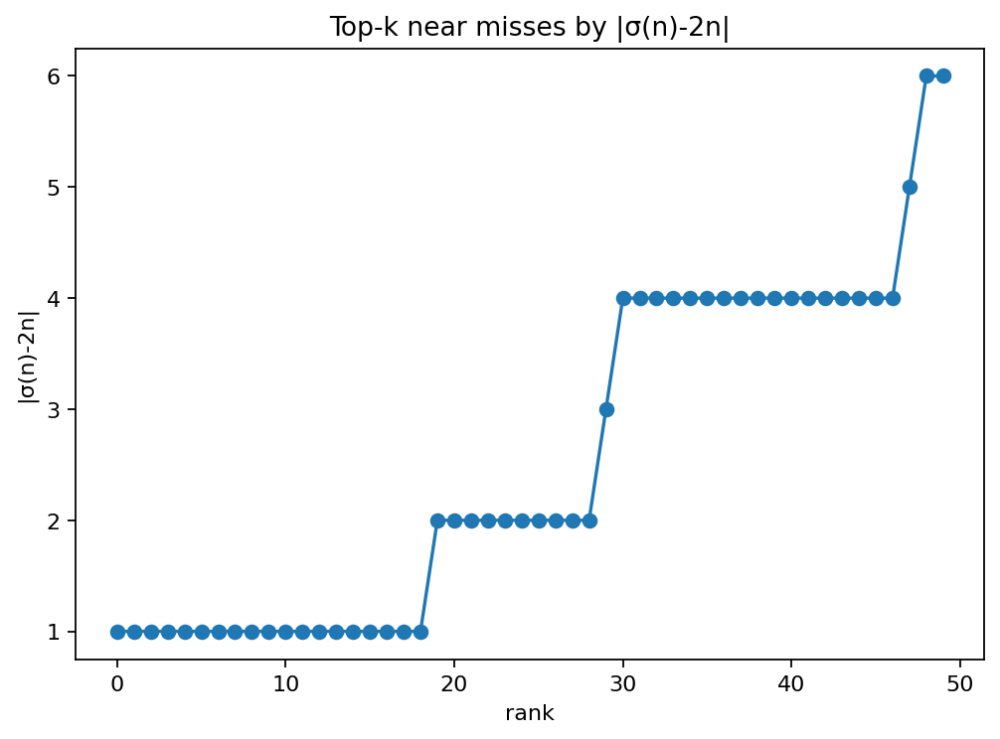
    

      <h3>E006 — Near-perfect numbers</h3>
      
Definitions, examples, and experiments around near-perfect (and related) integers.

      

        number-theory
        conjecture-generation
        visualization
        exploration
      

    

  </a>

  <a href="e007.html" class="gallery-card">
    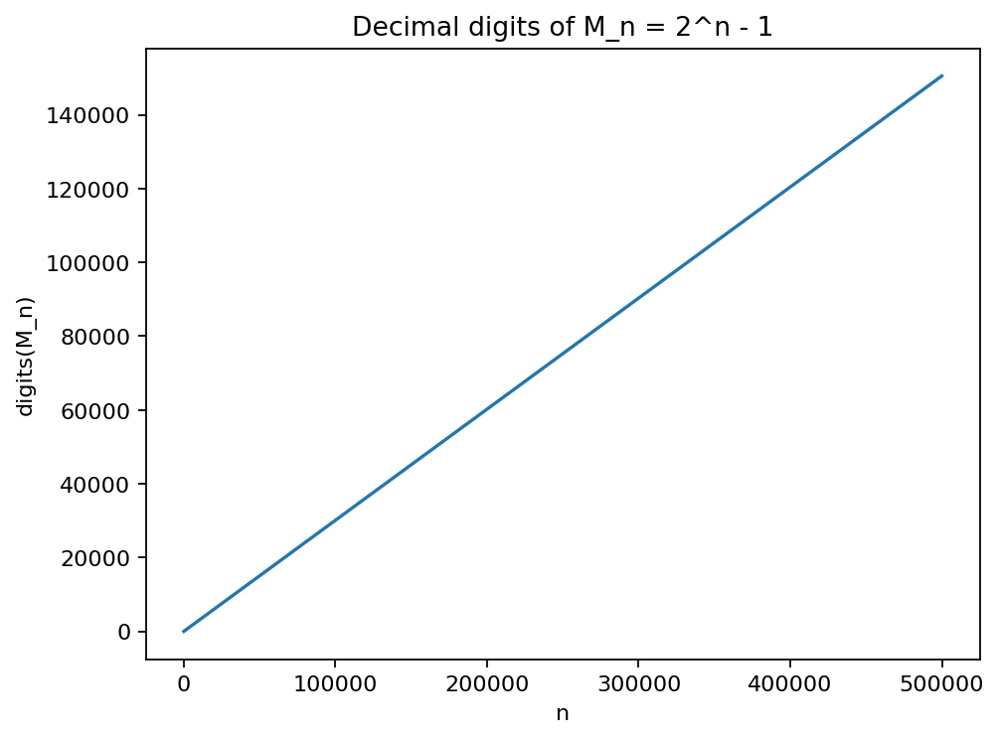
    

      <h3>E007 — Mersenne growth</h3>
      
Bits and digits of Mn = 2n − 1: fast size estimates for planning feasible bounds.

      

        number-theory
        quantitative-exploration
        visualization
        mersenne
      

    

  </a>

  <a href="e008.html" class="gallery-card">
    
    

      <h3>E008 — Lucas–Lehmer scan</h3>
      
Scan prime exponents with the Lucas–Lehmer test and visualize scaling and outcomes.

      

        number-theory
        quantitative-exploration
        visualization
        lucas-lehmer
      

    

  </a>

  <a href="e009.html" class="gallery-card">
    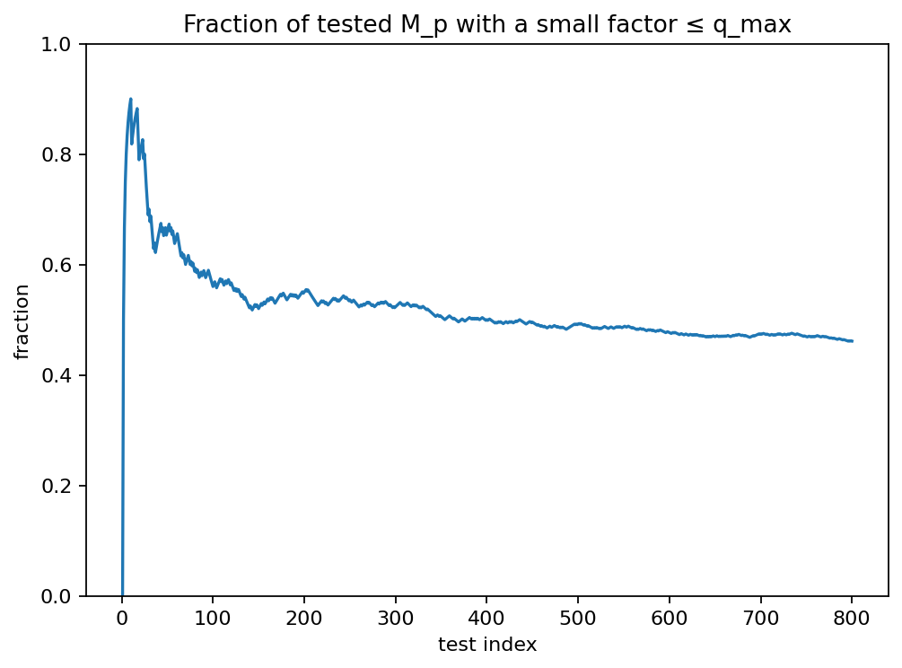
    

      <h3>E009 — Small-factor scan</h3>
      
Pre-sieve Mp candidates by finding small structured factors before expensive primality tests.

      

        number-theory
        quantitative-exploration
        visualization
        sieving
      

    

  </a>

  <a href="e010.html" class="gallery-card">
    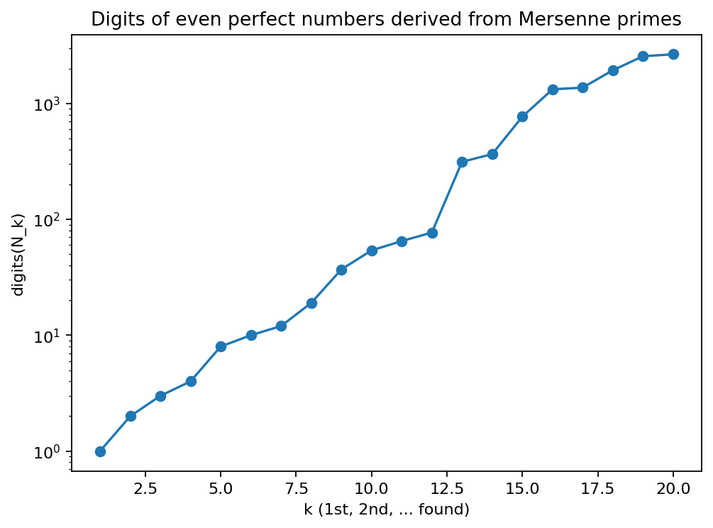
    

      <h3>E010 — Perfect numbers from Mersenne primes</h3>
      
Generate even perfect numbers via Euclid–Euler and visualize growth and validation checks.

      

        number-theory
        quantitative-exploration
        visualization
        perfect
      

    

  </a>

  <a href="e011.html" class="gallery-card">
    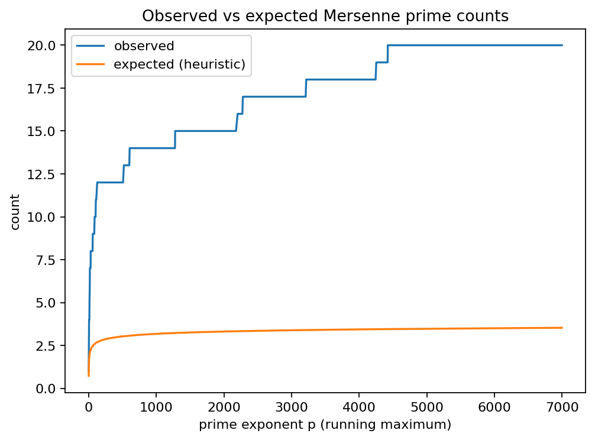
    

      <h3>E011 — Heuristic rarity</h3>
      
Compare observed Mersenne-prime counts to a simple heuristic expectation curve.

      

        number-theory
        quantitative-exploration
        visualization
        heuristics
      

    

  </a>

  <a href="e012.html" class="gallery-card">
    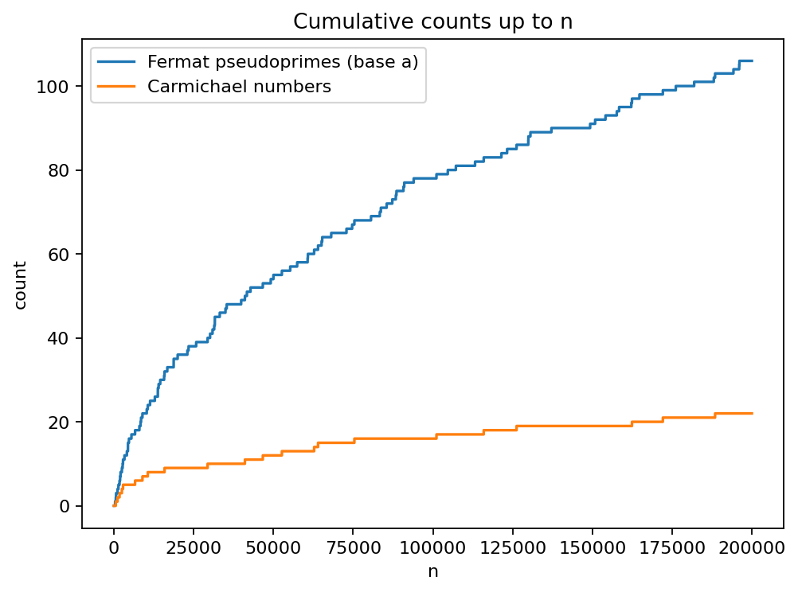
    

      <h3>E012 — Fermat pseudoprimes and Carmichael numbers (counterexamples)</h3>
      
Counterexamples to naive Fermat primality testing: base-a pseudoprimes and Carmichael numbers.

      

        number-theory
counterexample-search
visualization
pseudoprimes
      

    

  </a>

  <a href="e013.html" class="gallery-card">
    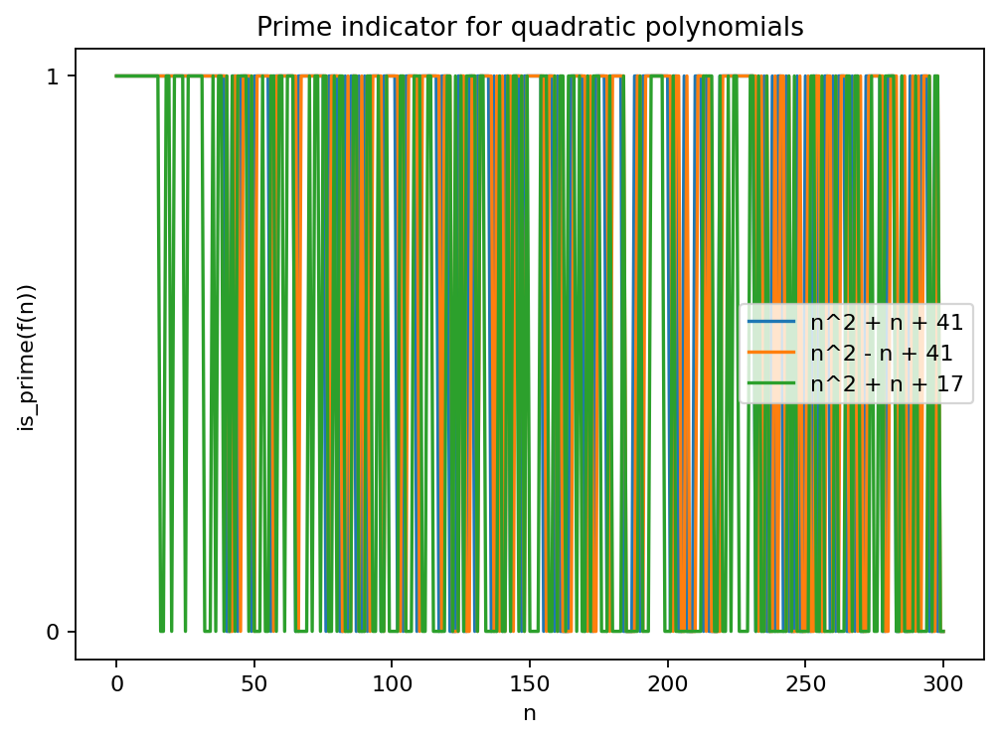
    

      <h3>E013 — Prime-polynomial counterexamples (Euler's n^2 + n + 41)</h3>
      
Turn “prime-generating polynomials” folklore into a crisp counterexample (Euler’s n²+n+41).

      

        number-theory
counterexample-search
visualization
primes
      

    

  </a>

  <a href="e014.html" class="gallery-card">
    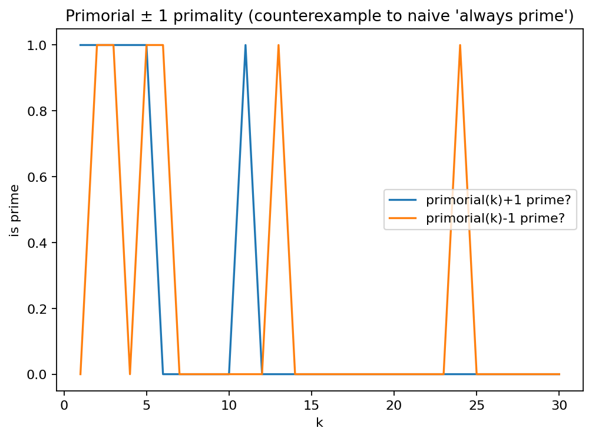
    

      <h3>E014 — Primorial ± 1 counterexamples</h3>
      
This is a thin wrapper that follows the standard experiment template and delegates the actual computation to…

      

        number-theory
counterexample-search
visualization
primorial
      

    

  </a>

  <a href="e015.html" class="gallery-card">
    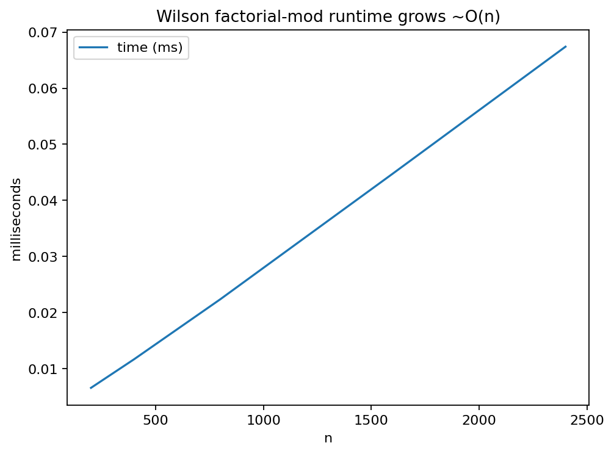
    

      <h3>E015 — Wilson test infeasibility</h3>
      
This is a thin wrapper that follows the standard experiment template and delegates the actual computation to…

      

        number-theory
quantitative-exploration
visualization
wilson
      

    

  </a>

  <a href="e016.html" class="gallery-card">
    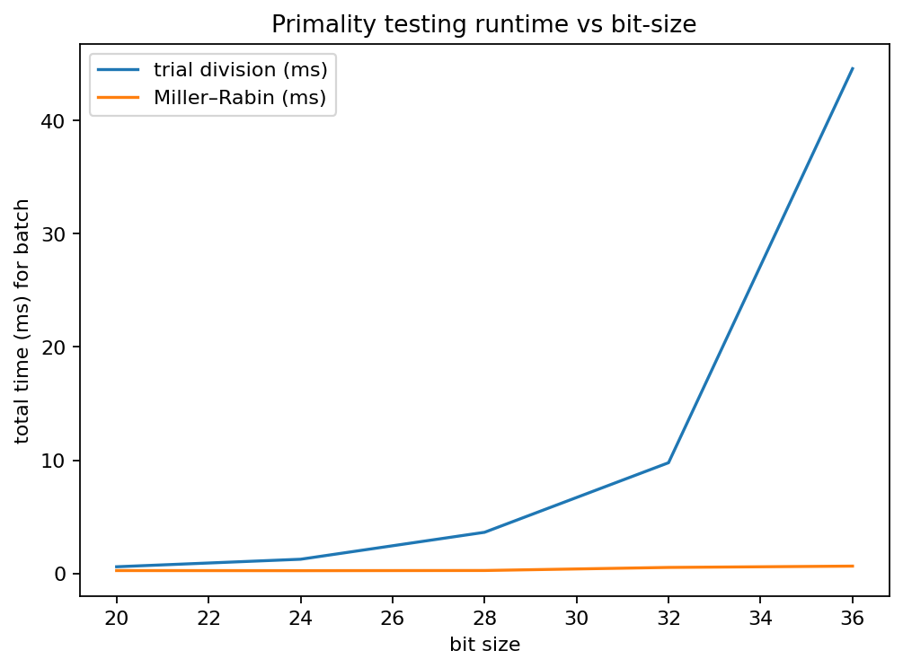
    

      <h3>E016 — Trial division vs Miller–Rabin scaling</h3>
      
This is a thin wrapper that follows the standard experiment template and delegates the actual computation to…

      

        number-theory
quantitative-exploration
visualization
miller–rabin
      

    

  </a>

  <a href="e017.html" class="gallery-card">
    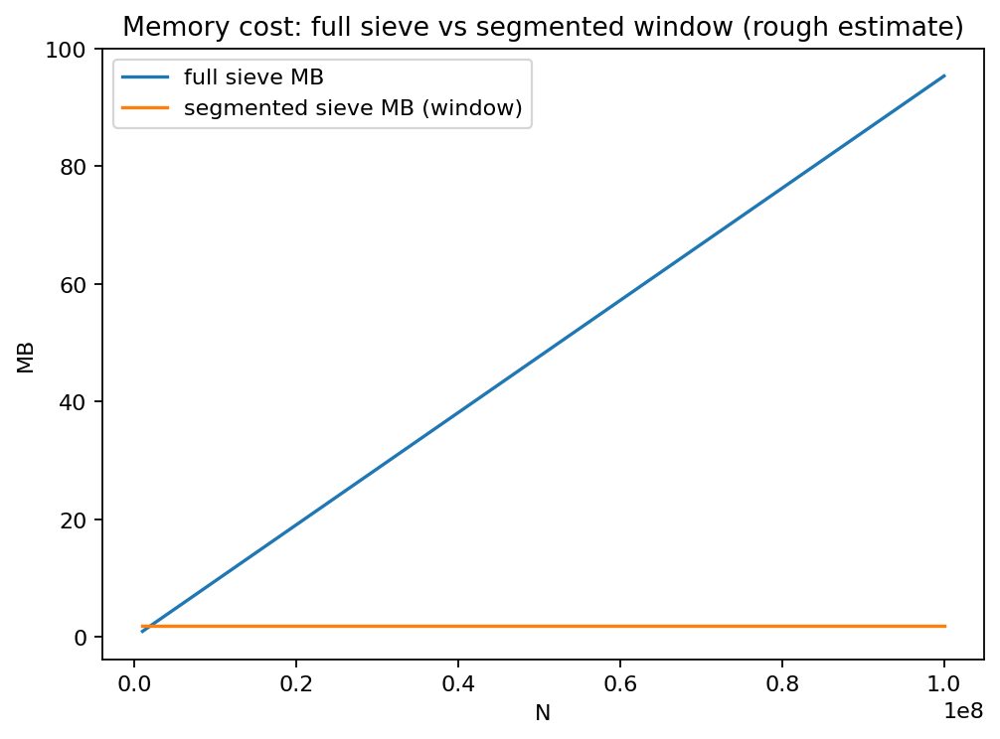
    

      <h3>E017 — Sieve memory blow-up vs segmented sieve</h3>
      
This is a thin wrapper that follows the standard experiment template and delegates the actual computation to…

      

        number-theory
quantitative-exploration
visualization
sieving
      

    

  </a>

  <a href="e018.html" class="gallery-card">
    
    

      <h3>E018 — Miller–Rabin base choice counterexamples</h3>
      
This is a thin wrapper that follows the standard experiment template and delegates the actual computation to…

      

        number-theory
counterexample-search
visualization
miller–rabin
      

    

  </a>

  <a href="e019.html" class="gallery-card">
    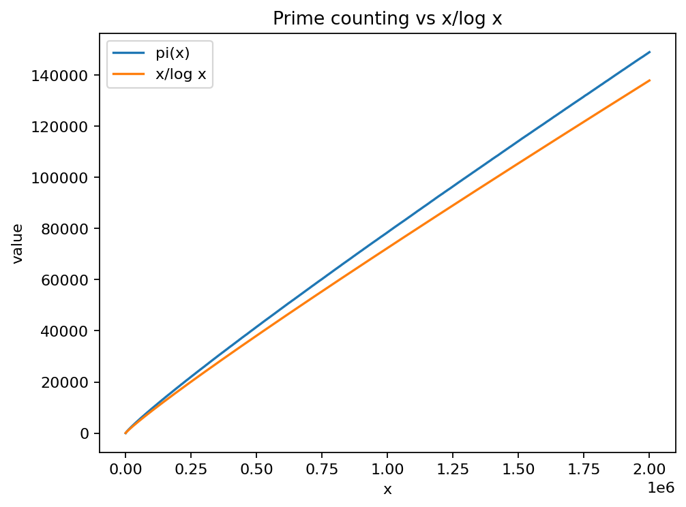
    

      <h3>E019 — Prime density and PNT visualization</h3>
      
This is a thin wrapper that follows the standard experiment template and delegates the actual computation to…

      

        number-theory
quantitative-exploration
visualization
PNT
      

    

  </a>

  <a href="e020.html" class="gallery-card">
    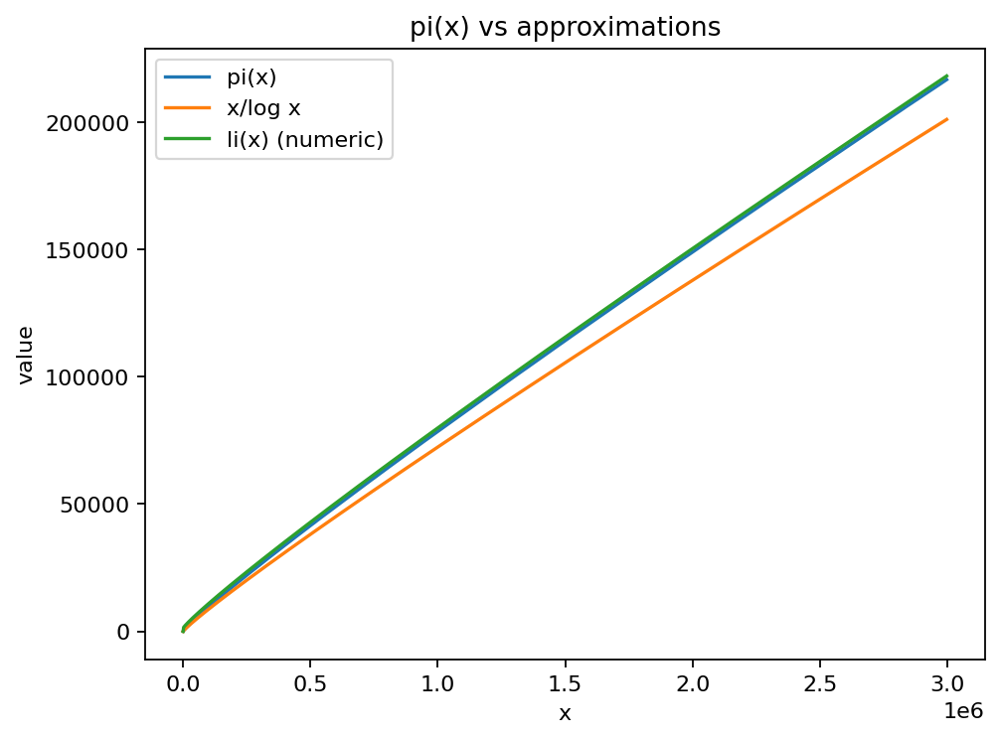
    

      <h3>E020 — Compare pi(x) to li(x) numerically</h3>
      
This is a thin wrapper that follows the standard experiment template and delegates the actual computation to…

      

        number-theory
quantitative-exploration
visualization
li(x)
      

    

  </a>

  <a href="e021.html" class="gallery-card">
    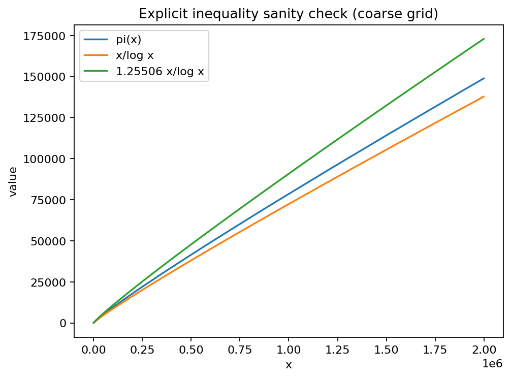
    

      <h3>E021 — Explicit bounds sanity checks</h3>
      
This is a thin wrapper that follows the standard experiment template and delegates the actual computation to…

      

        number-theory
quantitative-exploration
visualization
bounds
      

    

  </a>

  <a href="e022.html" class="gallery-card">
    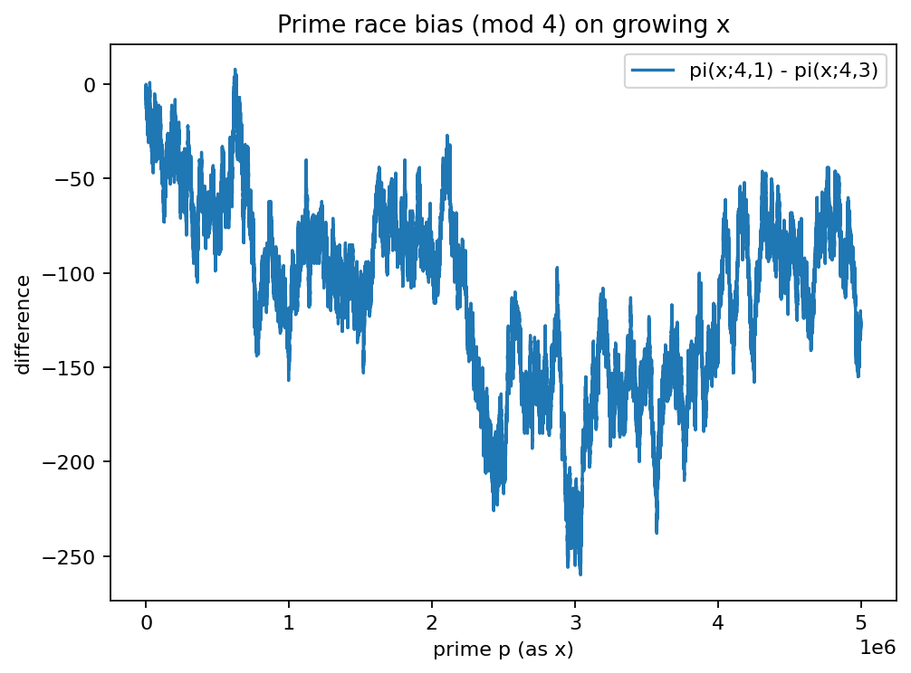
    

      <h3>E022 — Prime race modulo 4</h3>
      
This is a thin wrapper that follows the standard experiment template and delegates the actual computation to…

      

        number-theory
quantitative-exploration
visualization
primes
      

    

  </a>

  <a href="e023.html" class="gallery-card">
    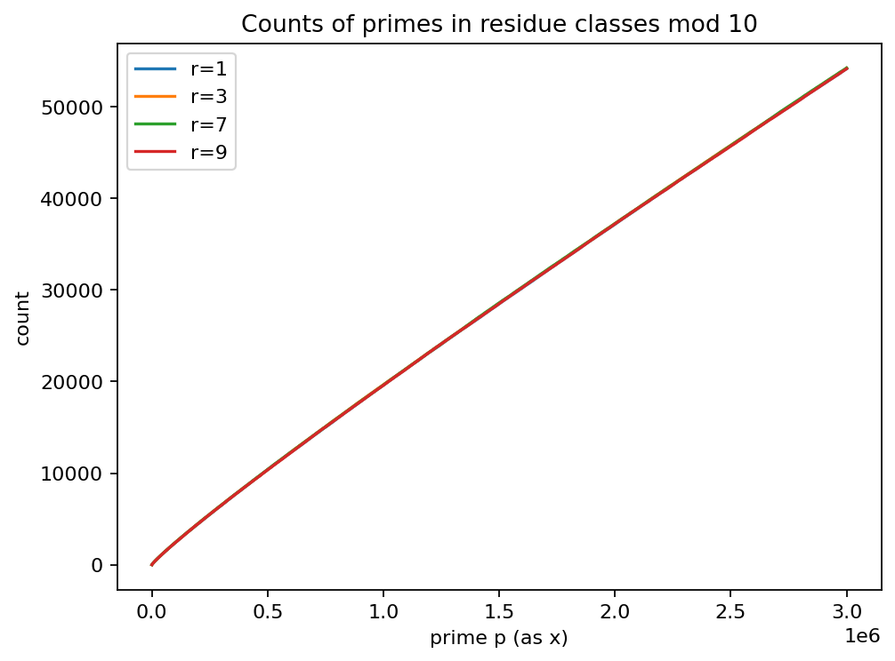
    

      <h3>E023 — Residue class distribution mod q</h3>
      
This is a thin wrapper that follows the standard experiment template and delegates the actual computation to…

      

        number-theory
quantitative-exploration
visualization
primes
      

    

  </a>

  <a href="e024.html" class="gallery-card">
    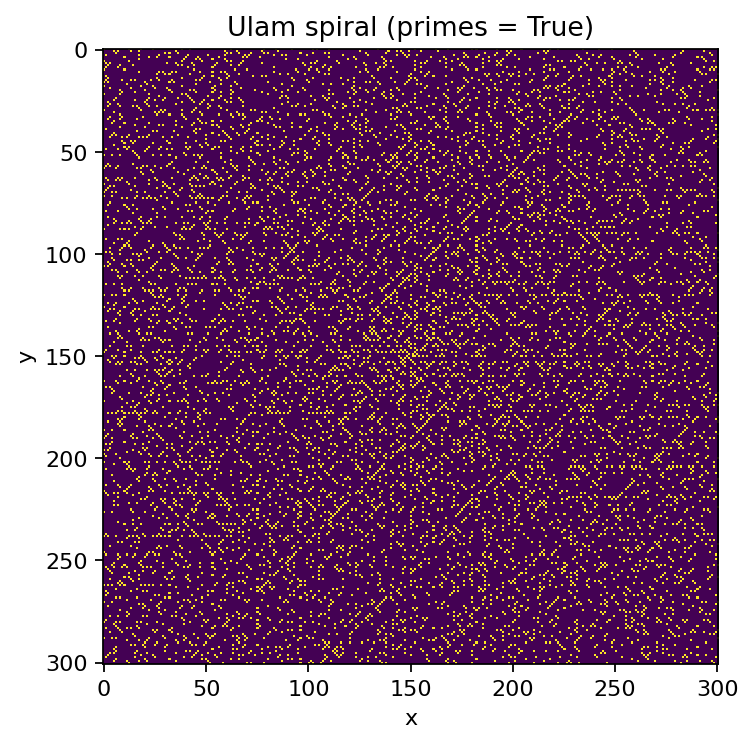
    

      <h3>E024 — Ulam spiral structure</h3>
      
This is a thin wrapper that follows the standard experiment template and delegates the actual computation to…

      

        number-theory
quantitative-exploration
visualization
ulam
      

    

  </a>

  <a href="e025.html" class="gallery-card">
    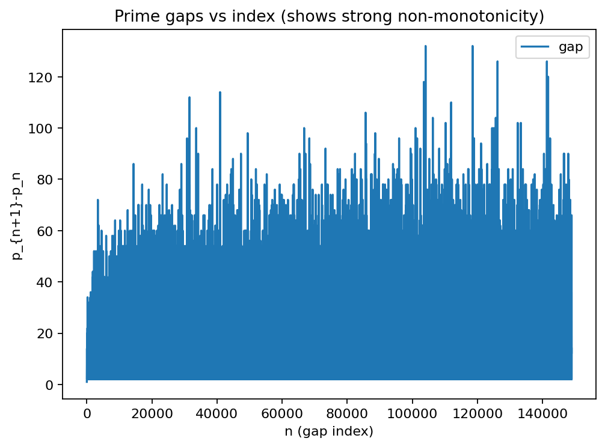
    

      <h3>E025 — Prime gaps are not monotone</h3>
      
This is a thin wrapper that follows the standard experiment template and delegates the actual computation to…

      

        number-theory
quantitative-exploration
visualization
gaps
      

    

  </a>

  <a href="e026.html" class="gallery-card">
    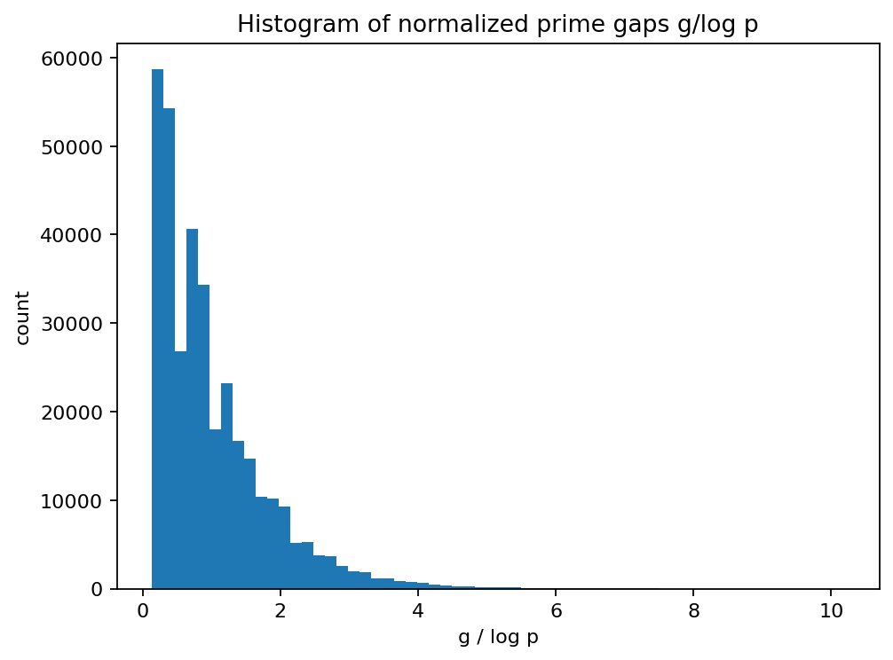
    

      <h3>E026 — Normalized prime gaps</h3>
      
This is a thin wrapper that follows the standard experiment template and delegates the actual computation to…

      

        number-theory
quantitative-exploration
visualization
gaps
      

    

  </a>

  <a href="e027.html" class="gallery-card">
    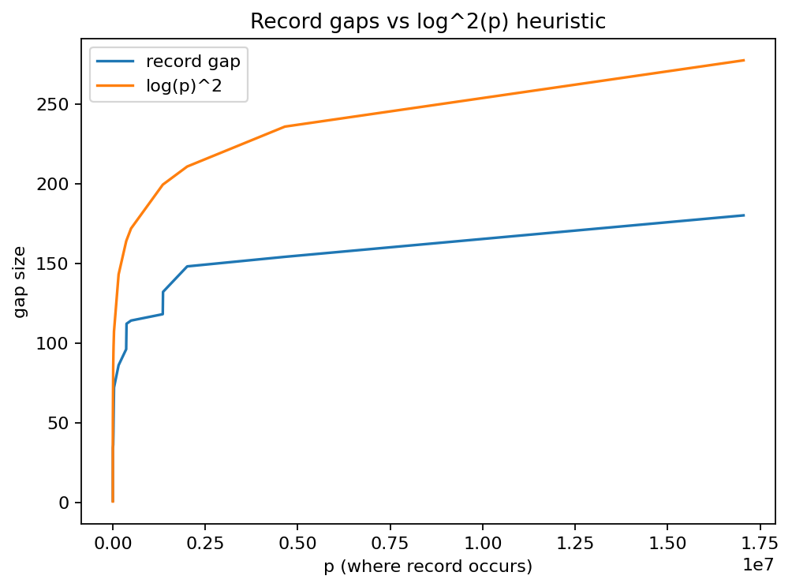
    

      <h3>E027 — Record prime gaps vs log^2 heuristic</h3>
      
This is a thin wrapper that follows the standard experiment template and delegates the actual computation to…

      

        number-theory
conjecture-generation
visualization
gaps
      

    

  </a>

  <a href="e028.html" class="gallery-card">
    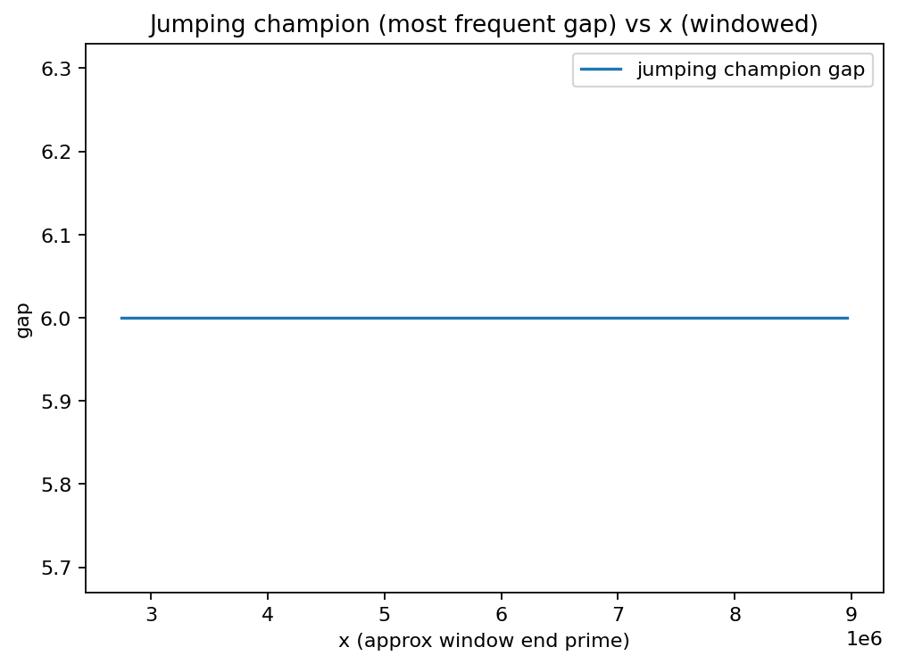
    

      <h3>E028 — Jumping champions (most frequent gaps)</h3>
      
This is a thin wrapper that follows the standard experiment template and delegates the actual computation to…

      

        number-theory
quantitative-exploration
visualization
gaps
      

    

  </a>

  <a href="e029.html" class="gallery-card">
    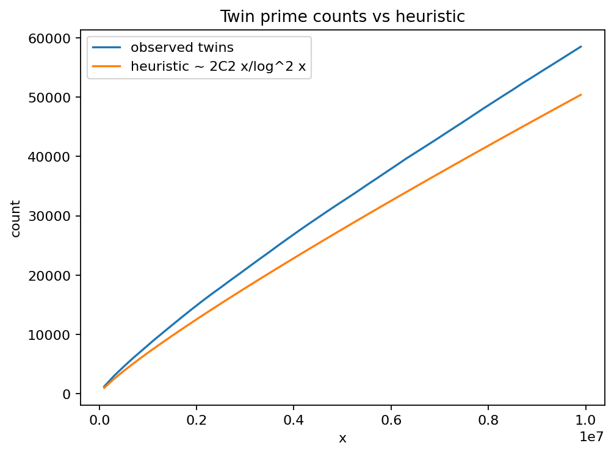
    

      <h3>E029 — Twin primes: observed vs heuristic</h3>
      
This is a thin wrapper that follows the standard experiment template and delegates the actual computation to…

      

        number-theory
conjecture-generation
visualization
twin
      

    

  </a>

  <a href="e030.html" class="gallery-card">
    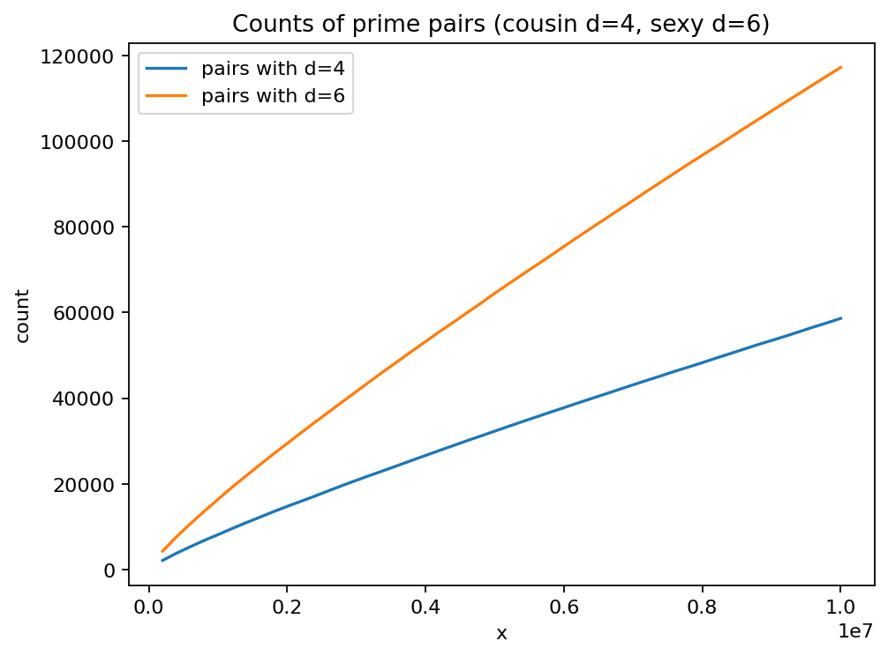
    

      <h3>E030 — Cousin and sexy prime pairs</h3>
      
This is a thin wrapper that follows the standard experiment template and delegates the actual computation to…

      

        number-theory
quantitative-exploration
visualization
primes
      

    

  </a>

  <a href="e031.html" class="gallery-card">
    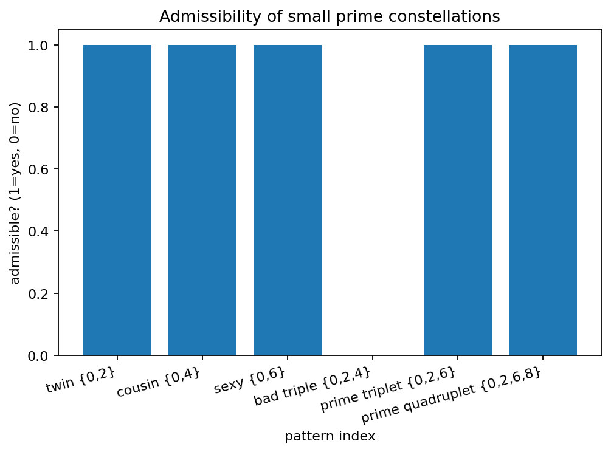
    

      <h3>E031 — Admissibility and modular obstructions</h3>
      
This is a thin wrapper that follows the standard experiment template and delegates the actual computation to…

      

        number-theory
quantitative-exploration
visualization
primes
      

    

  </a>

  <a href="e032.html" class="gallery-card">
    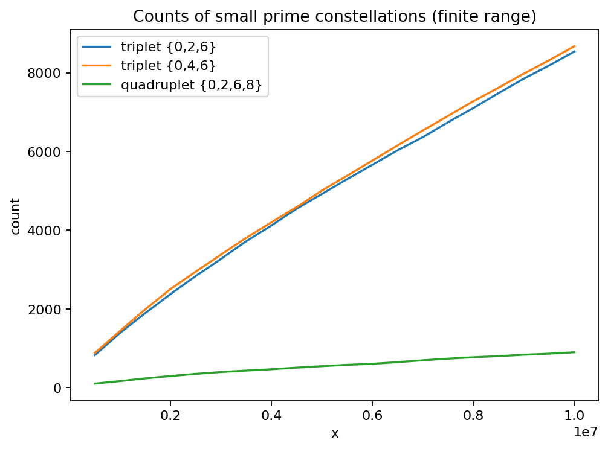
    

      <h3>E032 — Prime triplets and quadruplets</h3>
      
This is a thin wrapper that follows the standard experiment template and delegates the actual computation to…

      

        number-theory
quantitative-exploration
visualization
primes
      

    

  </a>

  <a href="e033.html" class="gallery-card">
    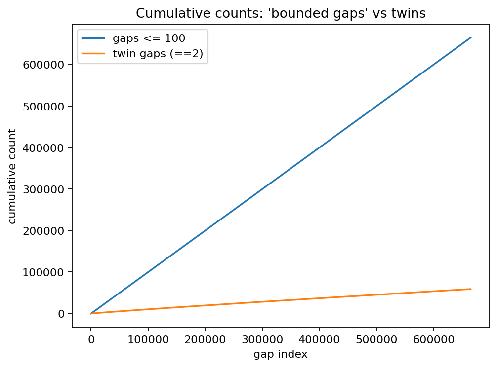
    

      <h3>E033 — Bounded gaps vs twin primes (not the same)</h3>
      
This is a thin wrapper that follows the standard experiment template and delegates the actual computation to…

      

        number-theory
quantitative-exploration
visualization
twin
      

    

  </a>

  <a href="e034.html" class="gallery-card">
    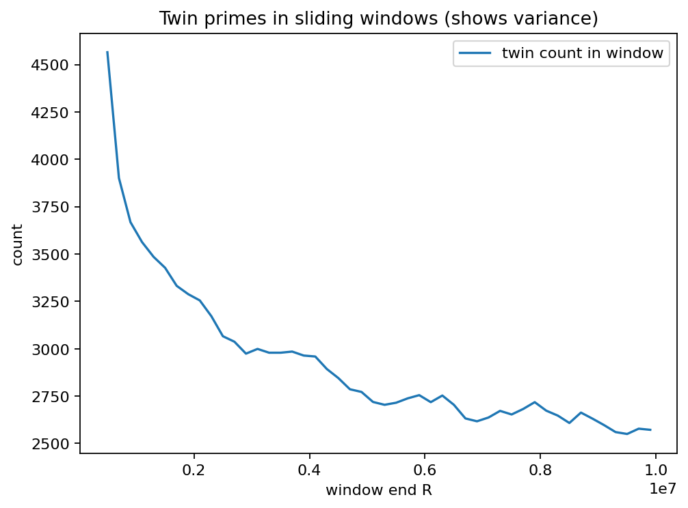
    

      <h3>E034 — Twin primes in sliding windows</h3>
      
This is a thin wrapper that follows the standard experiment template and delegates the actual computation to…

      

        number-theory
quantitative-exploration
visualization
twin
      

    

  </a>

  <a href="e035.html" class="gallery-card">
    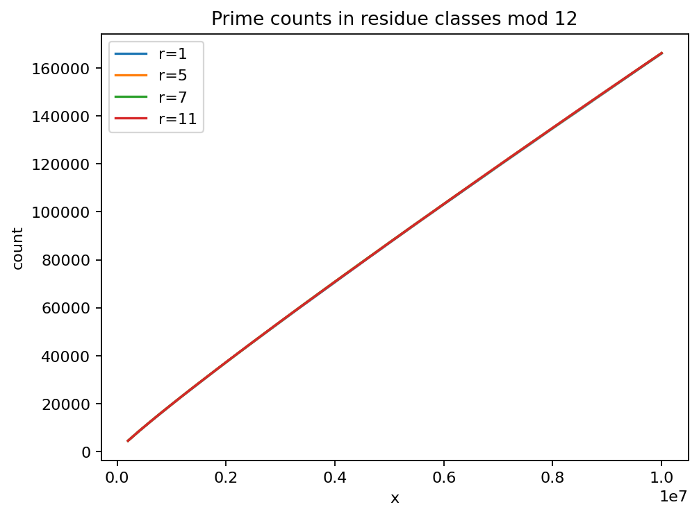
    

      <h3>E035 — Primes in arithmetic progressions mod q</h3>
      
This is a thin wrapper that follows the standard experiment template and delegates the actual computation to…

      

        number-theory
quantitative-exploration
visualization
APs
      

    

  </a>

  <a href="e036.html" class="gallery-card">
    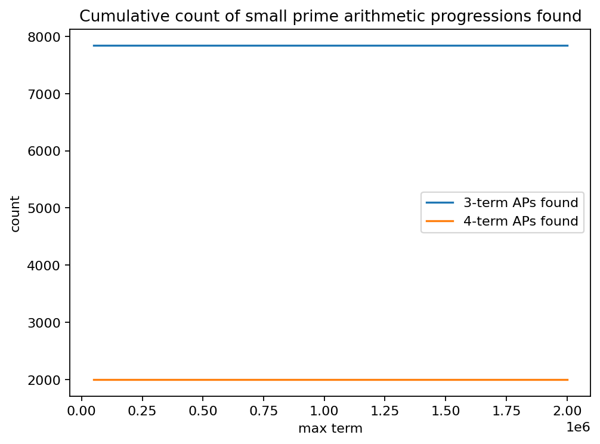
    

      <h3>E036 — Prime arithmetic progressions (small search)</h3>
      
This is a thin wrapper that follows the standard experiment template and delegates the actual computation to…

      

        number-theory
quantitative-exploration
visualization
APs
      

    

  </a>

  <a href="e037.html" class="gallery-card">
    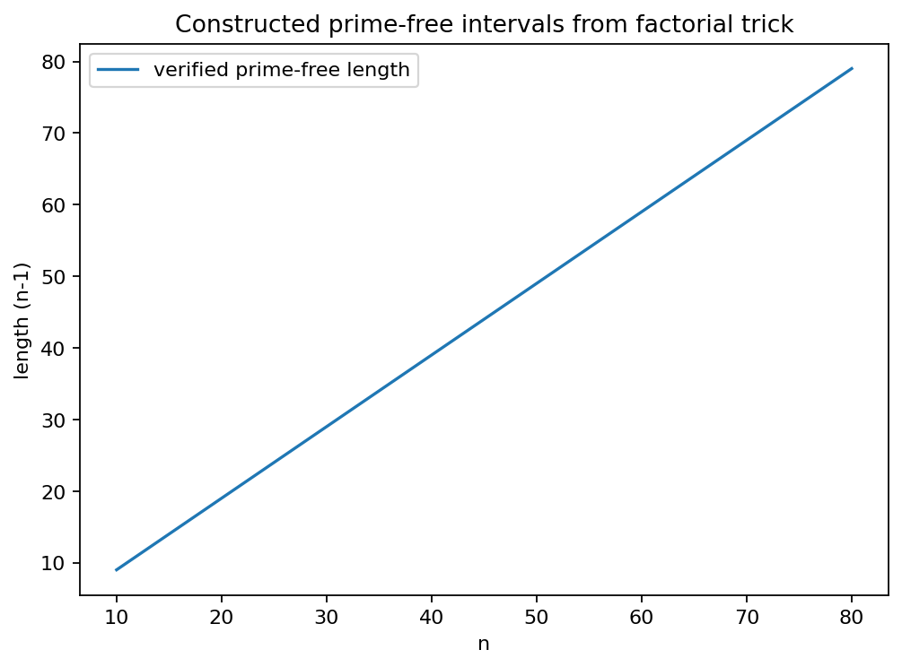
    

      <h3>E037 — Prime-free intervals via factorial construction</h3>
      
This is a thin wrapper that follows the standard experiment template and delegates the actual computation to…

      

        number-theory
quantitative-exploration
visualization
primes
      

    

  </a>

  <a href="e038.html" class="gallery-card">
    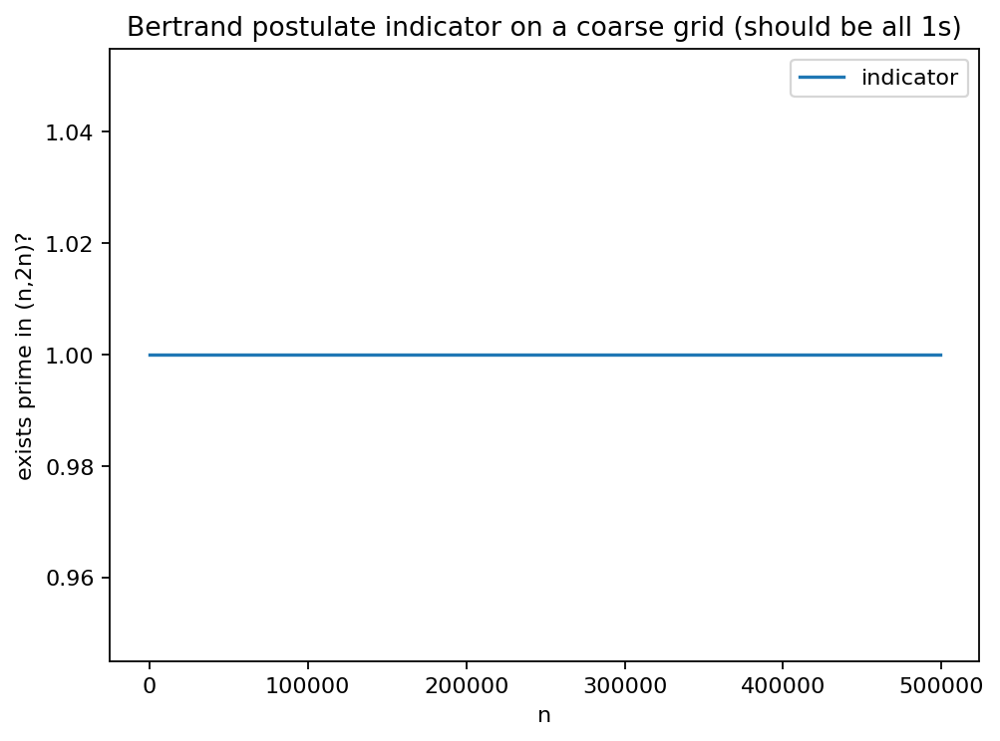
    

      <h3>E038 — Bertrand's postulate (computational verification)</h3>
      
This is a thin wrapper that follows the standard experiment template and delegates the actual computation to…

      

        number-theory
quantitative-exploration
visualization
primes
      

    

  </a>

  <a href="e039.html" class="gallery-card">
    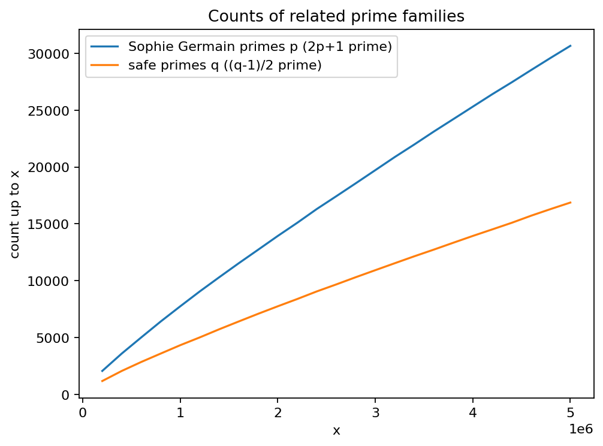
    

      <h3>E039 — Sophie Germain and safe primes</h3>
      
This is a thin wrapper that follows the standard experiment template and delegates the actual computation to…

      

        number-theory
quantitative-exploration
visualization
primes
      

    

  </a>

  <a href="e040.html" class="gallery-card">
    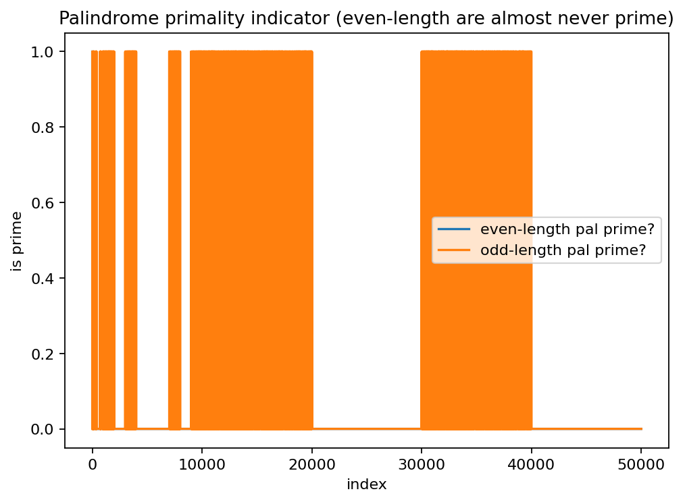
    

      <h3>E040 — Palindromic primes and the '11 trap'</h3>
      
This is a thin wrapper that follows the standard experiment template and delegates the actual computation to…

      

        number-theory
quantitative-exploration
visualization
primes
      

    

  </a>

  <a href="e041.html" class="gallery-card">
    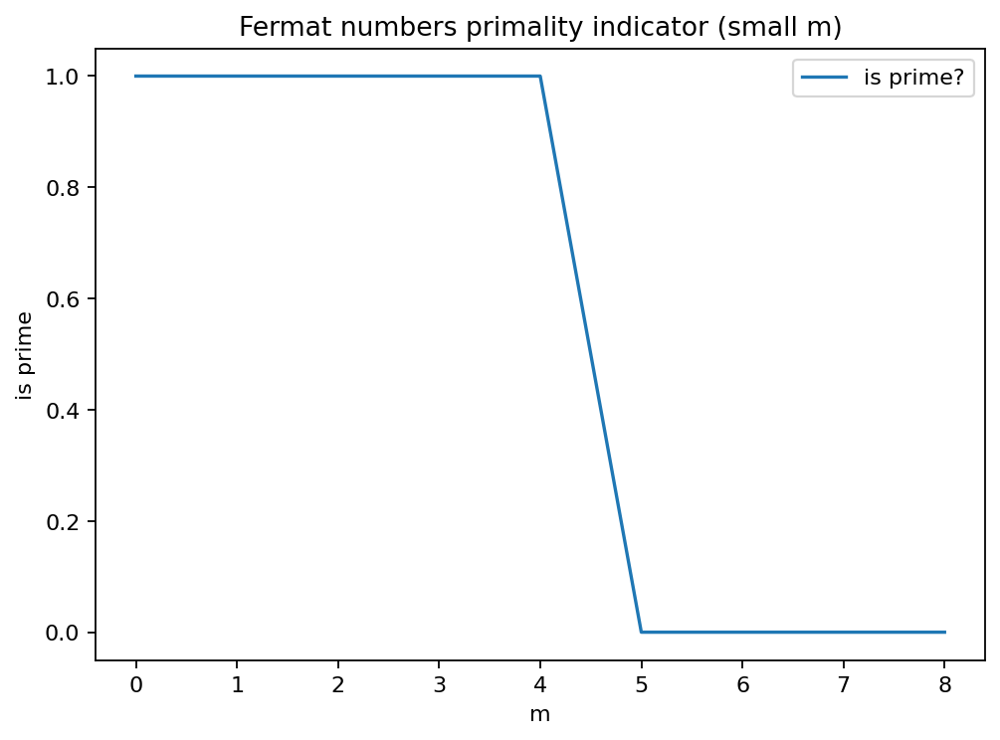
    

      <h3>E041 — Fermat numbers: not all prime</h3>
      
This is a thin wrapper that follows the standard experiment template and delegates the actual computation to…

      

        number-theory
quantitative-exploration
visualization
primes
      

    

  </a>

  <a href="e042.html" class="gallery-card">
    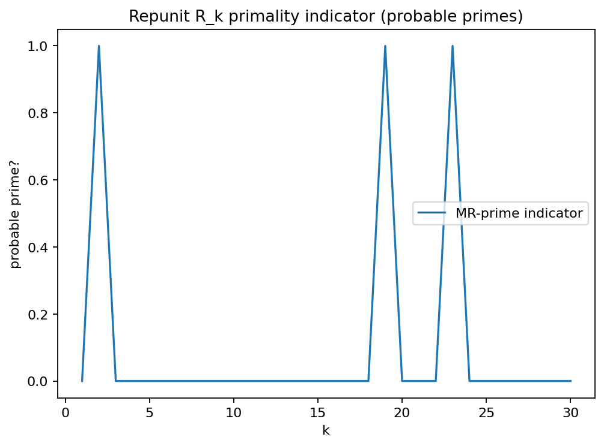
    

      <h3>E042 — Repunit primes (small k scan)</h3>
      
This is a thin wrapper that follows the standard experiment template and delegates the actual computation to…

      

        number-theory
quantitative-exploration
visualization
primes
      

    

  </a>

  <a href="e043.html" class="gallery-card">
    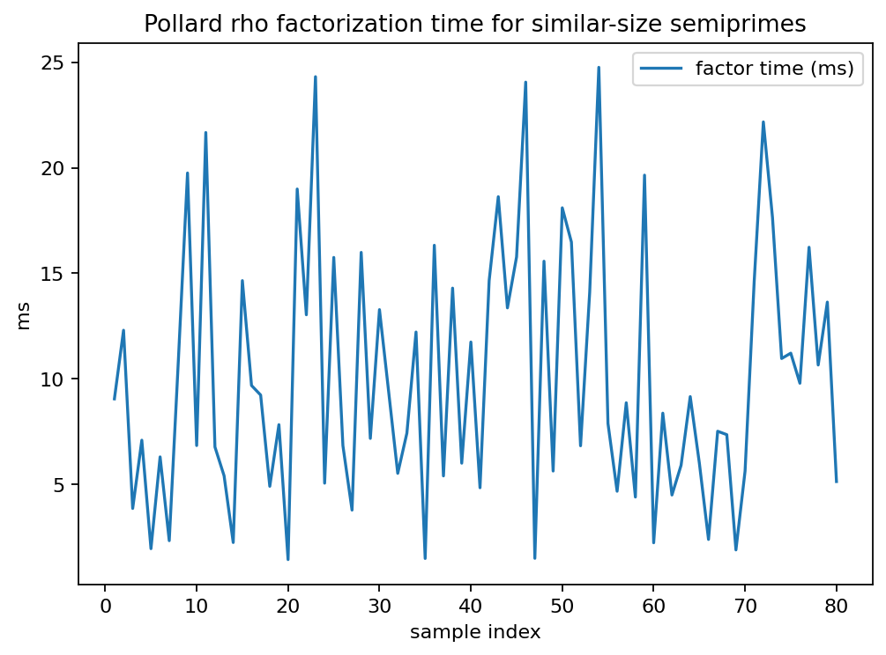
    

      <h3>E043 — Pollard rho runtime variability</h3>
      
This is a thin wrapper that follows the standard experiment template and delegates the actual computation to…

      

        number-theory
quantitative-exploration
visualization
primes
      

    

  </a>

  <a href="e044.html" class="gallery-card">
    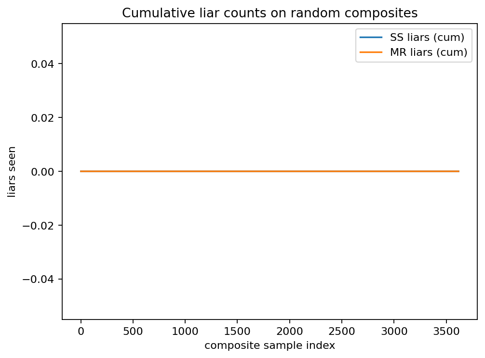
    

      <h3>E044 — Solovay–Strassen vs Miller–Rabin (liars)</h3>
      
This is a thin wrapper that follows the standard experiment template and delegates the actual computation to…

      

        number-theory
quantitative-exploration
visualization
miller–rabin
      

    

  </a>

  <a href="e045.html" class="gallery-card">
    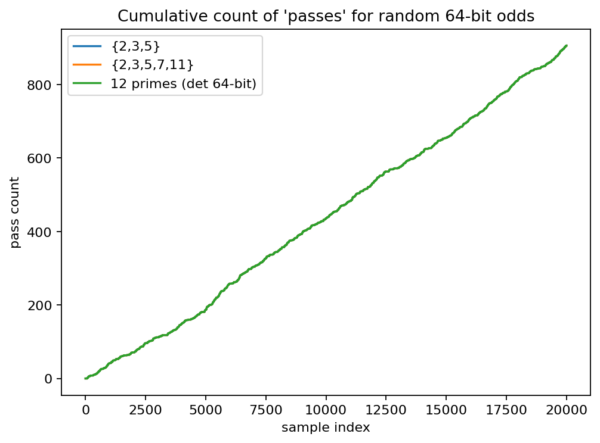
    

      <h3>E045 — Deterministic 64-bit MR base sets</h3>
      
This is a thin wrapper that follows the standard experiment template and delegates the actual computation to…

      

        number-theory
quantitative-exploration
visualization
primes
      

    

  </a>

  <a href="e046.html" class="gallery-card">
    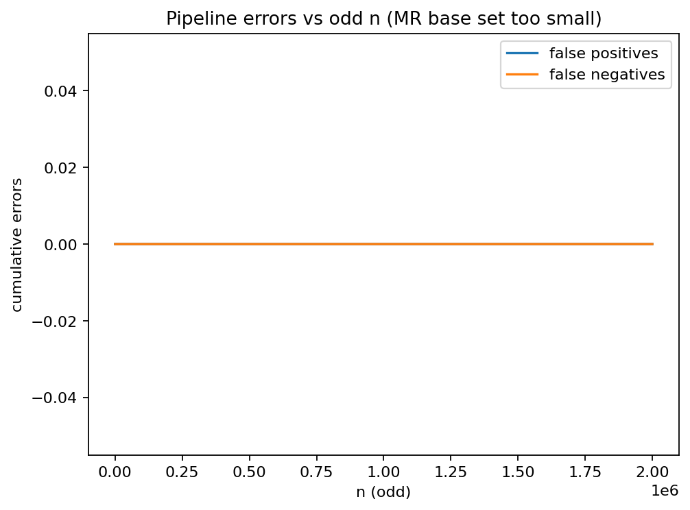
    

      <h3>E046 — Prime-testing pipeline and tuning pitfalls</h3>
      
This is a thin wrapper that follows the standard experiment template and delegates the actual computation to…

      

        number-theory
quantitative-exploration
visualization
primes
      

    

  </a>

::: {toctree}
:maxdepth: 1
:hidden:

e001
e002
e003
e004
e005
e006
e007
e008
e009
e010
e011
e012
e013
e014
e015
e016
e017
e018
e019
e020
e021
e022
e023
e024
e025
e026
e027
e028
e029
e030
e031
e032
e033
e034
e035
e036
e037
e038
e039
e040
e041
e042
e043
e044
e045
e046
:::
