# Experiments Gallery

A compact, image-first overview of the experiments in **py-mathx-lab**.

  

  <input id="gallery-search" type="search" placeholder="Search experiments…" autocomplete="off" spellcheck="false" aria-label="Search experiments" />
    <button id="gallery-clear" class="gallery-btn" type="button" title="Clear search and filters">Clear</button>
  

  

    Showing …
  

  

  
Tags

  

<noscript>
  

    
JavaScript disabled

    
The search and tag filters require JavaScript. The full gallery is still visible below.

  

</noscript>

  <a href="e001.html" class="gallery-card" data-title="E001 — Taylor error landscapes" data-tags="analysis,quantitative-exploration,visualization,taylor" data-desc="Truncation error, convergence behavior, and error landscapes for Taylor approximations.">
    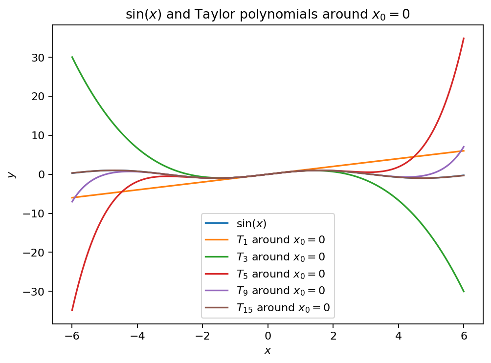
    

      <h3>E001 — Taylor error landscapes</h3>
      
Truncation error, convergence behavior, and error landscapes for Taylor approximations.

      

        analysis
        quantitative-exploration
        visualization
        taylor
      

    

  </a>
  <a href="e002.html" class="gallery-card" data-title="E002 — Perfect numbers" data-tags="number-theory,quantitative-exploration,visualization,perfect" data-desc="Explore perfect numbers via the sum-of-divisors function and the Euclid–Euler characterization.">
    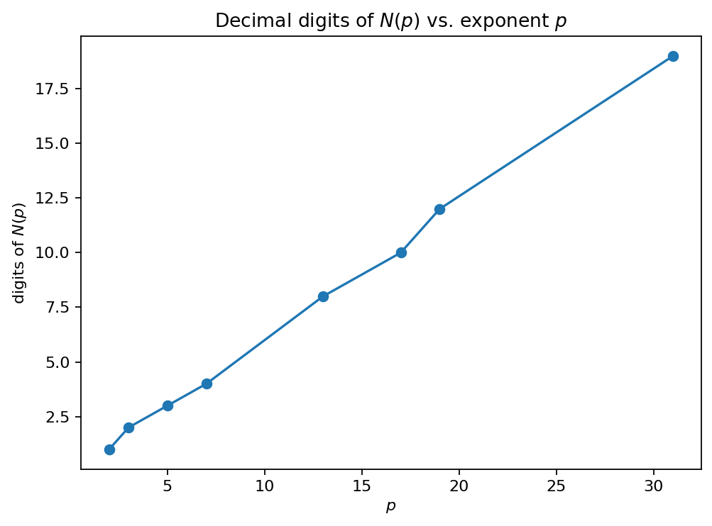
    

      <h3>E002 — Perfect numbers</h3>
      
Explore perfect numbers via the sum-of-divisors function and the Euclid–Euler characterization.

      

        number-theory
        quantitative-exploration
        visualization
        perfect
      

    

  </a>
  <a href="e003.html" class="gallery-card" data-title="E003 — Abundancy index" data-tags="number-theory,quantitative-exploration,visualization,classification" data-desc="Study the abundancy index $\sigma(n)/n$ and how it separates number classes.">
    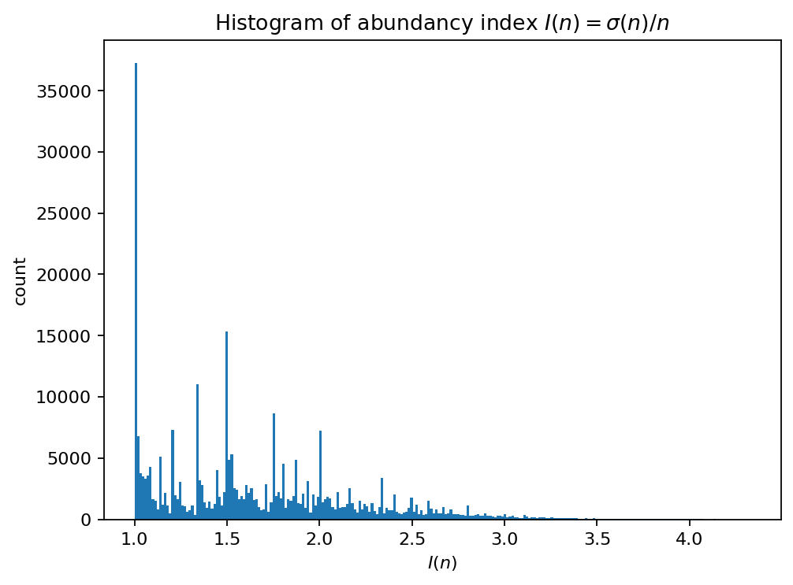
    

      <h3>E003 — Abundancy index</h3>
      
Study the abundancy index $\sigma(n)/n$ and how it separates number classes.

      

        number-theory
        quantitative-exploration
        visualization
        classification
      

    

  </a>
  <a href="e004.html" class="gallery-card" data-title="E004 — Sum-of-divisors (sigma)" data-tags="number-theory,quantitative-exploration,sigma" data-desc="Compute $\sigma(n)$, test multiplicativity, and explore divisor-sum structure.">
    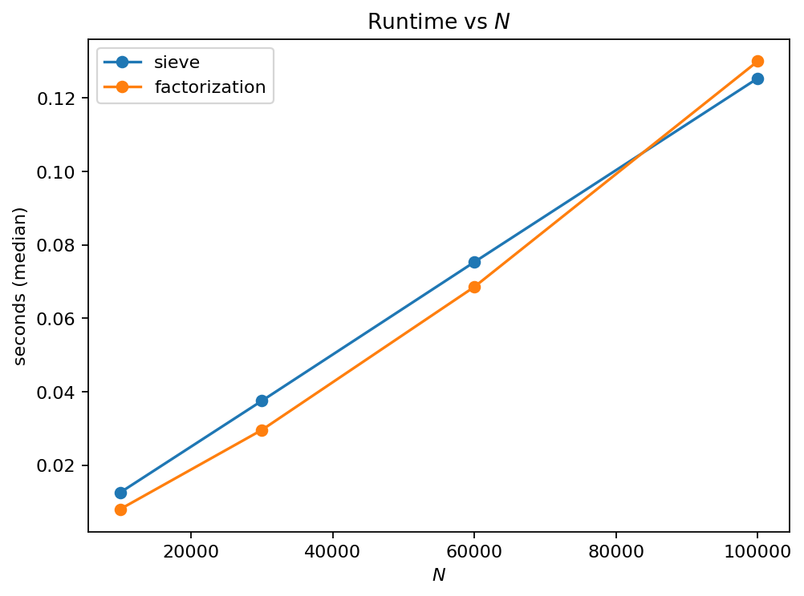
    

      <h3>E004 — Sum-of-divisors (sigma)</h3>
      
Compute $\sigma(n)$, test multiplicativity, and explore divisor-sum structure.

      

        number-theory
        quantitative-exploration
        sigma
      

    

  </a>
  <a href="e005.html" class="gallery-card" data-title="E005 — Odd perfect numbers" data-tags="number-theory,counterexample-search,visualization,open-problems" data-desc="Constraints, known results, and computational checks related to odd perfect numbers.">
    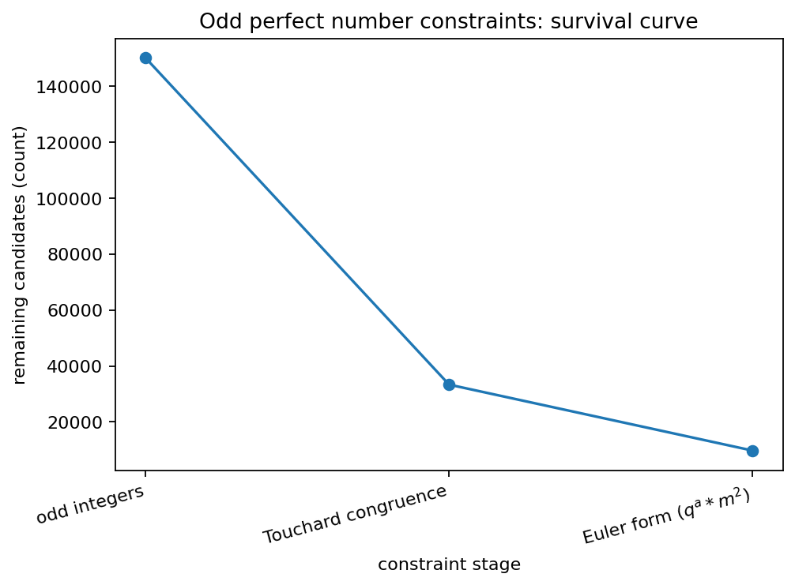
    

      <h3>E005 — Odd perfect numbers</h3>
      
Constraints, known results, and computational checks related to odd perfect numbers.

      

        number-theory
        counterexample-search
        visualization
        open-problems
      

    

  </a>
  <a href="e006.html" class="gallery-card" data-title="E006 — Near-perfect numbers" data-tags="number-theory,conjecture-generation,visualization,exploration" data-desc="Definitions, examples, and experiments around near-perfect (and related) integers.">
    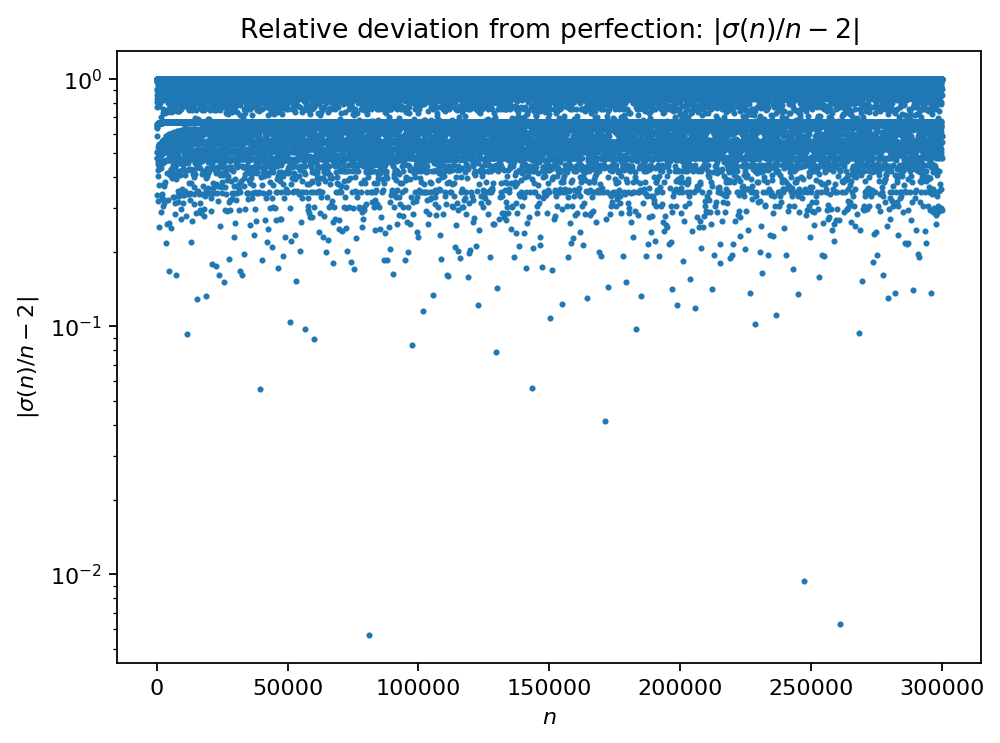
    

      <h3>E006 — Near-perfect numbers</h3>
      
Definitions, examples, and experiments around near-perfect (and related) integers.

      

        number-theory
        conjecture-generation
        visualization
        exploration
      

    

  </a>
  <a href="e007.html" class="gallery-card" data-title="E007 — Mersenne growth" data-tags="number-theory,quantitative-exploration,visualization,mersenne" data-desc="Bits and digits of M&lt;sub&gt;n&lt;/sub&gt; = 2&lt;sup&gt;n&lt;/sup&gt; − 1: fast size estimates for planning feasible bounds.">
    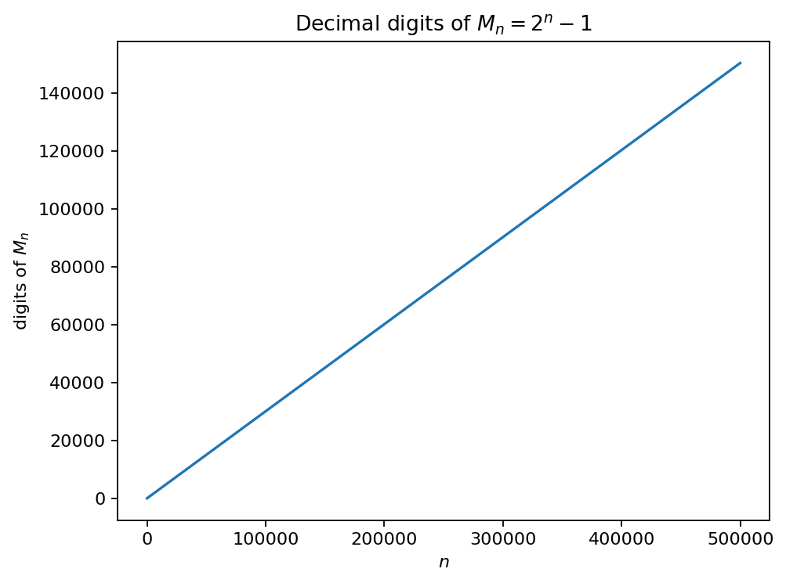
    

      <h3>E007 — Mersenne growth</h3>
      
Bits and digits of Mn = 2n − 1: fast size estimates for planning feasible bounds.

      

        number-theory
        quantitative-exploration
        visualization
        mersenne
      

    

  </a>
  <a href="e008.html" class="gallery-card" data-title="E008 — Lucas–Lehmer scan" data-tags="number-theory,quantitative-exploration,visualization,lucas-lehmer" data-desc="Scan prime exponents with the Lucas–Lehmer test and visualize scaling and outcomes.">
    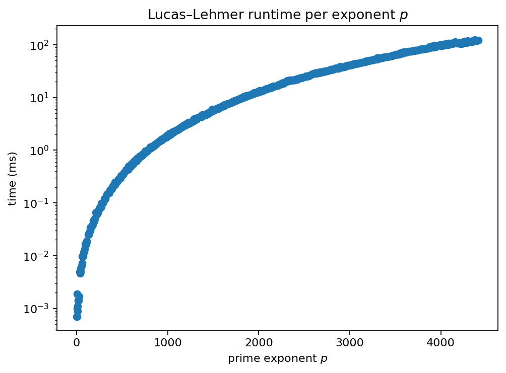
    

      <h3>E008 — Lucas–Lehmer scan</h3>
      
Scan prime exponents with the Lucas–Lehmer test and visualize scaling and outcomes.

      

        number-theory
        quantitative-exploration
        visualization
        lucas-lehmer
      

    

  </a>
  <a href="e009.html" class="gallery-card" data-title="E009 — Small-factor scan" data-tags="number-theory,quantitative-exploration,visualization,sieving" data-desc="Pre-sieve M&lt;sub&gt;p&lt;/sub&gt; candidates by finding small structured factors before expensive primality tests.">
    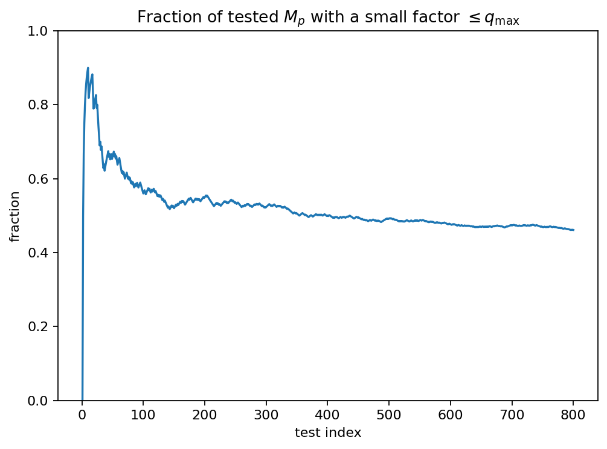
    

      <h3>E009 — Small-factor scan</h3>
      
Pre-sieve Mp candidates by finding small structured factors before expensive primality tests.

      

        number-theory
        quantitative-exploration
        visualization
        sieving
      

    

  </a>
  <a href="e010.html" class="gallery-card" data-title="E010 — Perfect numbers from Mersenne primes" data-tags="number-theory,quantitative-exploration,visualization,perfect" data-desc="Generate even perfect numbers via Euclid–Euler and visualize growth and validation checks.">
    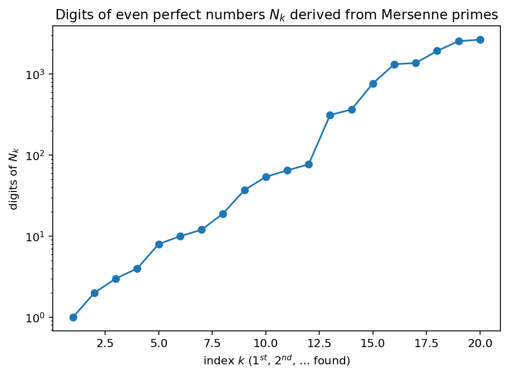
    

      <h3>E010 — Perfect numbers from Mersenne primes</h3>
      
Generate even perfect numbers via Euclid–Euler and visualize growth and validation checks.

      

        number-theory
        quantitative-exploration
        visualization
        perfect
      

    

  </a>
  <a href="e011.html" class="gallery-card" data-title="E011 — Heuristic rarity" data-tags="number-theory,quantitative-exploration,visualization,heuristics" data-desc="Compare observed Mersenne-prime counts to a simple heuristic expectation curve.">
    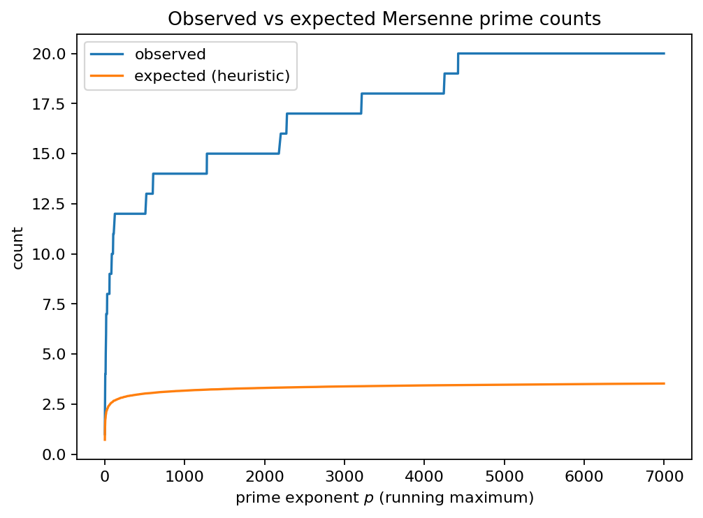
    

      <h3>E011 — Heuristic rarity</h3>
      
Compare observed Mersenne-prime counts to a simple heuristic expectation curve.

      

        number-theory
        quantitative-exploration
        visualization
        heuristics
      

    

  </a>
  <a href="e012.html" class="gallery-card" data-title="E012 — Fermat pseudoprimes and Carmichael numbers (counterexamples)" data-tags="number-theory,counterexample-search,visualization,pseudoprimes" data-desc="Counterexamples to naive Fermat primality testing: base-a pseudoprimes and Carmichael numbers.">
    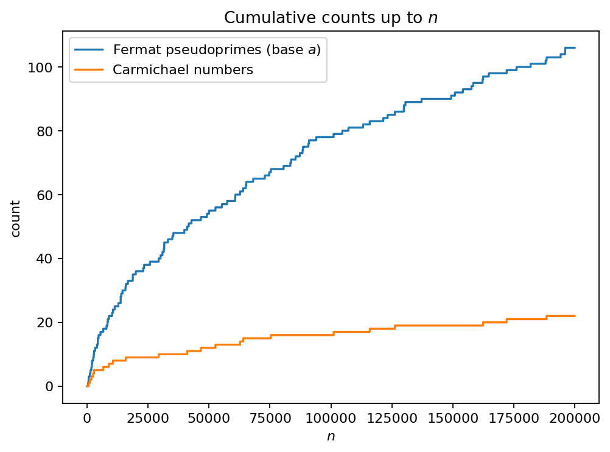
    

      <h3>E012 — Fermat pseudoprimes and Carmichael numbers (counterexamples)</h3>
      
Counterexamples to naive Fermat primality testing: base-a pseudoprimes and Carmichael numbers.

      

        number-theory
counterexample-search
visualization
pseudoprimes
      

    

  </a>
  <a href="e013.html" class="gallery-card" data-title="E013 — Prime-polynomial counterexamples (Euler's n^2 + n + 41)" data-tags="number-theory,counterexample-search,visualization,primes" data-desc="Turn “prime-generating polynomials” folklore into a crisp counterexample (Euler’s n²+n+41).">
    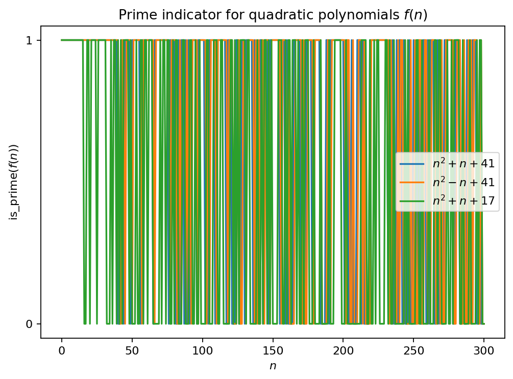
    

      <h3>E013 — Prime-polynomial counterexamples (Euler's n^2 + n + 41)</h3>
      
Turn “prime-generating polynomials” folklore into a crisp counterexample (Euler’s n²+n+41).

      

        number-theory
counterexample-search
visualization
primes
      

    

  </a>
  <a href="e014.html" class="gallery-card" data-title="E014 — Primorial ± 1 counterexamples" data-tags="number-theory,counterexample-search,visualization,primorial" data-desc="This is a thin wrapper that follows the standard experiment template and delegates the actual computation to…">
    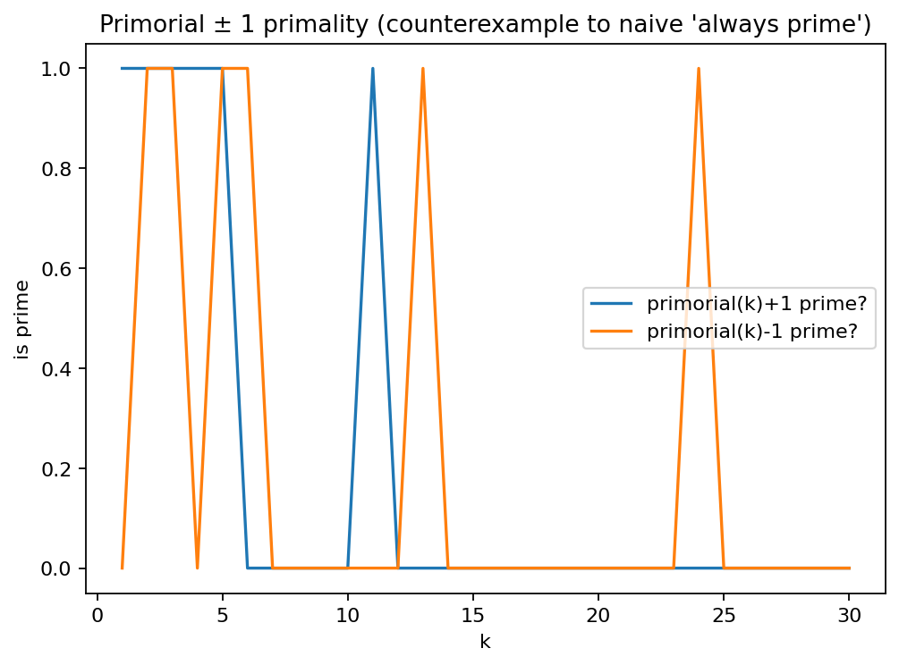
    

      <h3>E014 — Primorial ± 1 counterexamples</h3>
      
This is a thin wrapper that follows the standard experiment template and delegates the actual computation to…

      

        number-theory
counterexample-search
visualization
primorial
      

    

  </a>
  <a href="e015.html" class="gallery-card" data-title="E015 — Wilson test infeasibility" data-tags="number-theory,quantitative-exploration,visualization,wilson" data-desc="This is a thin wrapper that follows the standard experiment template and delegates the actual computation to…">
    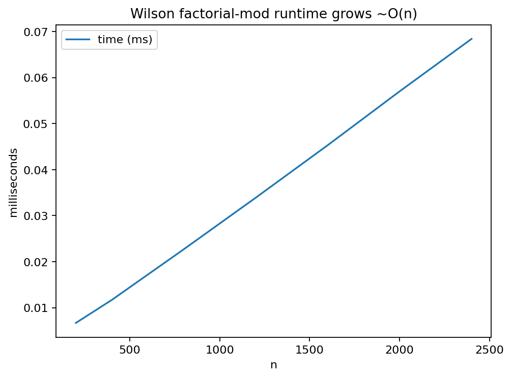
    

      <h3>E015 — Wilson test infeasibility</h3>
      
This is a thin wrapper that follows the standard experiment template and delegates the actual computation to…

      

        number-theory
quantitative-exploration
visualization
wilson
      

    

  </a>
  <a href="e016.html" class="gallery-card" data-title="E016 — Trial division vs. Miller–Rabin scaling" data-tags="number-theory,quantitative-exploration,visualization,miller-rabin" data-desc="This is a thin wrapper that follows the standard experiment template and delegates the actual computation to…">
    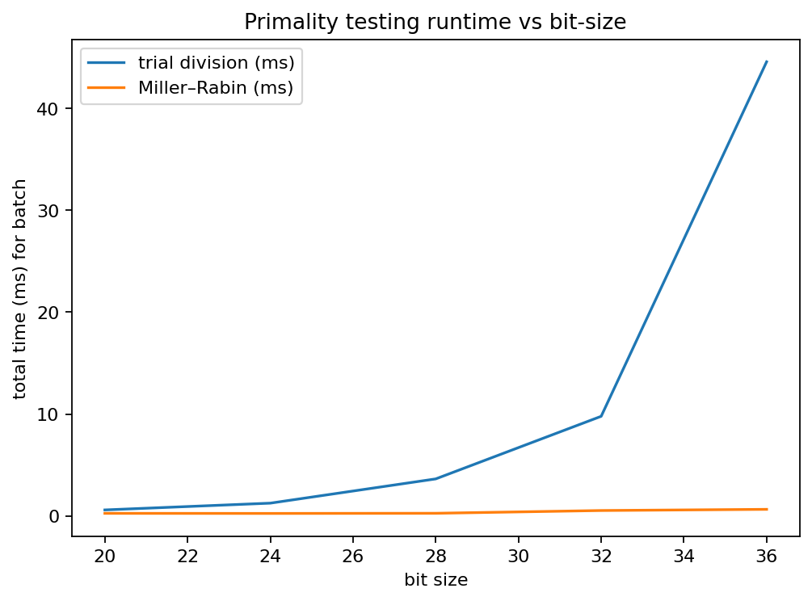
    

      <h3>E016 — Trial division vs. Miller–Rabin scaling</h3>
      
This is a thin wrapper that follows the standard experiment template and delegates the actual computation to…

      

        number-theory
quantitative-exploration
visualization
miller-rabin
      

    

  </a>
  <a href="e017.html" class="gallery-card" data-title="E017 — Sieve memory blow-up vs. segmented sieve" data-tags="number-theory,quantitative-exploration,visualization,sieving" data-desc="This is a thin wrapper that follows the standard experiment template and delegates the actual computation to…">
    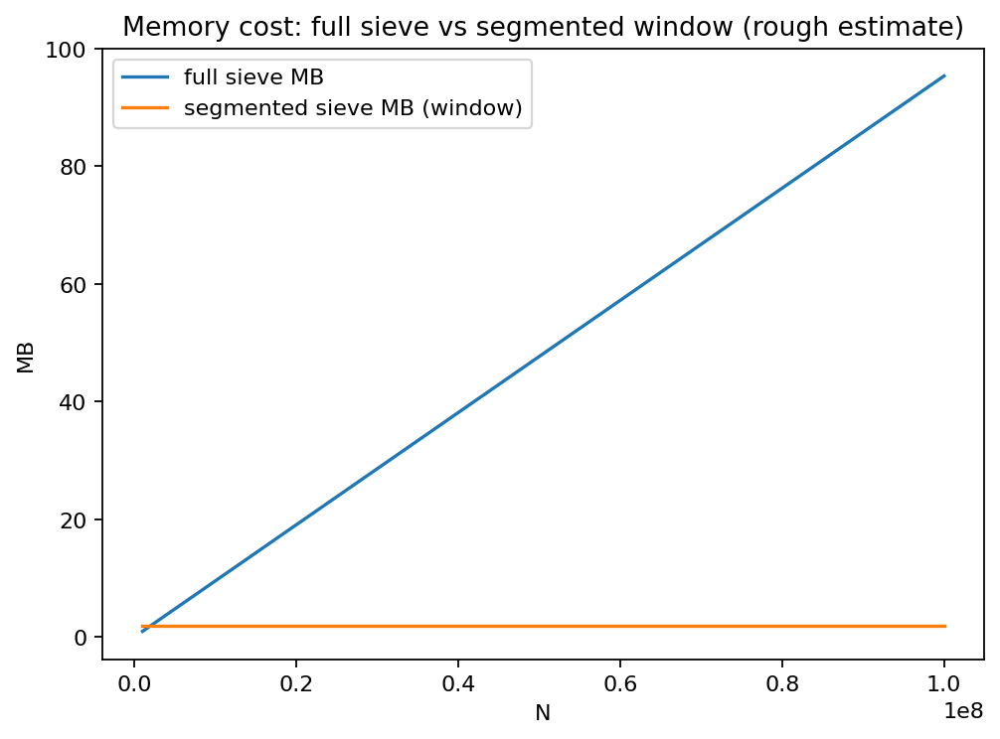
    

      <h3>E017 — Sieve memory blow-up vs. segmented sieve</h3>
      
This is a thin wrapper that follows the standard experiment template and delegates the actual computation to…

      

        number-theory
quantitative-exploration
visualization
sieving
      

    

  </a>
  <a href="e018.html" class="gallery-card" data-title="E018 — Miller–Rabin base choice counterexamples" data-tags="number-theory,counterexample-search,visualization,miller-rabin" data-desc="This is a thin wrapper that follows the standard experiment template and delegates the actual computation to…">
    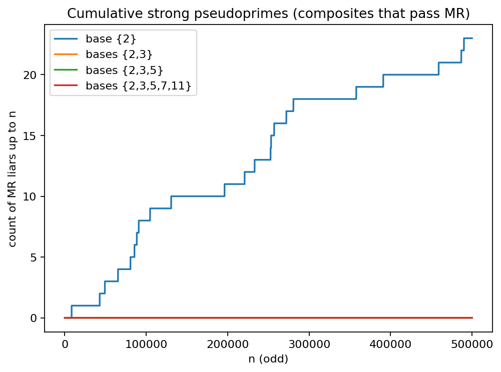
    

      <h3>E018 — Miller–Rabin base choice counterexamples</h3>
      
This is a thin wrapper that follows the standard experiment template and delegates the actual computation to…

      

        number-theory
counterexample-search
visualization
miller-rabin
      

    

  </a>
  <a href="e019.html" class="gallery-card" data-title="E019 — Prime density and pnt visualization" data-tags="number-theory,quantitative-exploration,visualization,pnt" data-desc="This is a thin wrapper that follows the standard experiment template and delegates the actual computation to…">
    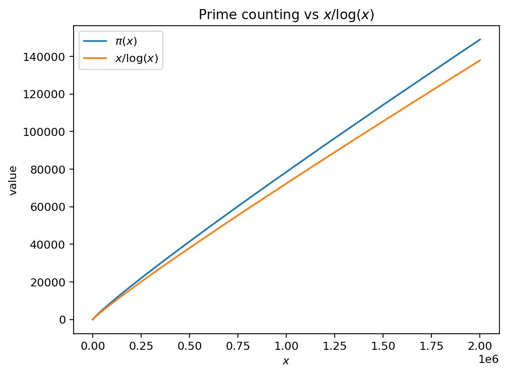
    

      <h3>E019 — Prime density and pnt visualization</h3>
      
This is a thin wrapper that follows the standard experiment template and delegates the actual computation to…

      

        number-theory
quantitative-exploration
visualization
pnt
      

    

  </a>
  <a href="e020.html" class="gallery-card" data-title="E020 — Compare pi(x) to li-x numerically" data-tags="number-theory,quantitative-exploration,visualization,li-x" data-desc="This is a thin wrapper that follows the standard experiment template and delegates the actual computation to…">
    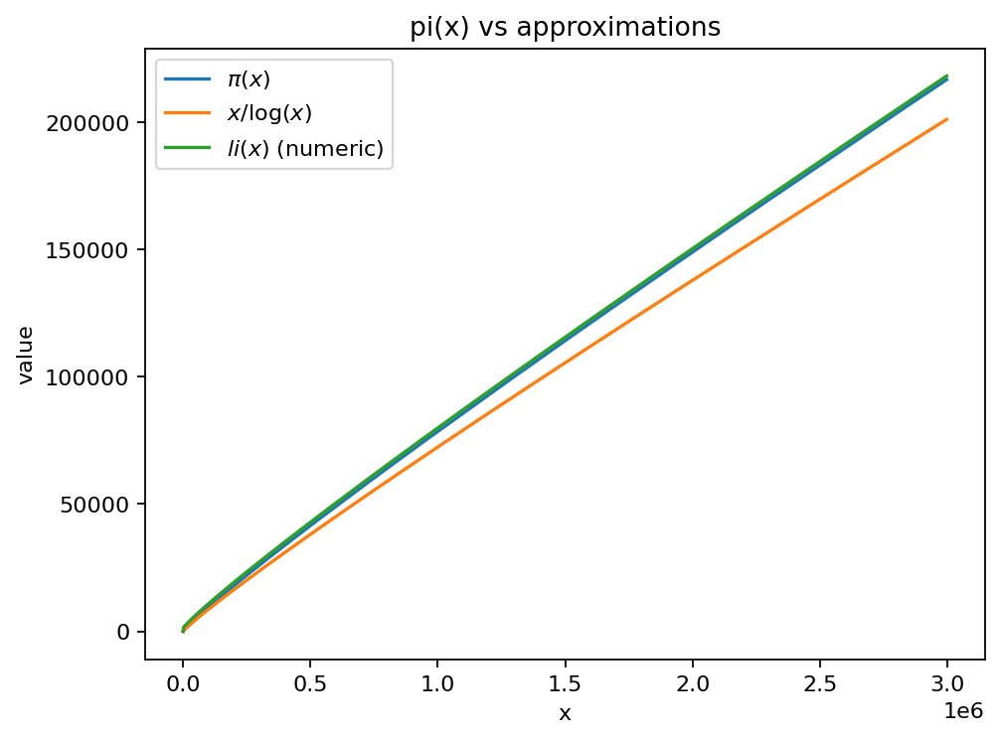
    

      <h3>E020 — Compare pi(x) to li-x numerically</h3>
      
This is a thin wrapper that follows the standard experiment template and delegates the actual computation to…

      

        number-theory
quantitative-exploration
visualization
li-x
      

    

  </a>
  <a href="e021.html" class="gallery-card" data-title="E021 — Explicit bounds sanity checks" data-tags="number-theory,quantitative-exploration,visualization,bounds" data-desc="This is a thin wrapper that follows the standard experiment template and delegates the actual computation to…">
    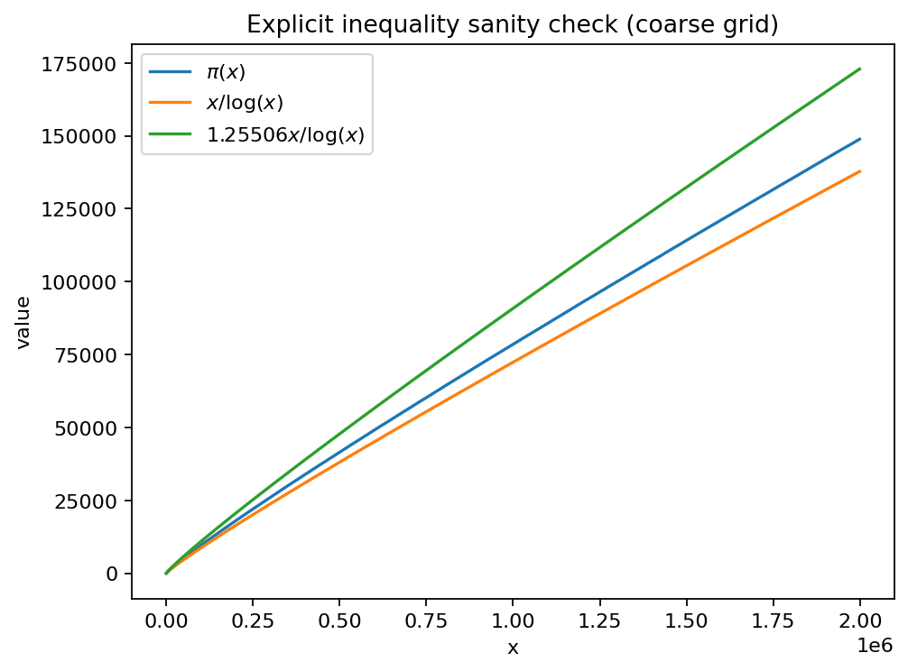
    

      <h3>E021 — Explicit bounds sanity checks</h3>
      
This is a thin wrapper that follows the standard experiment template and delegates the actual computation to…

      

        number-theory
quantitative-exploration
visualization
bounds
      

    

  </a>
  <a href="e022.html" class="gallery-card" data-title="E022 — Prime race modulo 4" data-tags="number-theory,quantitative-exploration,visualization,primes" data-desc="This is a thin wrapper that follows the standard experiment template and delegates the actual computation to…">
    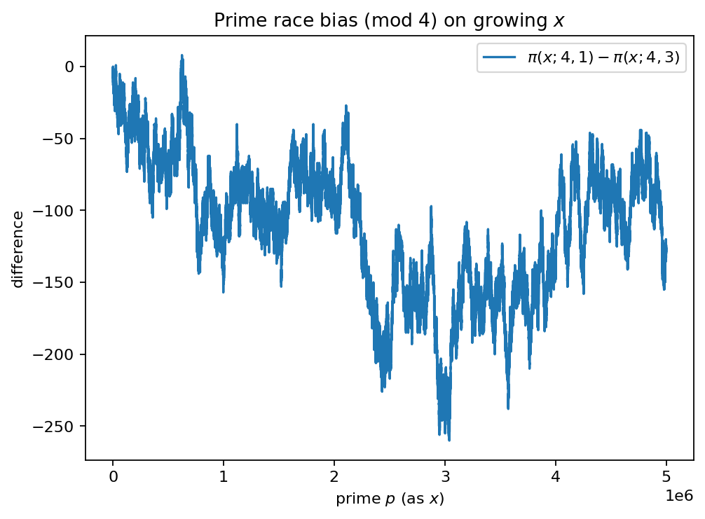
    

      <h3>E022 — Prime race modulo 4</h3>
      
This is a thin wrapper that follows the standard experiment template and delegates the actual computation to…

      

        number-theory
quantitative-exploration
visualization
primes
      

    

  </a>
  <a href="e023.html" class="gallery-card" data-title="E023 — Residue class distribution mod q" data-tags="number-theory,quantitative-exploration,visualization,primes" data-desc="This is a thin wrapper that follows the standard experiment template and delegates the actual computation to…">
    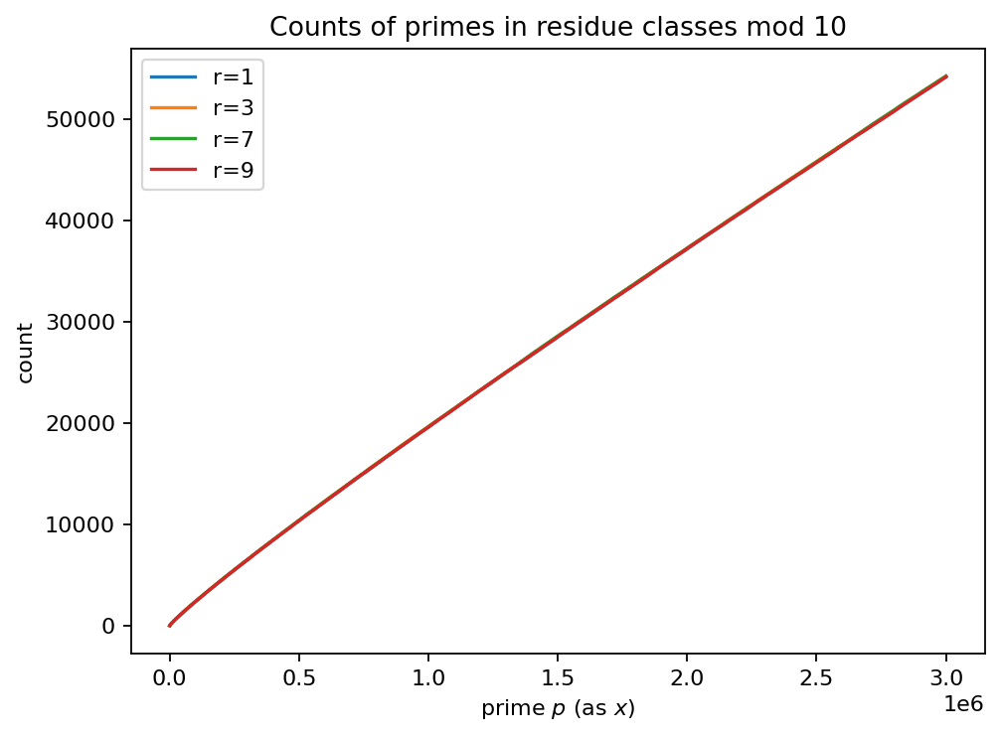
    

      <h3>E023 — Residue class distribution mod q</h3>
      
This is a thin wrapper that follows the standard experiment template and delegates the actual computation to…

      

        number-theory
quantitative-exploration
visualization
primes
      

    

  </a>
  <a href="e024.html" class="gallery-card" data-title="E024 — Ulam spiral structure" data-tags="number-theory,quantitative-exploration,visualization,ulam" data-desc="This is a thin wrapper that follows the standard experiment template and delegates the actual computation to…">
    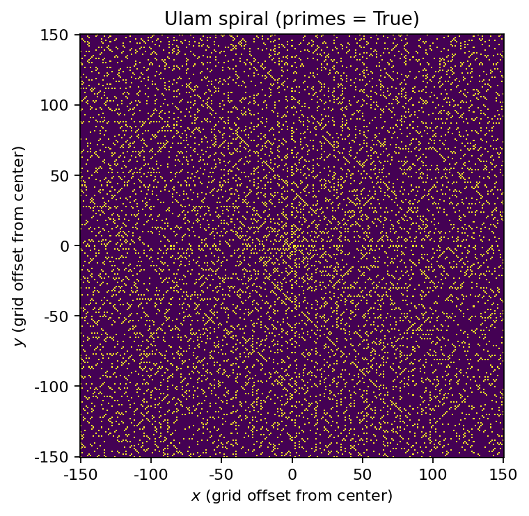
    

      <h3>E024 — Ulam spiral structure</h3>
      
This is a thin wrapper that follows the standard experiment template and delegates the actual computation to…

      

        number-theory
quantitative-exploration
visualization
ulam
      

    

  </a>
  <a href="e025.html" class="gallery-card" data-title="E025 — Prime gaps are not monotone" data-tags="number-theory,quantitative-exploration,visualization,gaps" data-desc="This is a thin wrapper that follows the standard experiment template and delegates the actual computation to…">
    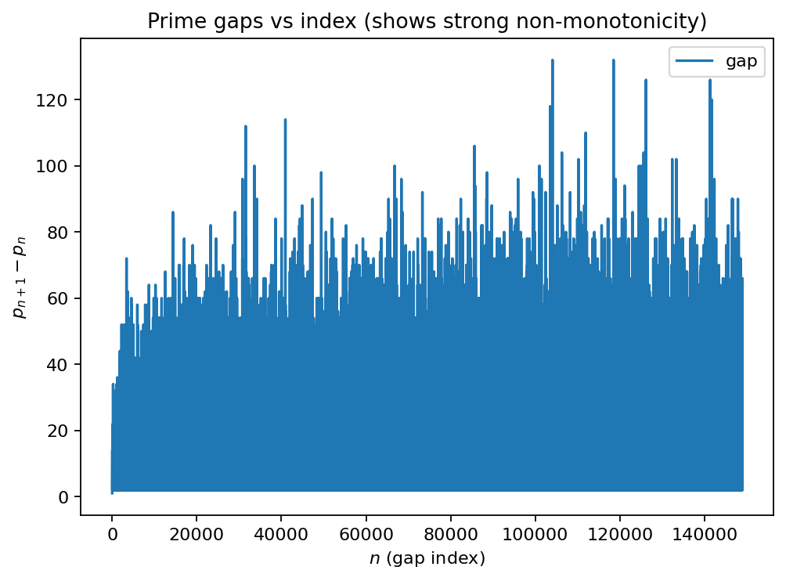
    

      <h3>E025 — Prime gaps are not monotone</h3>
      
This is a thin wrapper that follows the standard experiment template and delegates the actual computation to…

      

        number-theory
quantitative-exploration
visualization
gaps
      

    

  </a>
  <a href="e026.html" class="gallery-card" data-title="E026 — Normalized prime gaps" data-tags="number-theory,quantitative-exploration,visualization,gaps" data-desc="This is a thin wrapper that follows the standard experiment template and delegates the actual computation to…">
    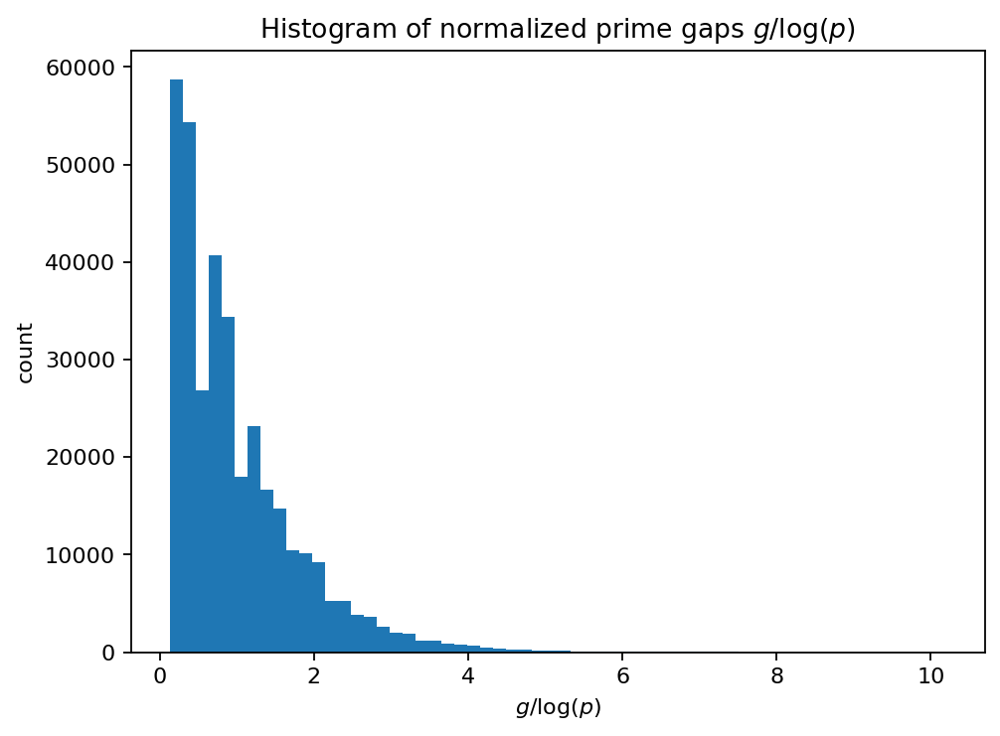
    

      <h3>E026 — Normalized prime gaps</h3>
      
This is a thin wrapper that follows the standard experiment template and delegates the actual computation to…

      

        number-theory
quantitative-exploration
visualization
gaps
      

    

  </a>
  <a href="e027.html" class="gallery-card" data-title="E027 — Record prime gaps vs. log^2 heuristic" data-tags="number-theory,conjecture-generation,visualization,gaps" data-desc="This is a thin wrapper that follows the standard experiment template and delegates the actual computation to…">
    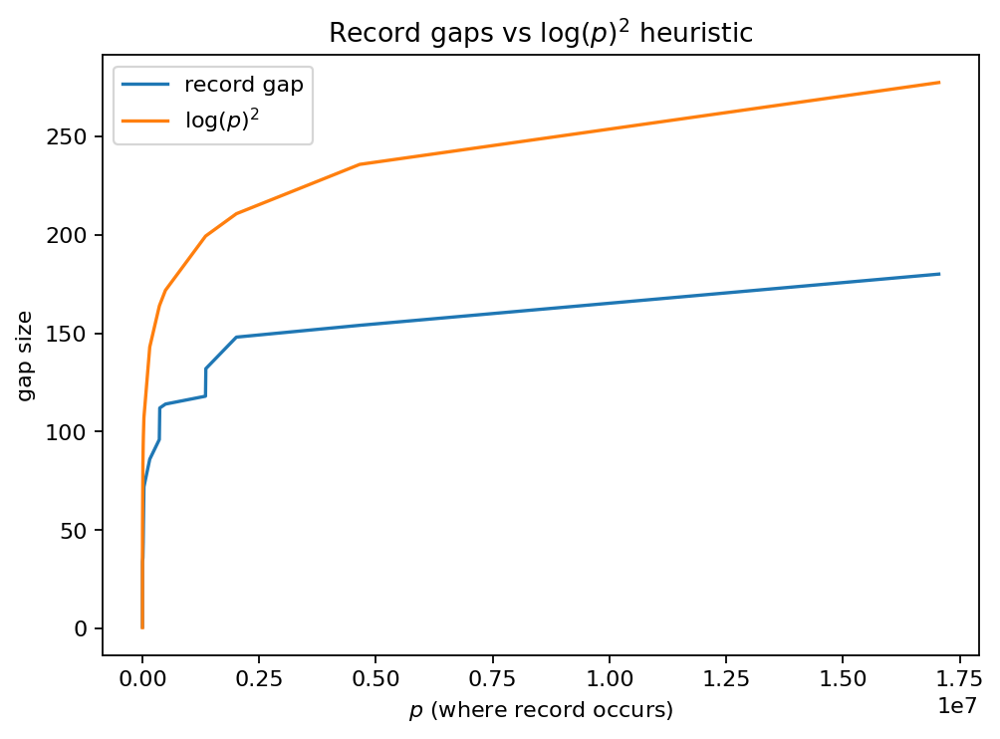
    

      <h3>E027 — Record prime gaps vs. log^2 heuristic</h3>
      
This is a thin wrapper that follows the standard experiment template and delegates the actual computation to…

      

        number-theory
conjecture-generation
visualization
gaps
      

    

  </a>
  <a href="e028.html" class="gallery-card" data-title="E028 — Jumping champions (most frequent gaps)" data-tags="number-theory,quantitative-exploration,visualization,gaps" data-desc="This is a thin wrapper that follows the standard experiment template and delegates the actual computation to…">
    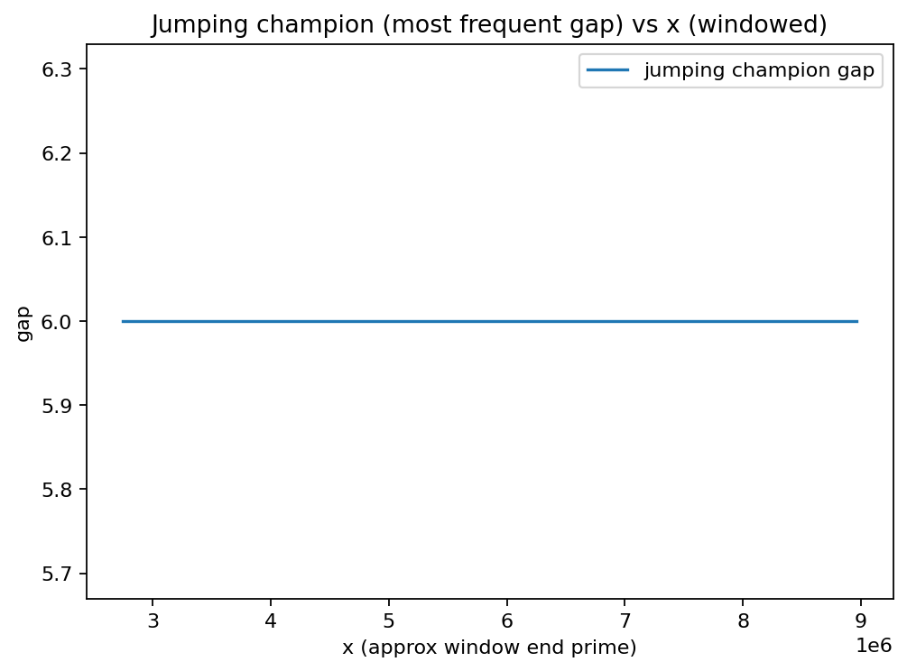
    

      <h3>E028 — Jumping champions (most frequent gaps)</h3>
      
This is a thin wrapper that follows the standard experiment template and delegates the actual computation to…

      

        number-theory
quantitative-exploration
visualization
gaps
      

    

  </a>
  <a href="e029.html" class="gallery-card" data-title="E029 — Twin primes: observed vs. heuristic" data-tags="number-theory,conjecture-generation,visualization,twin" data-desc="This is a thin wrapper that follows the standard experiment template and delegates the actual computation to…">
    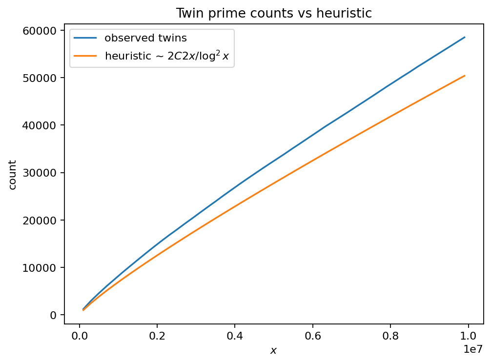
    

      <h3>E029 — Twin primes: observed vs. heuristic</h3>
      
This is a thin wrapper that follows the standard experiment template and delegates the actual computation to…

      

        number-theory
conjecture-generation
visualization
twin
      

    

  </a>
  <a href="e030.html" class="gallery-card" data-title="E030 — Cousin and sexy prime pairs" data-tags="number-theory,quantitative-exploration,visualization,primes" data-desc="This is a thin wrapper that follows the standard experiment template and delegates the actual computation to…">
    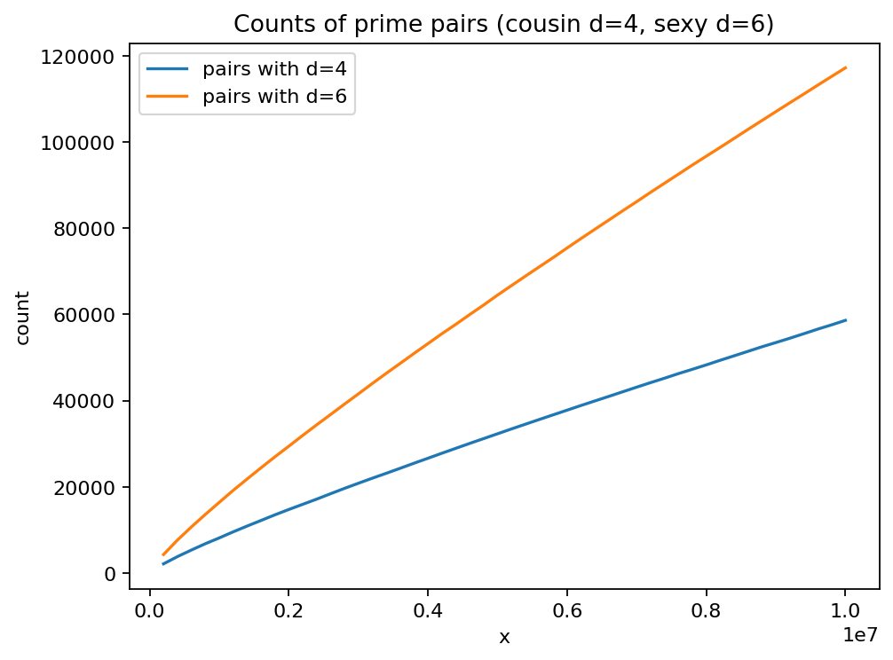
    

      <h3>E030 — Cousin and sexy prime pairs</h3>
      
This is a thin wrapper that follows the standard experiment template and delegates the actual computation to…

      

        number-theory
quantitative-exploration
visualization
primes
      

    

  </a>
  <a href="e031.html" class="gallery-card" data-title="E031 — Admissibility and modular obstructions" data-tags="number-theory,quantitative-exploration,visualization,primes" data-desc="This is a thin wrapper that follows the standard experiment template and delegates the actual computation to…">
    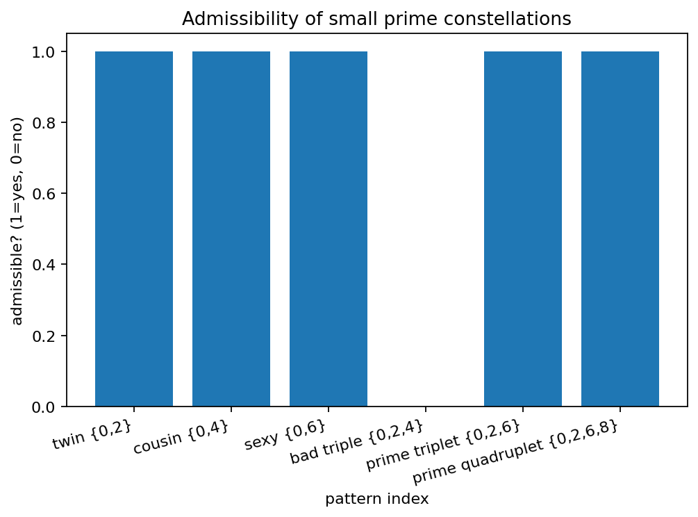
    

      <h3>E031 — Admissibility and modular obstructions</h3>
      
This is a thin wrapper that follows the standard experiment template and delegates the actual computation to…

      

        number-theory
quantitative-exploration
visualization
primes
      

    

  </a>
  <a href="e032.html" class="gallery-card" data-title="E032 — Prime triplets and quadruplets" data-tags="number-theory,quantitative-exploration,visualization,primes" data-desc="This is a thin wrapper that follows the standard experiment template and delegates the actual computation to…">
    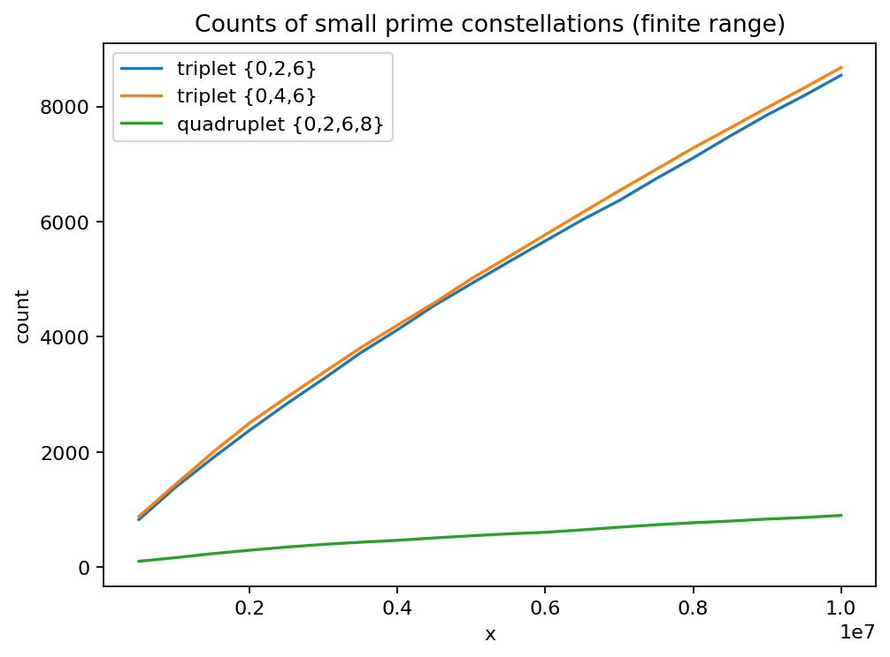
    

      <h3>E032 — Prime triplets and quadruplets</h3>
      
This is a thin wrapper that follows the standard experiment template and delegates the actual computation to…

      

        number-theory
quantitative-exploration
visualization
primes
      

    

  </a>
  <a href="e033.html" class="gallery-card" data-title="E033 — Bounded gaps vs. twin primes (not the same)" data-tags="number-theory,quantitative-exploration,visualization,twin" data-desc="This is a thin wrapper that follows the standard experiment template and delegates the actual computation to…">
    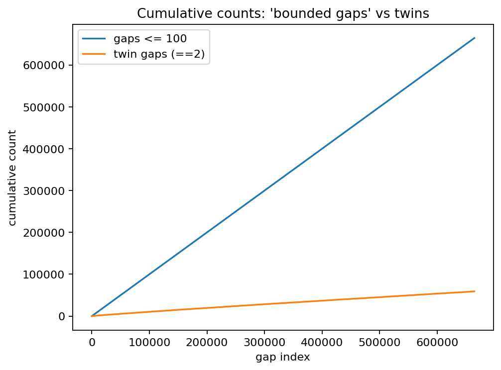
    

      <h3>E033 — Bounded gaps vs. twin primes (not the same)</h3>
      
This is a thin wrapper that follows the standard experiment template and delegates the actual computation to…

      

        number-theory
quantitative-exploration
visualization
twin
      

    

  </a>
  <a href="e034.html" class="gallery-card" data-title="E034 — Twin primes in sliding windows" data-tags="number-theory,quantitative-exploration,visualization,twin" data-desc="This is a thin wrapper that follows the standard experiment template and delegates the actual computation to…">
    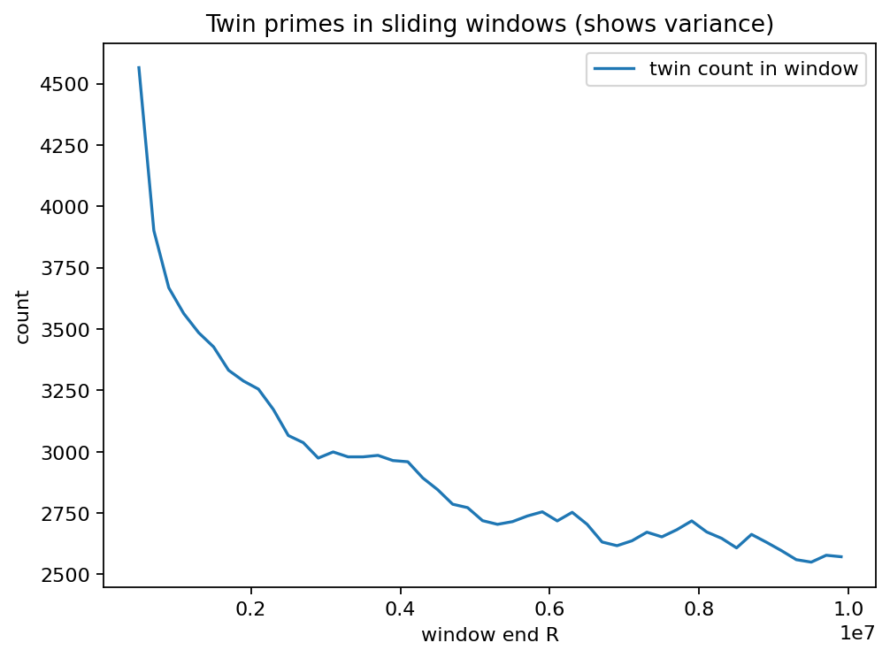
    

      <h3>E034 — Twin primes in sliding windows</h3>
      
This is a thin wrapper that follows the standard experiment template and delegates the actual computation to…

      

        number-theory
quantitative-exploration
visualization
twin
      

    

  </a>
  <a href="e035.html" class="gallery-card" data-title="E035 — Primes in arithmetic progressions mod q" data-tags="number-theory,quantitative-exploration,visualization,aps" data-desc="This is a thin wrapper that follows the standard experiment template and delegates the actual computation to…">
    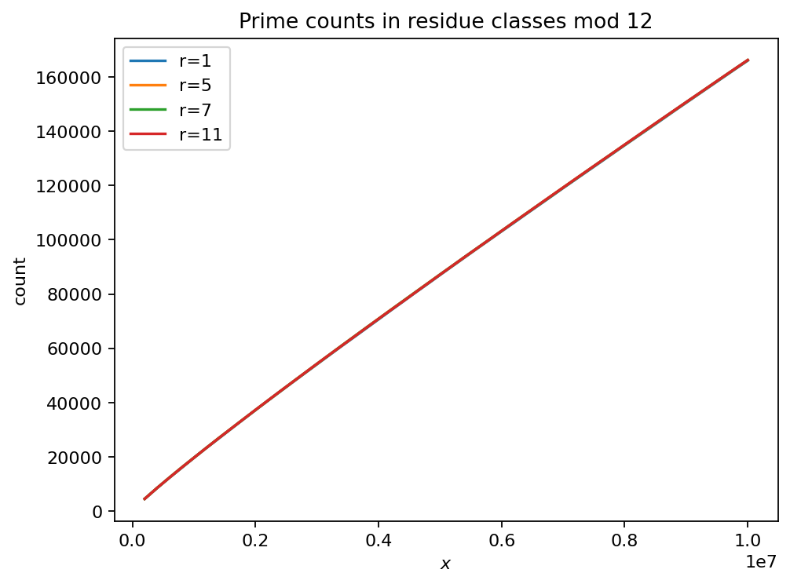
    

      <h3>E035 — Primes in arithmetic progressions mod q</h3>
      
This is a thin wrapper that follows the standard experiment template and delegates the actual computation to…

      

        number-theory
quantitative-exploration
visualization
aps
      

    

  </a>
  <a href="e036.html" class="gallery-card" data-title="E036 — Prime arithmetic progressions (small search)" data-tags="number-theory,quantitative-exploration,visualization,aps" data-desc="This is a thin wrapper that follows the standard experiment template and delegates the actual computation to…">
    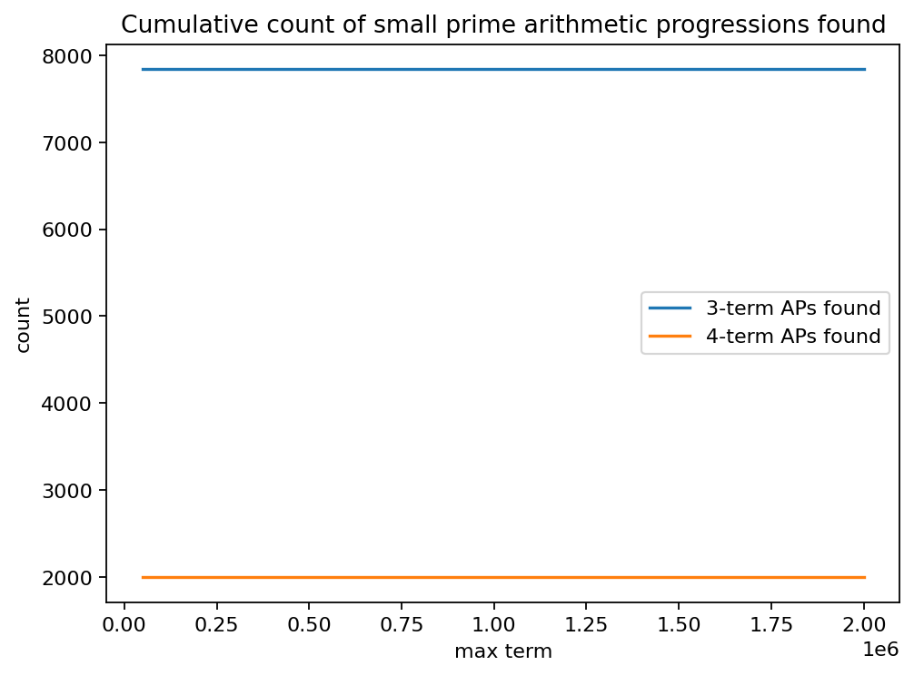
    

      <h3>E036 — Prime arithmetic progressions (small search)</h3>
      
This is a thin wrapper that follows the standard experiment template and delegates the actual computation to…

      

        number-theory
quantitative-exploration
visualization
aps
      

    

  </a>
  <a href="e037.html" class="gallery-card" data-title="E037 — Prime-free intervals via factorial construction" data-tags="number-theory,quantitative-exploration,visualization,primes" data-desc="This is a thin wrapper that follows the standard experiment template and delegates the actual computation to…">
    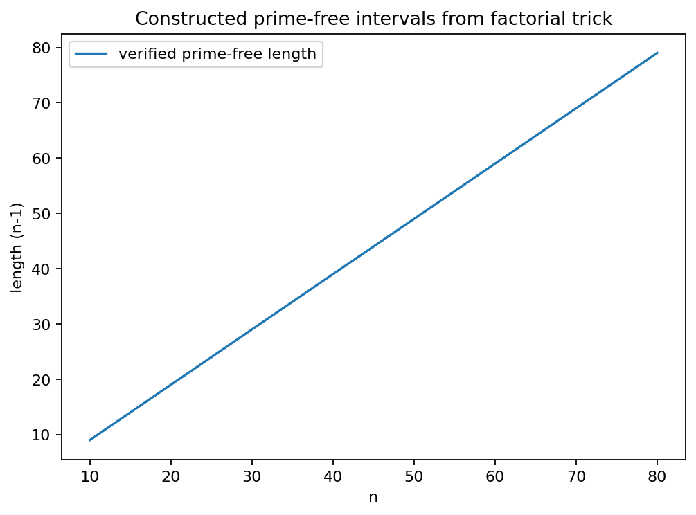
    

      <h3>E037 — Prime-free intervals via factorial construction</h3>
      
This is a thin wrapper that follows the standard experiment template and delegates the actual computation to…

      

        number-theory
quantitative-exploration
visualization
primes
      

    

  </a>
  <a href="e038.html" class="gallery-card" data-title="E038 — Bertrand's postulate (computational verification)" data-tags="number-theory,quantitative-exploration,visualization,primes" data-desc="This is a thin wrapper that follows the standard experiment template and delegates the actual computation to…">
    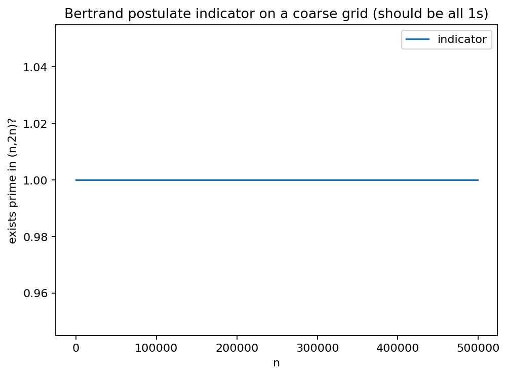
    

      <h3>E038 — Bertrand's postulate (computational verification)</h3>
      
This is a thin wrapper that follows the standard experiment template and delegates the actual computation to…

      

        number-theory
quantitative-exploration
visualization
primes
      

    

  </a>
  <a href="e039.html" class="gallery-card" data-title="E039 — Sophie Germain and safe primes" data-tags="number-theory,quantitative-exploration,visualization,primes" data-desc="This is a thin wrapper that follows the standard experiment template and delegates the actual computation to…">
    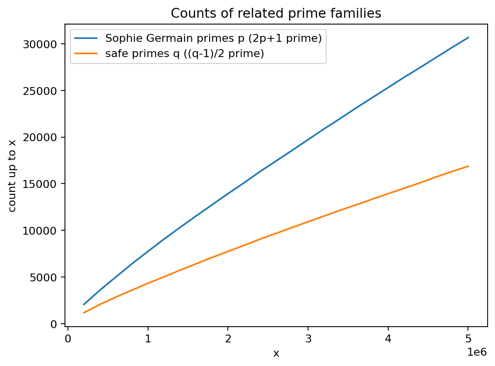
    

      <h3>E039 — Sophie Germain and safe primes</h3>
      
This is a thin wrapper that follows the standard experiment template and delegates the actual computation to…

      

        number-theory
quantitative-exploration
visualization
primes
      

    

  </a>
  <a href="e040.html" class="gallery-card" data-title="E040 — Palindromic primes and the '11 trap'" data-tags="number-theory,quantitative-exploration,visualization,primes" data-desc="This is a thin wrapper that follows the standard experiment template and delegates the actual computation to…">
    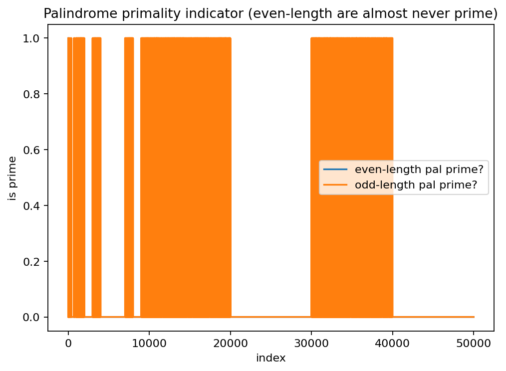
    

      <h3>E040 — Palindromic primes and the '11 trap'</h3>
      
This is a thin wrapper that follows the standard experiment template and delegates the actual computation to…

      

        number-theory
quantitative-exploration
visualization
primes
      

    

  </a>
  <a href="e041.html" class="gallery-card" data-title="E041 — Fermat numbers: not all prime" data-tags="number-theory,quantitative-exploration,visualization,primes" data-desc="This is a thin wrapper that follows the standard experiment template and delegates the actual computation to…">
    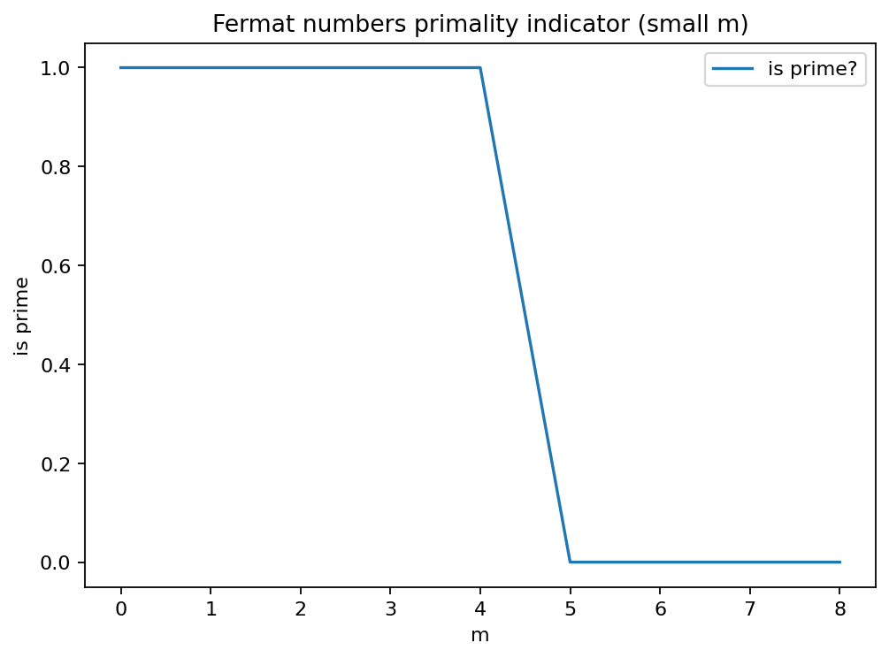
    

      <h3>E041 — Fermat numbers: not all prime</h3>
      
This is a thin wrapper that follows the standard experiment template and delegates the actual computation to…

      

        number-theory
quantitative-exploration
visualization
primes
      

    

  </a>
  <a href="e042.html" class="gallery-card" data-title="E042 — Repunit primes (small k scan)" data-tags="number-theory,quantitative-exploration,visualization,primes" data-desc="This is a thin wrapper that follows the standard experiment template and delegates the actual computation to…">
    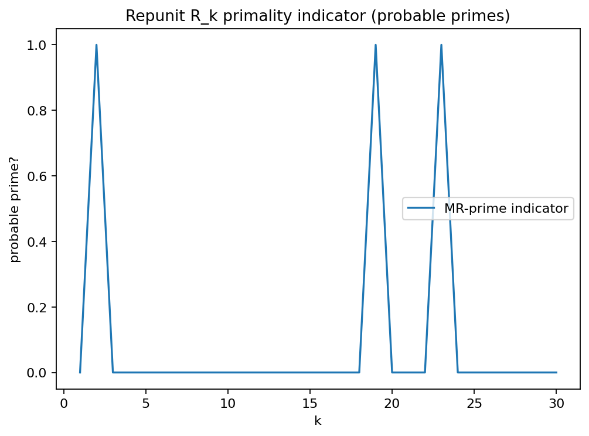
    

      <h3>E042 — Repunit primes (small k scan)</h3>
      
This is a thin wrapper that follows the standard experiment template and delegates the actual computation to…

      

        number-theory
quantitative-exploration
visualization
primes
      

    

  </a>
  <a href="e043.html" class="gallery-card" data-title="E043 — Pollard rho runtime variability" data-tags="number-theory,quantitative-exploration,visualization,primes" data-desc="This is a thin wrapper that follows the standard experiment template and delegates the actual computation to…">
    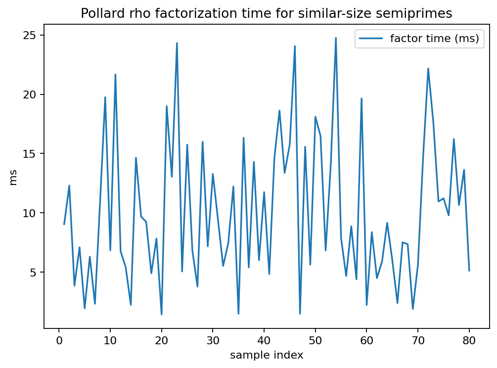
    

      <h3>E043 — Pollard rho runtime variability</h3>
      
This is a thin wrapper that follows the standard experiment template and delegates the actual computation to…

      

        number-theory
quantitative-exploration
visualization
primes
      

    

  </a>
  <a href="e044.html" class="gallery-card" data-title="E044 — Solovay–Strassen vs. Miller–Rabin (liars)" data-tags="number-theory,quantitative-exploration,visualization,miller-rabin" data-desc="This is a thin wrapper that follows the standard experiment template and delegates the actual computation to…">
    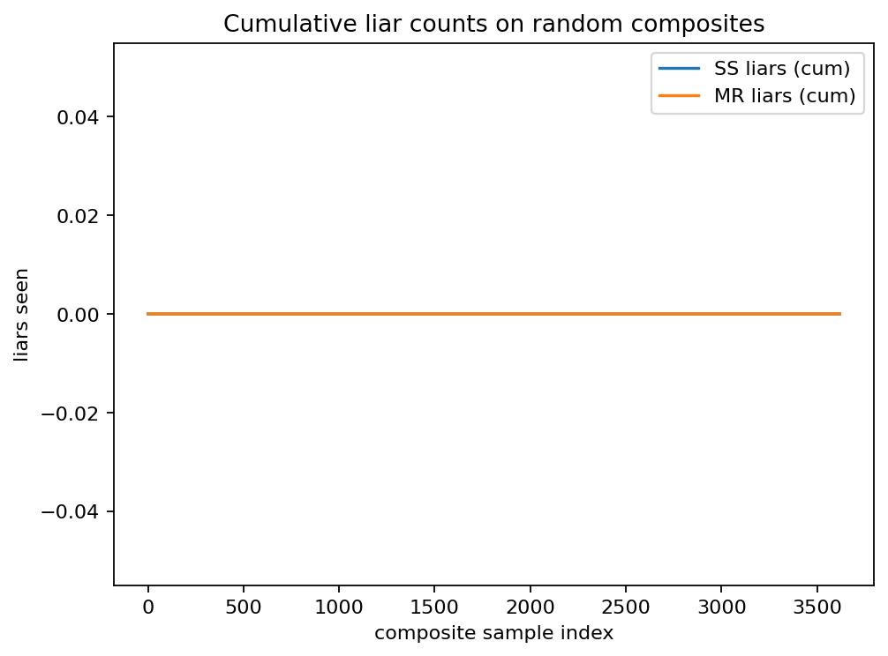
    

      <h3>E044 — Solovay–Strassen vs. Miller–Rabin (liars)</h3>
      
This is a thin wrapper that follows the standard experiment template and delegates the actual computation to…

      

        number-theory
quantitative-exploration
visualization
miller-rabin
      

    

  </a>
  <a href="e045.html" class="gallery-card" data-title="E045 — Deterministic 64-bit MR base sets" data-tags="number-theory,quantitative-exploration,visualization,primes" data-desc="This is a thin wrapper that follows the standard experiment template and delegates the actual computation to…">
    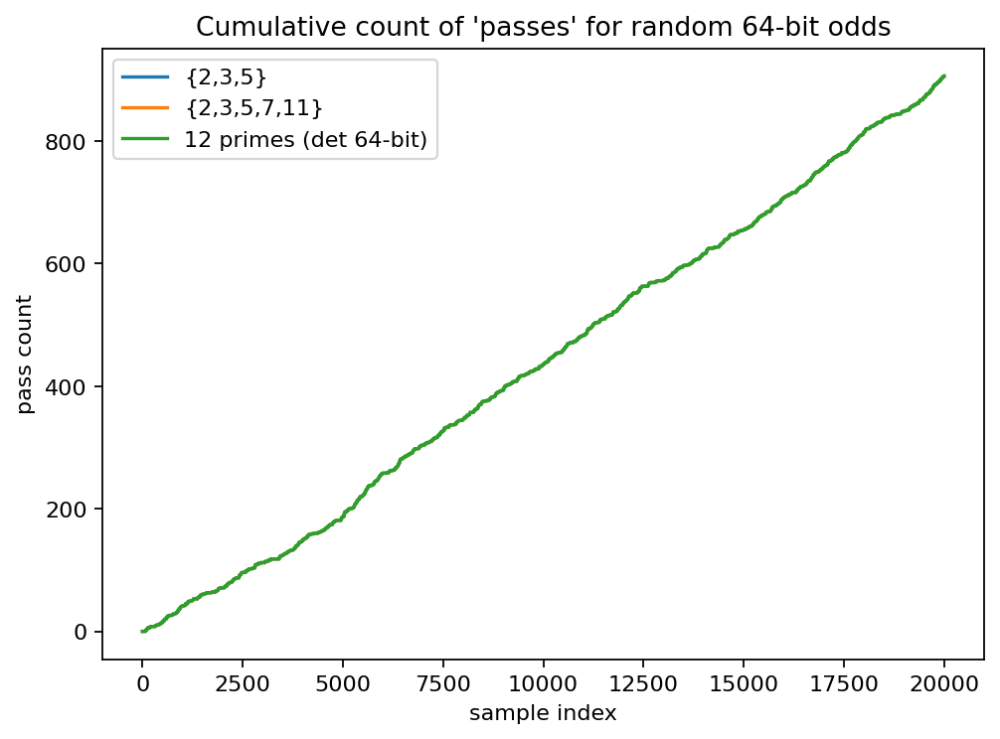
    

      <h3>E045 — Deterministic 64-bit MR base sets</h3>
      
This is a thin wrapper that follows the standard experiment template and delegates the actual computation to…

      

        number-theory
quantitative-exploration
visualization
primes
      

    

  </a>
  <a href="e046.html" class="gallery-card" data-title="E046 — Prime-testing pipeline and tuning pitfalls" data-tags="number-theory,quantitative-exploration,visualization,primes" data-desc="This is a thin wrapper that follows the standard experiment template and delegates the actual computation to…">
    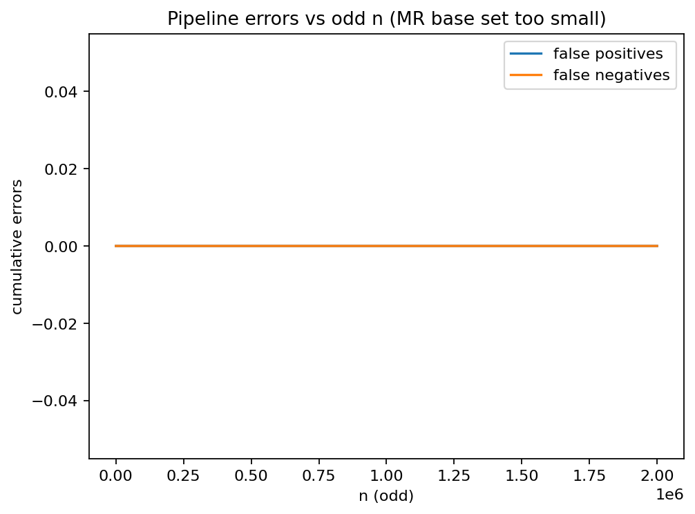
    

      <h3>E046 — Prime-testing pipeline and tuning pitfalls</h3>
      
This is a thin wrapper that follows the standard experiment template and delegates the actual computation to…

      

        number-theory
quantitative-exploration
visualization
primes
      

    

  </a>
  <a href="e047.html" class="gallery-card" data-title="E047 — Fermat numbers: Pépin test + factor witnesses" data-tags="number-theory,counterexample-search,visualization,fermat" data-desc="Pépin test classification and bounded factor search, showing the classic counterexample at F₅.">
    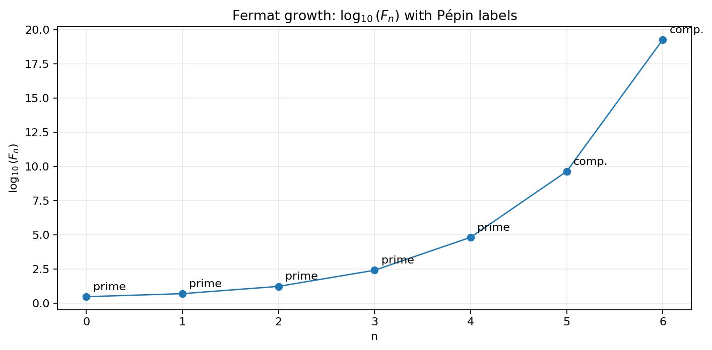
    

      <h3>E047 — Fermat numbers: Pépin test + factor witnesses</h3>
      
Pépin test classification and bounded factor search, showing the classic counterexample at F₅.

      

        number-theory
counterexample-search
visualization
fermat
      

    

  </a>
  <a href="e048.html" class="gallery-card" data-title="E048 — Carmichael numbers: Korselt scan" data-tags="number-theory,counterexample-search,quantitative-exploration,visualization,carmichael,pseudoprime" data-desc="Enumerate 3-prime-factor Carmichael numbers via Korselt’s criterion and verify Fermat-test failure modes.">
    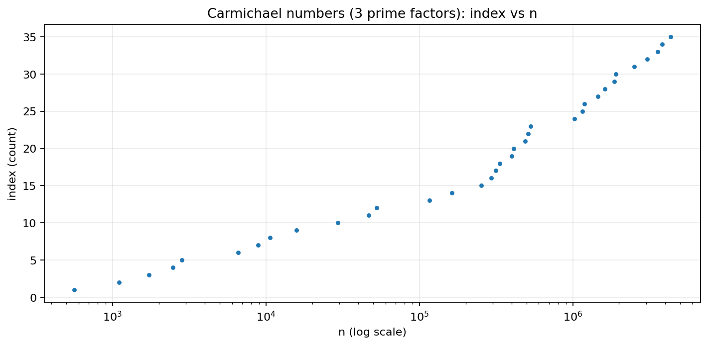
    

      <h3>E048 — Carmichael numbers: Korselt scan</h3>
      
Enumerate 3-prime-factor Carmichael numbers via Korselt’s criterion and verify Fermat-test failure modes.

      

        number-theory
counterexample-search
quantitative-exploration
visualization
carmichael
pseudoprime
      

    

  </a>
  <a href="e049.html" class="gallery-card" data-title="E049 — Wieferich primes: scan up to a bound" data-tags="number-theory,counterexample-search,visualization,wieferich" data-desc="Search for base-2 Wieferich primes and visualize the quotient-like distribution; recovers 1093 and 3511 under default bounds.">
    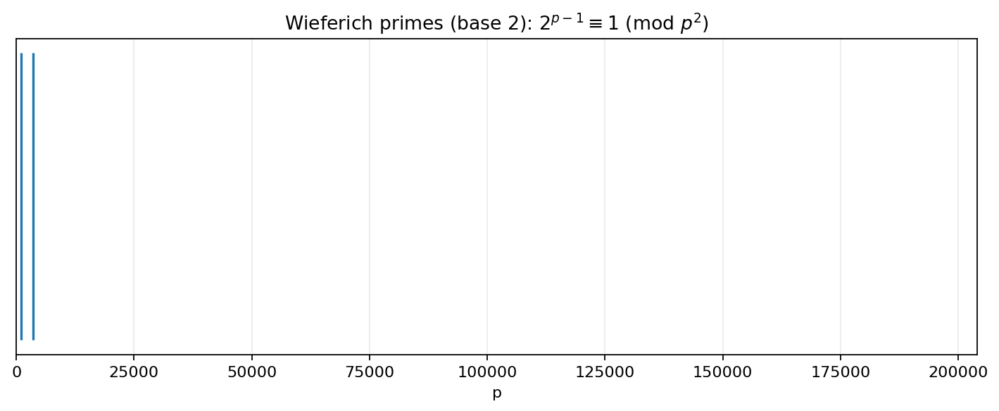
    

      <h3>E049 — Wieferich primes: scan up to a bound</h3>
      
Search for base-2 Wieferich primes and visualize the quotient-like distribution; recovers 1093 and 3511 under default bounds.

      

        number-theory
counterexample-search
visualization
wieferich
      

    

  </a>
  <a href="e050.html" class="gallery-card" data-title="E050 — Primorials: Euclid numbers p# ± 1" data-tags="number-theory,counterexample-search,quantitative-exploration,visualization,primorial" data-desc="Compute primorial ± 1 and show they are usually composite; produce small factor witnesses for early k.">
    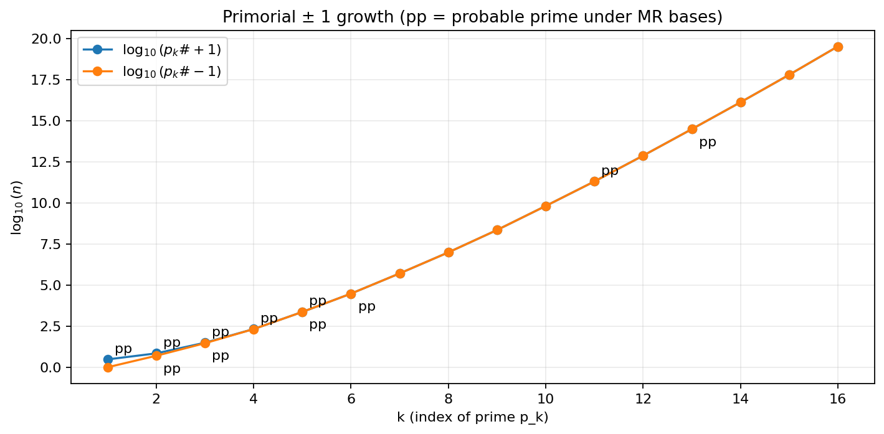
    

      <h3>E050 — Primorials: Euclid numbers p# ± 1</h3>
      
Compute primorial ± 1 and show they are usually composite; produce small factor witnesses for early k.

      

        number-theory
counterexample-search
quantitative-exploration
visualization
primorial
      

    

  </a>
  <a href="e051.html" class="gallery-card" data-title="E051 — Semiprimes: balanced vs. unbalanced factoring" data-tags="number-theory,quantitative-exploration,visualization,factorization,semiprime" data-desc="Generate small semiprimes and compare Pollard-rho factorization timings for balanced vs. unbalanced cases.">
    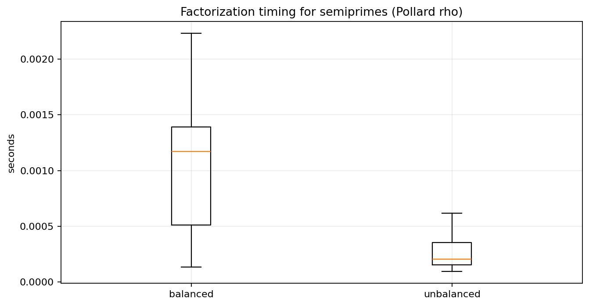
    

      <h3>E051 — Semiprimes: balanced vs. unbalanced factoring</h3>
      
Generate small semiprimes and compare Pollard-rho factorization timings for balanced vs. unbalanced cases.

      

        number-theory
quantitative-exploration
visualization
factorization
semiprime
      

    

  </a>
  <a href="e052.html" class="gallery-card" data-title="E052 — Totient ratio landscape" data-tags="number-theory,quantitative-exploration,visualization,arithmetic-functions,totient,multiplicative" data-desc="Visual structure in \varphi(n)/n and primorial effects">
  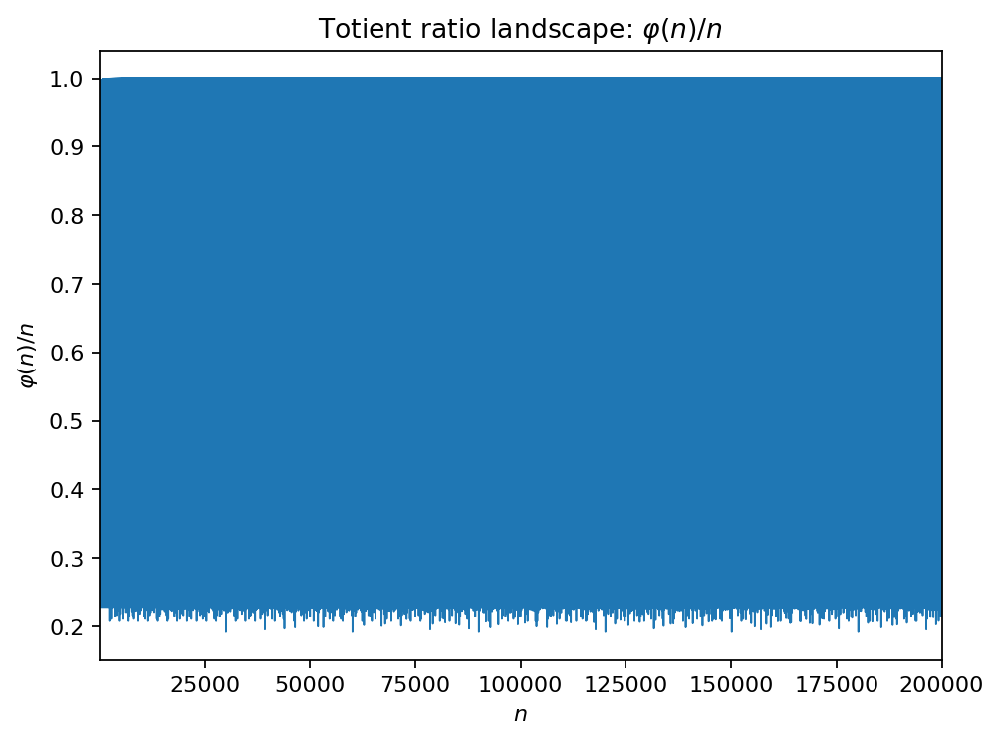
  

    <h3>E052 — Totient ratio landscape</h3>
    
Visual structure in \varphi(n)/n and primorial effects

    

      number-theory
  quantitative-exploration
  visualization
  arithmetic-functions
  totient
  multiplicative
    

  

</a>
  <a href="e053.html" class="gallery-card" data-title="E053 — Inverse totient multiplicities" data-tags="number-theory,quantitative-exploration,visualization,arithmetic-functions,totient,search" data-desc="How often does a value occur as \varphi(n)?">
  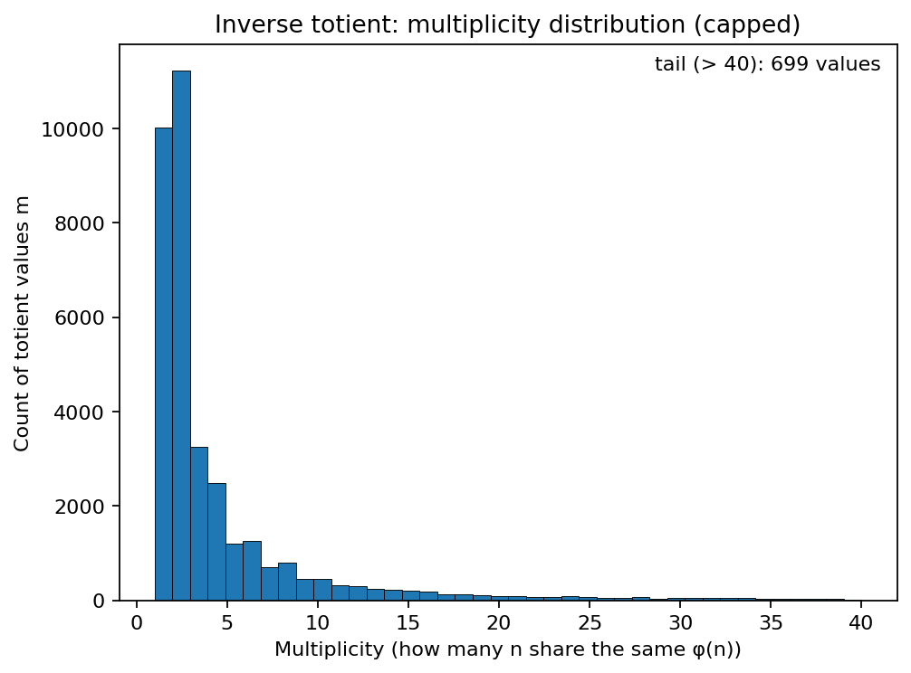
  

    <h3>E053 — Inverse totient multiplicities</h3>
    
How often does a value occur as \varphi(n)?

    

      number-theory
  quantitative-exploration
  visualization
  arithmetic-functions
  totient
  search
    

  

</a>
  <a href="e054.html" class="gallery-card" data-title="E054 — Squarefree density via Möbius" data-tags="number-theory,quantitative-exploration,visualization,arithmetic-functions,mobius,summatory" data-desc="Estimate the squarefree density using \mu(n)^2">
  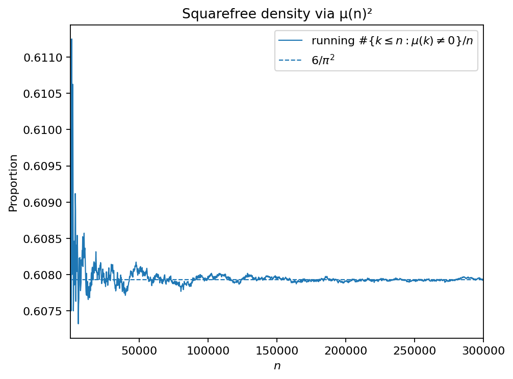
  

    <h3>E054 — Squarefree density via Möbius</h3>
    
Estimate the squarefree density using \mu(n)^2

    

      number-theory
  quantitative-exploration
  visualization
  arithmetic-functions
  mobius
  summatory
    

  

</a>
  <a href="e055.html" class="gallery-card" data-title="E055 — Mertens function walk" data-tags="number-theory,quantitative-exploration,visualization,arithmetic-functions,mobius,summatory,model-checking" data-desc="Summatory Möbius M(x)=\sum_{n\le x}\mu(n) as a random-walk-like object">
  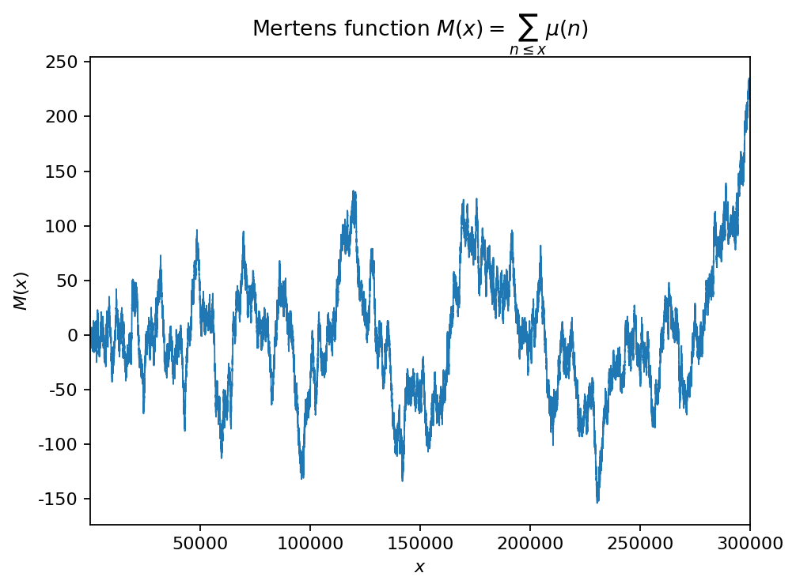
  

    <h3>E055 — Mertens function walk</h3>
    
Summatory Möbius M(x)=\sum_{n\le x}\mu(n) as a random-walk-like object

    

      number-theory
  quantitative-exploration
  visualization
  arithmetic-functions
  mobius
  summatory
  model-checking
    

  

</a>
  <a href="e056.html" class="gallery-card" data-title="E056 — Liouville vs. Möbius walks" data-tags="number-theory,quantitative-exploration,visualization,arithmetic-functions,summatory,liouville,mobius" data-desc="Compare summatory \lambda(n) and \mu(n)">
  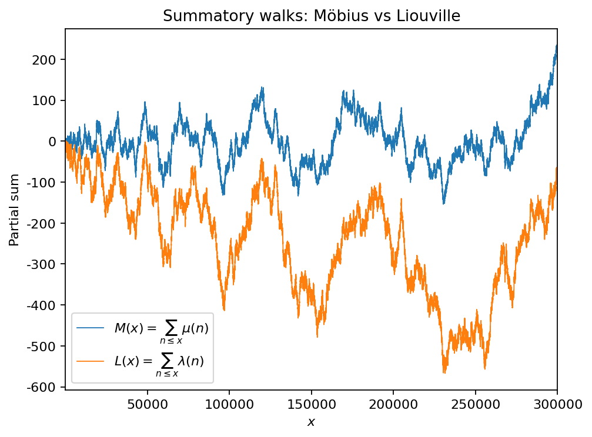
  

    <h3>E056 — Liouville vs. Möbius walks</h3>
    
Compare summatory \lambda(n) and \mu(n)

    

      number-theory
  quantitative-exploration
  visualization
  arithmetic-functions
  summatory
  liouville
  mobius
    

  

</a>
  <a href="e057.html" class="gallery-card" data-title="E057 — Erdős–Kac in practice" data-tags="number-theory,quantitative-exploration,visualization,arithmetic-functions,omega,heuristics" data-desc="Histogram of \Omega(n) and normal approximation">
  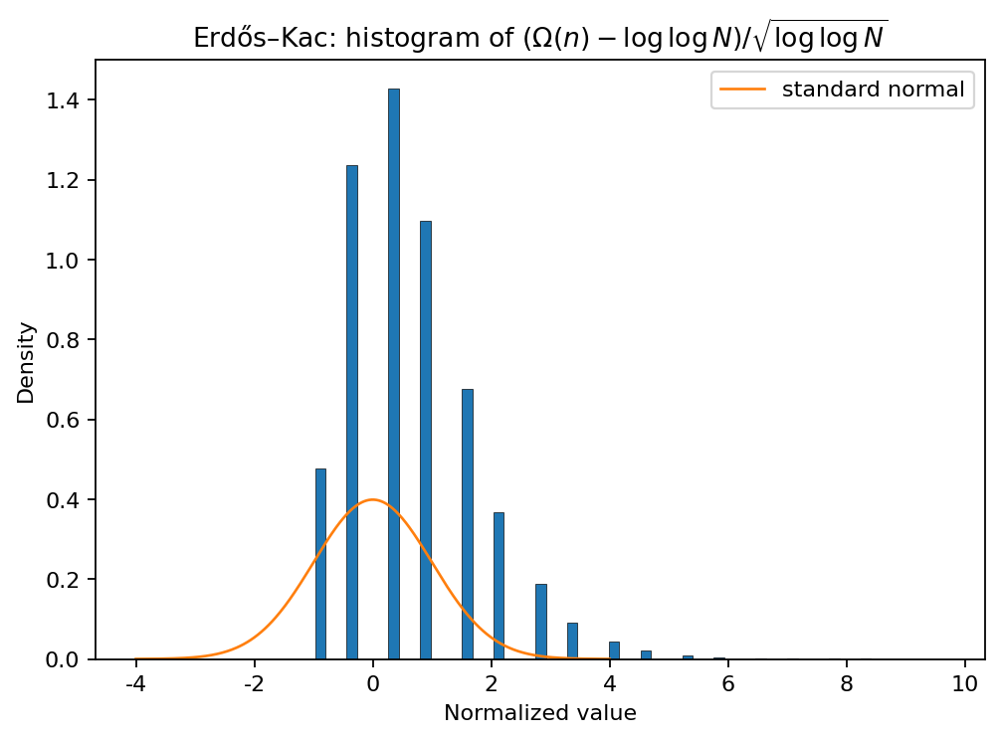
  

    <h3>E057 — Erdős–Kac in practice</h3>
    
Histogram of \Omega(n) and normal approximation

    

      number-theory
  quantitative-exploration
  visualization
  arithmetic-functions
  omega
  heuristics
    

  

</a>
  <a href="e058.html" class="gallery-card" data-title="E058 — Divisor-count record highs" data-tags="number-theory,quantitative-exploration,visualization,arithmetic-functions,divisor-function,bounds" data-desc="Record values of \tau(n) and highly composite behavior">
  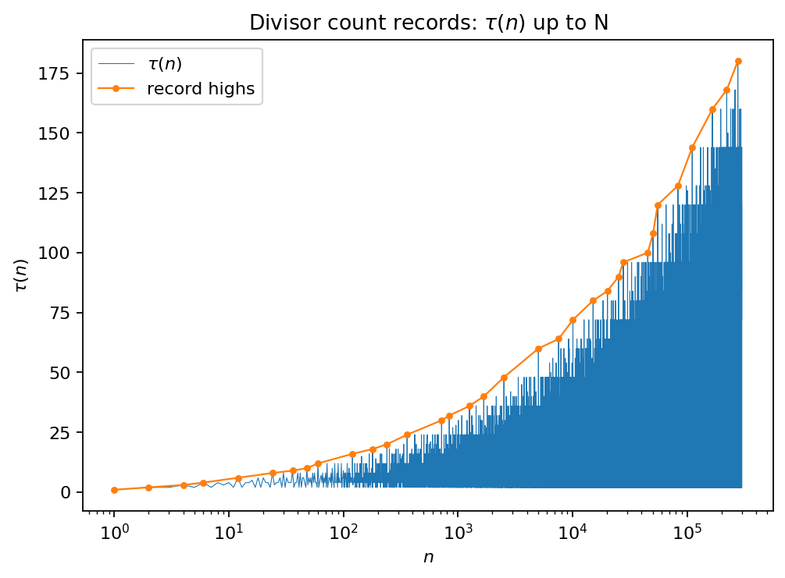
  

    <h3>E058 — Divisor-count record highs</h3>
    
Record values of \tau(n) and highly composite behavior

    

      number-theory
  quantitative-exploration
  visualization
  arithmetic-functions
  divisor-function
  bounds
    

  

</a>
  <a href="e059.html" class="gallery-card" data-title="E059 — Abundancy index landscape" data-tags="number-theory,quantitative-exploration,visualization,arithmetic-functions,sigma,divisor-function,perfect" data-desc="Plot \sigma(n)/n and connect to perfect / abundant numbers">
  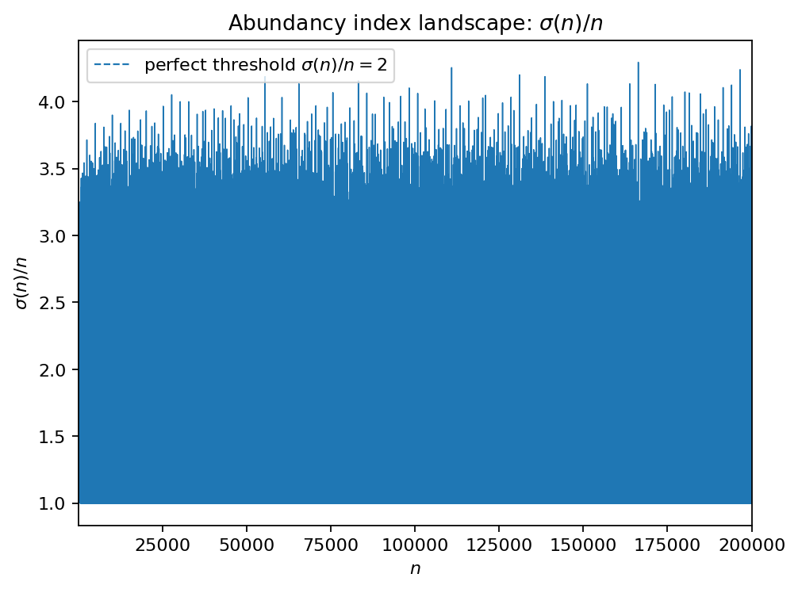
  

    <h3>E059 — Abundancy index landscape</h3>
    
Plot \sigma(n)/n and connect to perfect / abundant numbers

    

      number-theory
  quantitative-exploration
  visualization
  arithmetic-functions
  sigma
  divisor-function
  perfect
    

  

</a>
  <a href="e060.html" class="gallery-card" data-title="E060 — Jordan totients" data-tags="number-theory,quantitative-exploration,visualization,arithmetic-functions,totient,multiplicative" data-desc="Normalize J_k(n) by n^k for small k">
  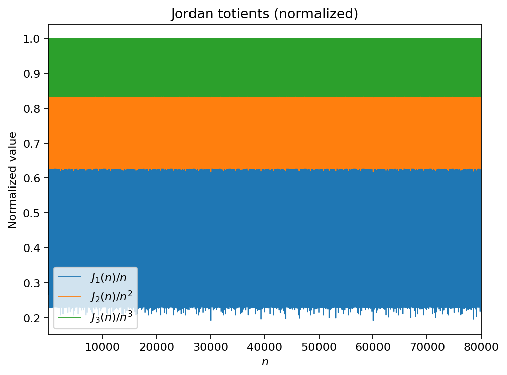
  

    <h3>E060 — Jordan totients</h3>
    
Normalize J_k(n) by n^k for small k

    

      number-theory
  quantitative-exploration
  visualization
  arithmetic-functions
  totient
  multiplicative
    

  

</a>
  <a href="e061.html" class="gallery-card" data-title="E061 — Chebyshev ψ(x) and prime powers" data-tags="number-theory,quantitative-exploration,visualization,arithmetic-functions,mangoldt,pnt,summatory" data-desc="Compute \psi(x)=\sum_{n\le x}\Lambda(n) and compare to x">
  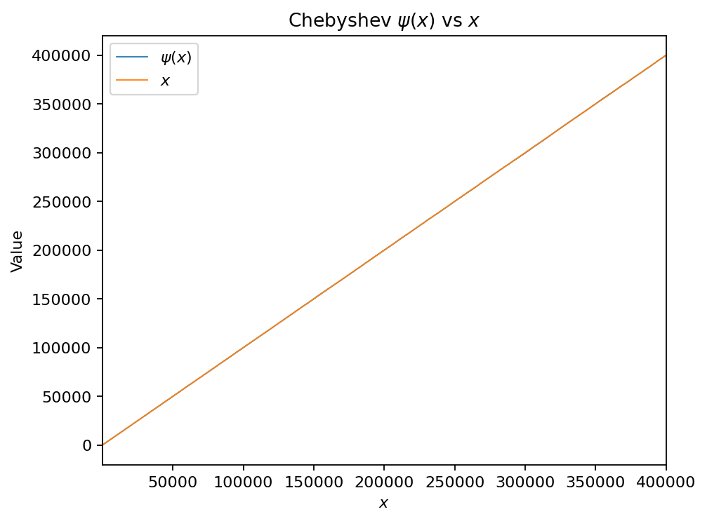
  

    <h3>E061 — Chebyshev ψ(x) and prime powers</h3>
    
Compute \psi(x)=\sum_{n\le x}\Lambda(n) and compare to x

    

      number-theory
  quantitative-exploration
  visualization
  arithmetic-functions
  mangoldt
  pnt
  summatory
    

  

</a>
  <a href="e062.html" class="gallery-card" data-title="E062 — Carmichael λ(n) vs. φ(n)" data-tags="number-theory,quantitative-exploration,visualization,arithmetic-functions,carmichael-lambda,totient" data-desc="Compare λ(n) and φ(n) via ratios and distributions">
  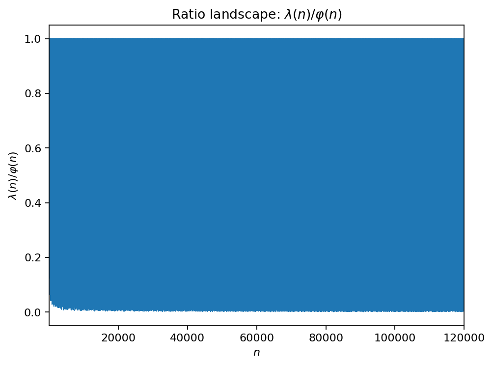
  

    <h3>E062 — Carmichael λ(n) vs. φ(n)</h3>
    
Compare λ(n) and φ(n) via ratios and distributions

    

      number-theory
  quantitative-exploration
  visualization
  arithmetic-functions
  carmichael-lambda
  totient
    

  

</a>
  <a href="e063.html" class="gallery-card" data-title="E063 — Dirichlet convolution playground" data-tags="number-theory,quantitative-exploration,visualization,arithmetic-functions,dirichlet-convolution,model-checking" data-desc="Validate classic identities like \mu*1=\varepsilon and \mu*\mathrm{id}=\varphi">
  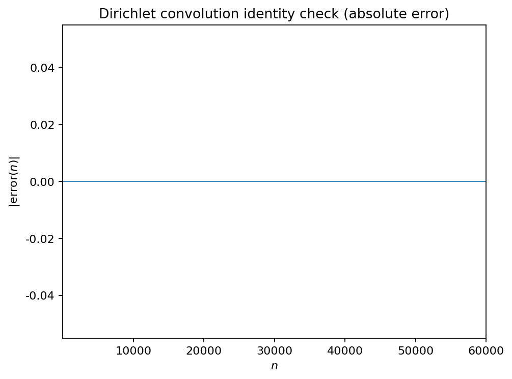
  

    <h3>E063 — Dirichlet convolution playground</h3>
    
Validate classic identities like \mu*1=\varepsilon and \mu*\mathrm{id}=\varphi

    

      number-theory
  quantitative-exploration
  visualization
  arithmetic-functions
  dirichlet-convolution
  model-checking
    

  

</a>
  <a href="e064.html" class="gallery-card" data-title="E064 — Dirichlet character tables (phase view)" data-tags="number-theory,quantitative-exploration,visualization,dirichlet-characters" data-desc="Enumerate Dirichlet characters modulo a small q and visualize character values on residues a=0..q-1.">
    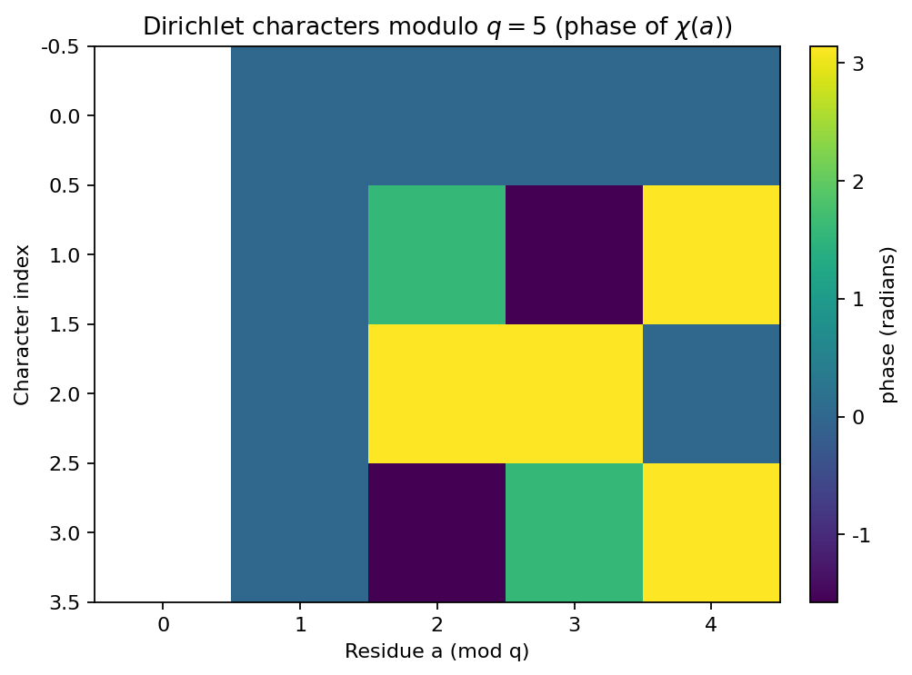
    

      <h3>E064 — Dirichlet character tables (phase view)</h3>
      
Enumerate Dirichlet characters modulo a small q and visualize character values on residues a=0..q-1.

      

        number-theory
        quantitative-exploration
        visualization
        dirichlet-characters
      

    

  </a>
  <a href="e065.html" class="gallery-card" data-title="E065 — Orthogonality matrix for Dirichlet characters" data-tags="number-theory,quantitative-exploration,visualization,dirichlet-characters" data-desc="Compute the character inner-product matrix modulo q and visualize orthogonality errors.">
    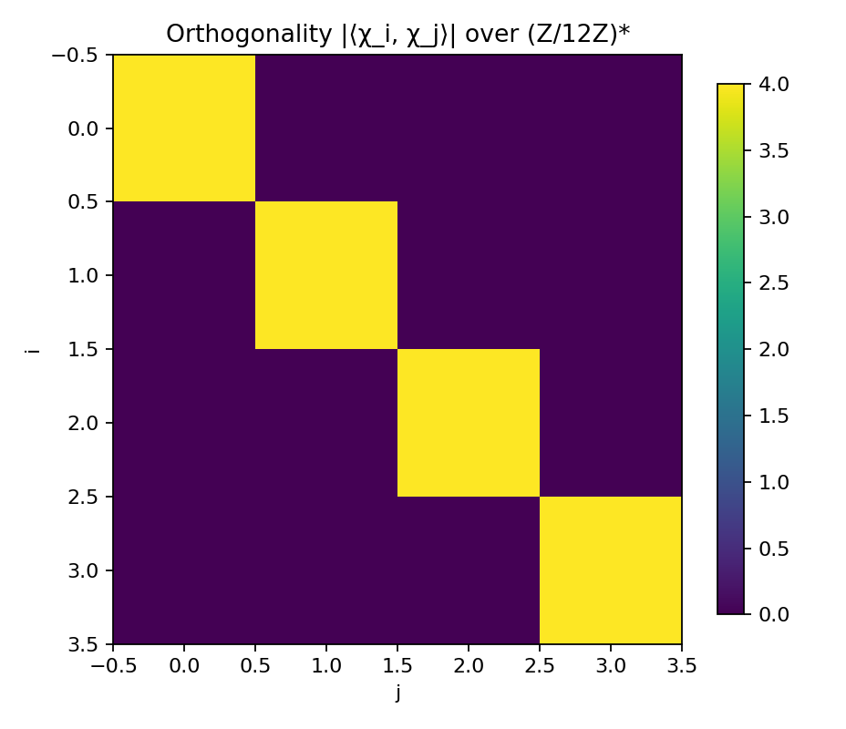
    

      <h3>E065 — Orthogonality matrix for Dirichlet characters</h3>
      
Compute the character inner-product matrix modulo q and visualize orthogonality errors.

      

        number-theory
        quantitative-exploration
        visualization
        dirichlet-characters
      

    

  </a>
  <a href="e066.html" class="gallery-card" data-title="E066 — Character partial sums: cancellation profiles" data-tags="number-theory,quantitative-exploration,visualization,dirichlet-characters" data-desc="Study partial sums S(N)=sum_{n&lt;=N} chi(n) and measure maximum growth for small moduli.">
    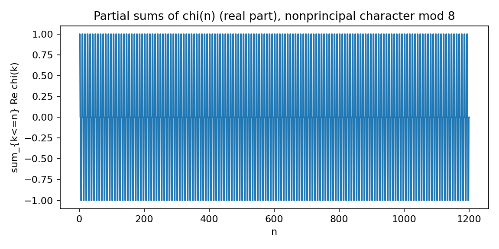
    

      <h3>E066 — Character partial sums: cancellation profiles</h3>
      
Study partial sums S(N)=sum_{n&lt;=N} chi(n) and measure maximum growth for small moduli.

      

        number-theory
        quantitative-exploration
        visualization
        dirichlet-characters
      

    

  </a>
  <a href="e067.html" class="gallery-card" data-title="E067 — Gauss sums: magnitude vs. sqrt(q)" data-tags="number-theory,quantitative-exploration,visualization,dirichlet-characters" data-desc="Compute Gauss sums for characters modulo q and compare magnitudes to sqrt(q).">
    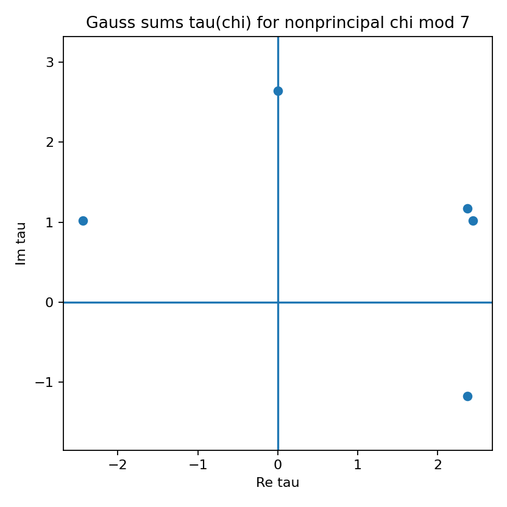
    

      <h3>E067 — Gauss sums: magnitude vs. sqrt(q)</h3>
      
Compute Gauss sums for characters modulo q and compare magnitudes to sqrt(q).

      

        number-theory
        quantitative-exploration
        visualization
        dirichlet-characters
      

    

  </a>
  <a href="e068.html" class="gallery-card" data-title="E068 — Dirichlet L(s,chi): series vs. Euler product" data-tags="number-theory,quantitative-exploration,visualization,dirichlet-characters,l-functions" data-desc="For Re(s)&gt;1, compare partial Dirichlet series and partial Euler products for L(s,chi).">
    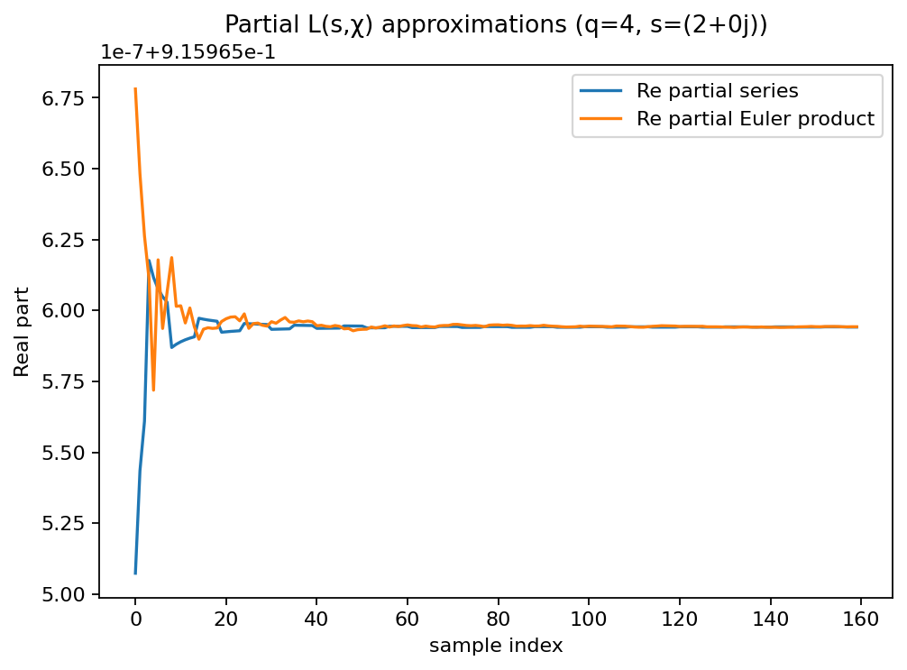
    

      <h3>E068 — Dirichlet L(s,chi): series vs. Euler product</h3>
      
For Re(s)&gt;1, compare partial Dirichlet series and partial Euler products for L(s,chi).

      

        number-theory
        quantitative-exploration
        visualization
        dirichlet-characters
        l-functions
      

    

  </a>
  <a href="e069.html" class="gallery-card" data-title="E069 — L(1,chi): slow convergence and smoothing" data-tags="number-theory,quantitative-exploration,visualization,dirichlet-characters,l-functions" data-desc="Investigate slow convergence near s=1 and compare naive partial sums to smoothed/accelerated variants.">
    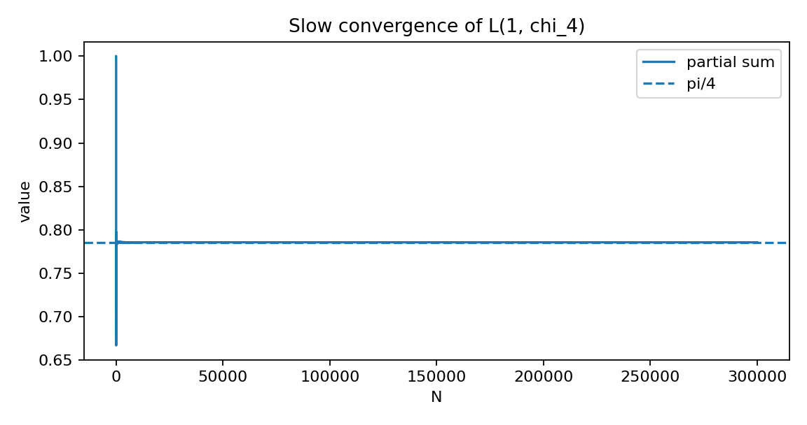
    

      <h3>E069 — L(1,chi): slow convergence and smoothing</h3>
      
Investigate slow convergence near s=1 and compare naive partial sums to smoothed/accelerated variants.

      

        number-theory
        quantitative-exploration
        visualization
        dirichlet-characters
        l-functions
      

    

  </a>
  <a href="e070.html" class="gallery-card" data-title="E070 — Primes in residue classes: pi(x; q, a)" data-tags="number-theory,quantitative-exploration,visualization,aps" data-desc="Count primes in selected reduced residue classes modulo q and compare class-to-class differences.">
    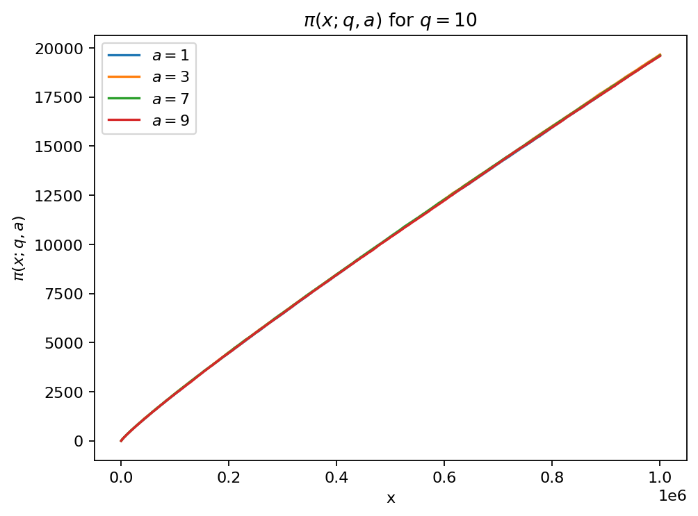
    

      <h3>E070 — Primes in residue classes: pi(x; q, a)</h3>
      
Count primes in selected reduced residue classes modulo q and compare class-to-class differences.

      

        number-theory
        quantitative-exploration
        visualization
        aps
      

    

  </a>
  <a href="e071.html" class="gallery-card" data-title="E071 — PNT(AP) numerics: pi(x;q,a) minus Li(x)/phi(q)" data-tags="number-theory,quantitative-exploration,visualization,aps" data-desc="Compare prime counts in arithmetic progressions to the PNT(AP) main term Li(x)/phi(q).">
    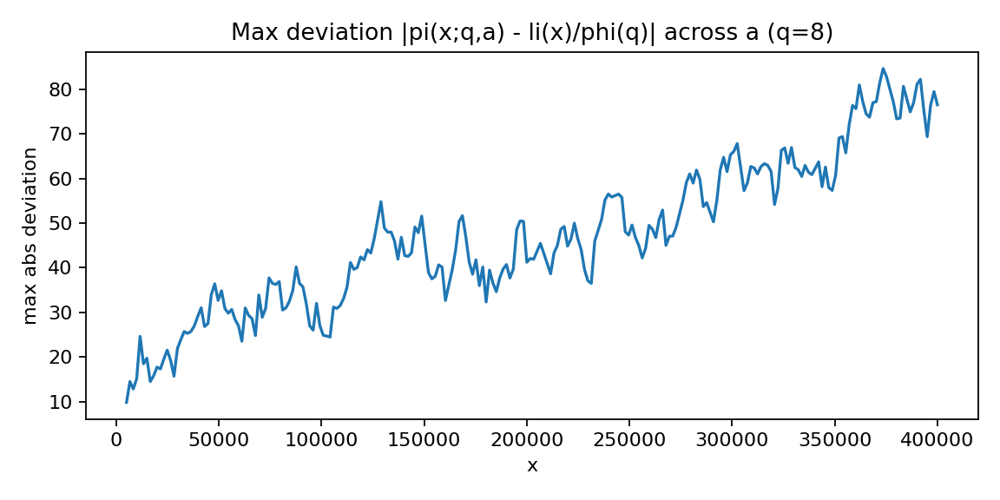
    

      <h3>E071 — PNT(AP) numerics: pi(x;q,a) minus Li(x)/phi(q)</h3>
      
Compare prime counts in arithmetic progressions to the PNT(AP) main term Li(x)/phi(q).

      

        number-theory
        quantitative-exploration
        visualization
        aps
      

    

  </a>
  <a href="e072.html" class="gallery-card" data-title="E072 — Prime race mod 4: pi(x;4,3) vs. pi(x;4,1)" data-tags="number-theory,quantitative-exploration,visualization,prime-races,aps" data-desc="Track the classic mod-4 prime race and visualize the running lead and sign changes.">
    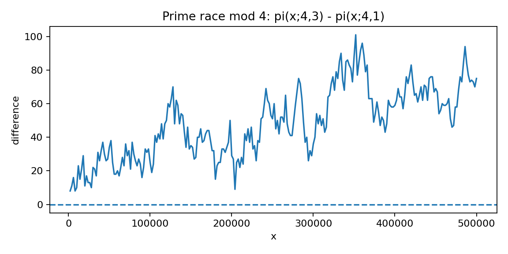
    

      <h3>E072 — Prime race mod 4: pi(x;4,3) vs. pi(x;4,1)</h3>
      
Track the classic mod-4 prime race and visualize the running lead and sign changes.

      

        number-theory
        quantitative-exploration
        visualization
        prime-races
        aps
      

    

  </a>
  <a href="e073.html" class="gallery-card" data-title="E073 — Prime race mod 3: pi(x;3,2) vs. pi(x;3,1)" data-tags="number-theory,quantitative-exploration,visualization,prime-races,aps" data-desc="Compare the two reduced residue classes modulo 3 and study lead changes over x.">
    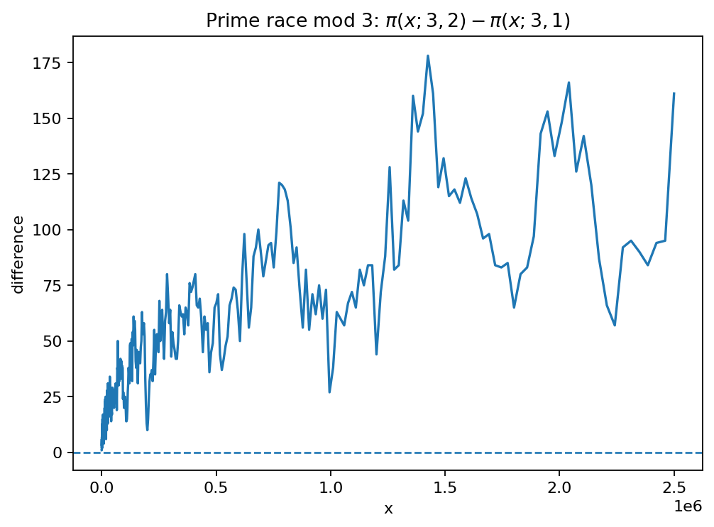
    

      <h3>E073 — Prime race mod 3: pi(x;3,2) vs. pi(x;3,1)</h3>
      
Compare the two reduced residue classes modulo 3 and study lead changes over x.

      

        number-theory
        quantitative-exploration
        visualization
        prime-races
        aps
      

    

  </a>
  <a href="e074.html" class="gallery-card" data-title="E074 — Prime race mod 8: leaderboard among 1,3,5,7" data-tags="number-theory,quantitative-exploration,visualization,prime-races,aps" data-desc="Track four residue classes modulo 8 and visualize which class leads most often.">
    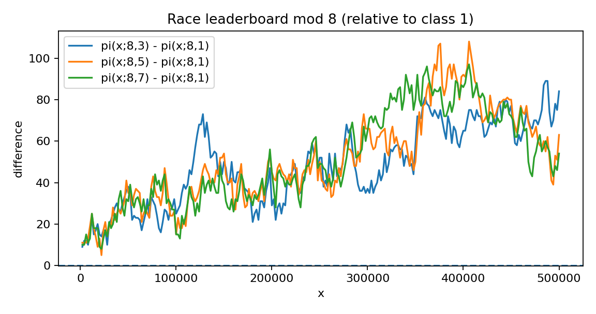
    

      <h3>E074 — Prime race mod 8: leaderboard among 1,3,5,7</h3>
      
Track four residue classes modulo 8 and visualize which class leads most often.

      

        number-theory
        quantitative-exploration
        visualization
        prime-races
        aps
      

    

  </a>
  <a href="e075.html" class="gallery-card" data-title="E075 — Prime race statistic: distribution on a log-grid" data-tags="number-theory,quantitative-exploration,visualization,prime-races,aps" data-desc="Study a normalized race statistic on a log-grid and compare its empirical distribution to heuristics.">
    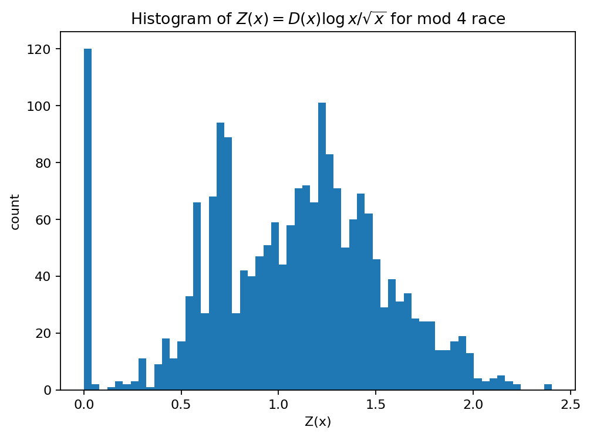
    

      <h3>E075 — Prime race statistic: distribution on a log-grid</h3>
      
Study a normalized race statistic on a log-grid and compare its empirical distribution to heuristics.

      

        number-theory
        quantitative-exploration
        visualization
        prime-races
        aps
      

    

  </a>
  <a href="e076.html" class="gallery-card" data-title="E076 — Chebyshev theta(x;q,a): weighted prime counts" data-tags="number-theory,quantitative-exploration,visualization,prime-races,aps" data-desc="Compute theta(x;q,a) for residue classes and compare growth and fluctuations across classes.">
    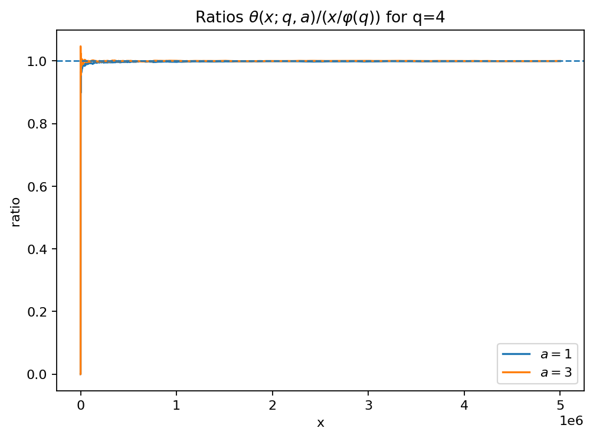
    

      <h3>E076 — Chebyshev theta(x;q,a): weighted prime counts</h3>
      
Compute theta(x;q,a) for residue classes and compare growth and fluctuations across classes.

      

        number-theory
        quantitative-exploration
        visualization
        prime-races
        aps
      

    

  </a>
  <a href="e077.html" class="gallery-card" data-title="E077 — Indicator via character orthogonality (sanity check)" data-tags="number-theory,quantitative-exploration,visualization,dirichlet-characters" data-desc="Use character orthogonality to express an indicator of a residue class and verify numerically.">
    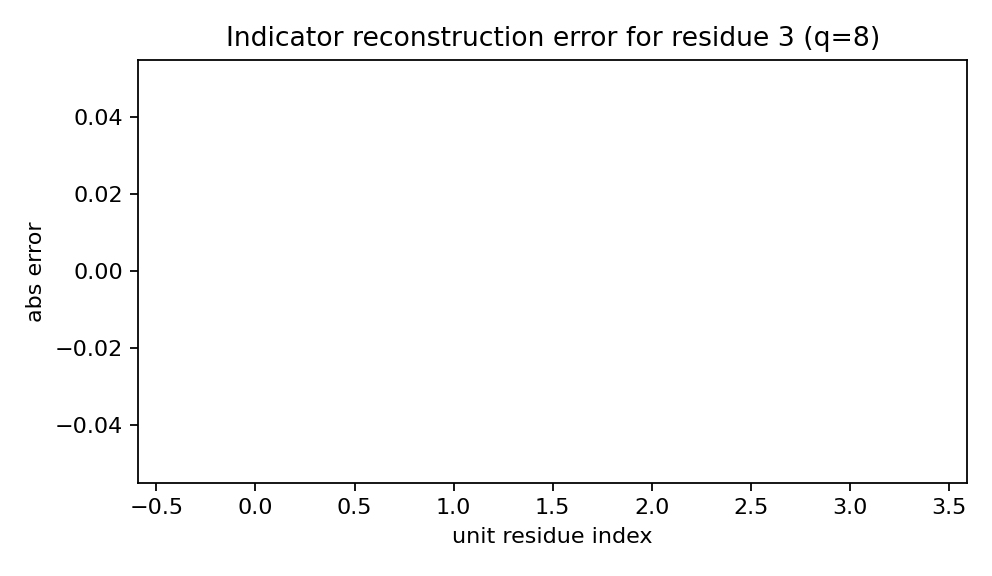
    

      <h3>E077 — Indicator via character orthogonality (sanity check)</h3>
      
Use character orthogonality to express an indicator of a residue class and verify numerically.

      

        number-theory
        quantitative-exploration
        visualization
        dirichlet-characters
      

    

  </a>
  <a href="e078.html" class="gallery-card" data-title="E078 — Max partial sums across characters" data-tags="number-theory,quantitative-exploration,visualization,dirichlet-characters" data-desc="For each character modulo q, compute max_{1&lt;=N&lt;=Nmax} |S(N)| and compare across the character table.">
    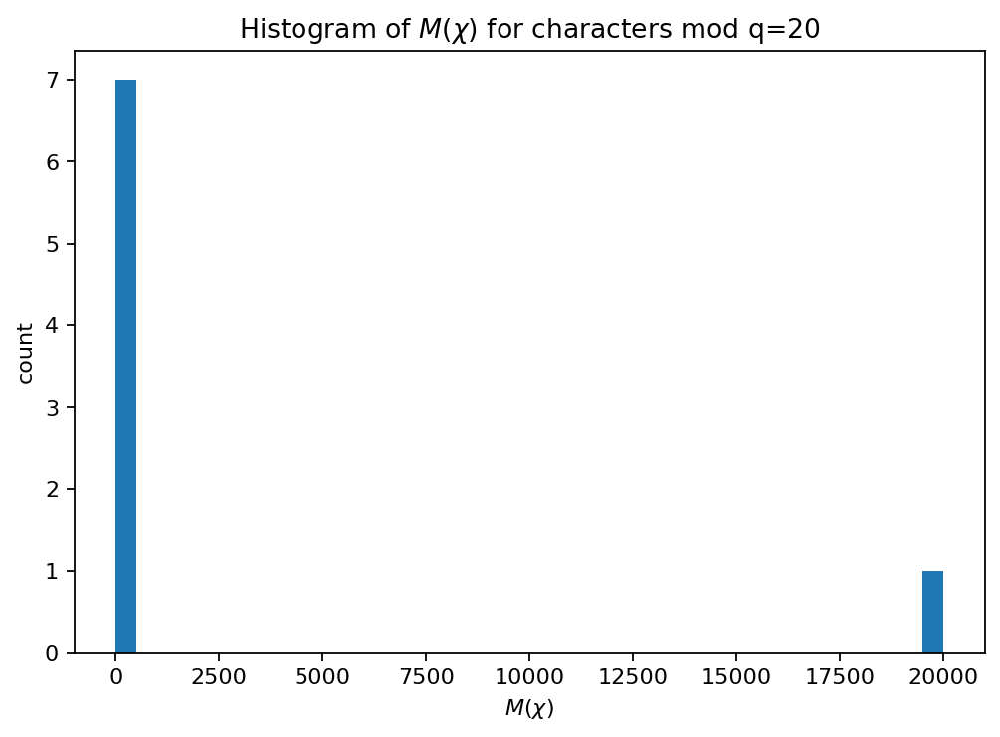
    

      <h3>E078 — Max partial sums across characters</h3>
      
For each character modulo q, compute max_{1&lt;=N&lt;=Nmax} |S(N)| and compare across the character table.

      

        number-theory
        quantitative-exploration
        visualization
        dirichlet-characters
      

    

  </a>
  <a href="e079.html" class="gallery-card" data-title="E079 — Primitive vs. imprimitive characters: conductors" data-tags="number-theory,quantitative-exploration,visualization,dirichlet-characters" data-desc="Classify characters by conductor (smallest modulus they factor through) and visualize primitive vs. imprimitive structure.">
    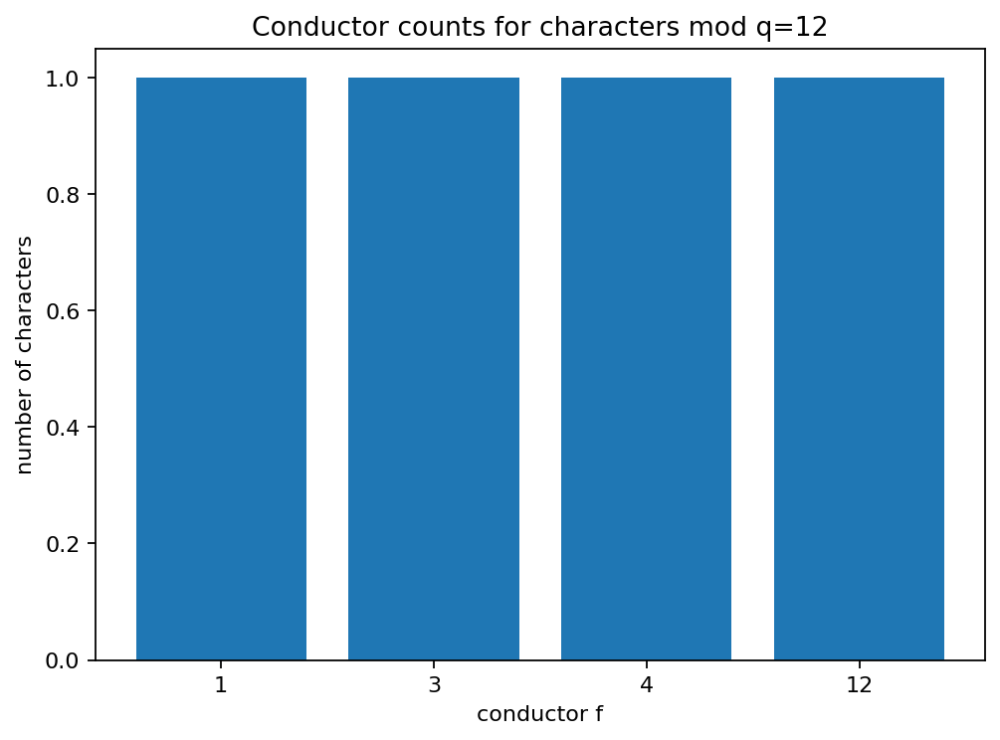
    

      <h3>E079 — Primitive vs. imprimitive characters: conductors</h3>
      
Classify characters by conductor (smallest modulus they factor through) and visualize primitive vs. imprimitive structure.

      

        number-theory
        quantitative-exploration
        visualization
        dirichlet-characters
      

    

  </a>
  <a href="e080.html" class="gallery-card" data-title="E080 — Chebyshev bias: leader fraction vs. x" data-tags="number-theory,quantitative-exploration,visualization,prime-races" data-desc="For a prime race difference D(x), compute the fraction of x where D(x)&gt;0 and visualize bias as x grows.">
    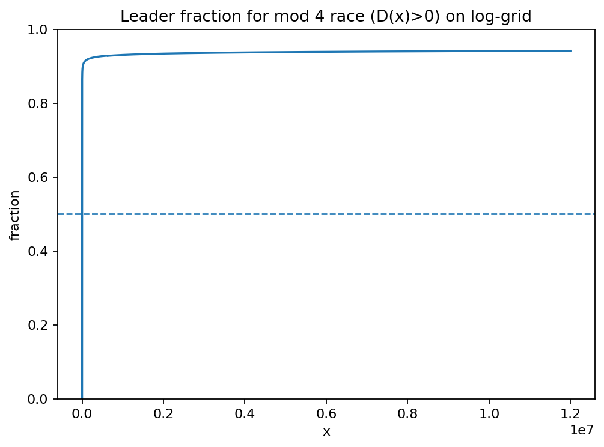
    

      <h3>E080 — Chebyshev bias: leader fraction vs. x</h3>
      
For a prime race difference D(x), compute the fraction of x where D(x)&gt;0 and visualize bias as x grows.

      

        number-theory
        quantitative-exploration
        visualization
        prime-races
      

    

  </a>
  <a href="e081.html" class="gallery-card" data-title="E081 — Prime race sign changes: first crossings table" data-tags="number-theory,quantitative-exploration,visualization,prime-races" data-desc="Track sign changes of a prime race difference D(x) and record early crossing points in a compact table.">
    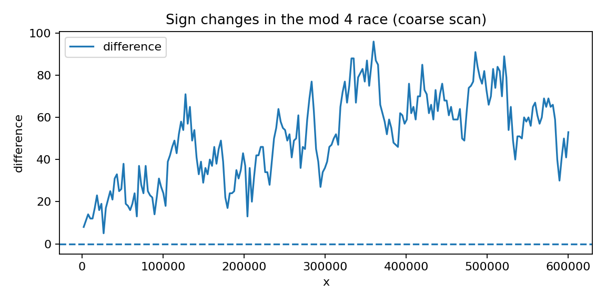
    

      <h3>E081 — Prime race sign changes: first crossings table</h3>
      
Track sign changes of a prime race difference D(x) and record early crossing points in a compact table.

      

        number-theory
        quantitative-exploration
        visualization
        prime-races
      

    

  </a>

  <a href="e082.html" class="gallery-card" data-title="E082 — Zeta(s) series convergence" data-tags="analysis,quantitative-exploration,visualization,riemann-zeta,numerics" data-desc="Compare partial sums of the Dirichlet series for ζ(s) across regions of the complex plane.">
    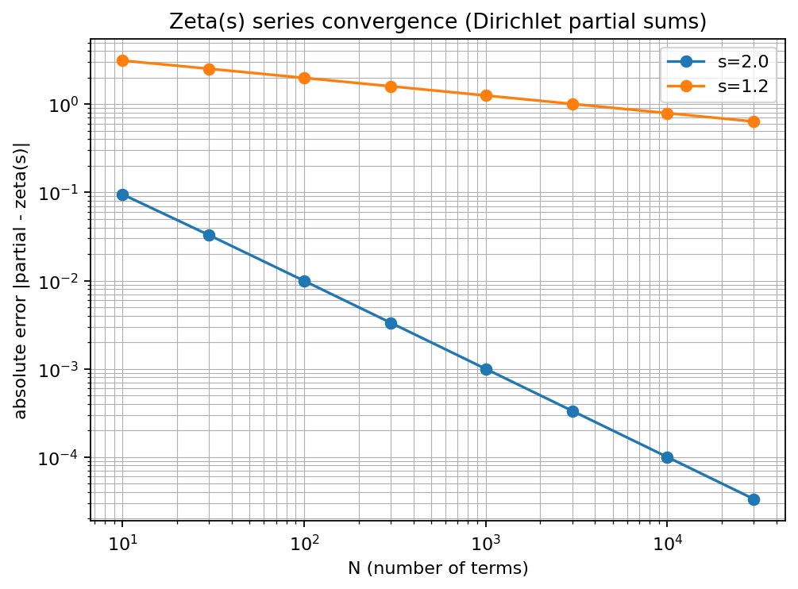
    

      <h3>E082 — Zeta(s) series convergence</h3>
      
Compare partial sums of the Dirichlet series for ζ(s) across regions of the complex plane.

      

        analysis
        quantitative-exploration
        visualization
        riemann-zeta
        numerics
      

    

  </a>

  <a href="e083.html" class="gallery-card" data-title="E083 — Series vs. Euler product (ζ)" data-tags="analysis,quantitative-exploration,visualization,riemann-zeta,numerics" data-desc="Numerically compare ζ(s) via truncated Dirichlet series versus truncated Euler product.">
    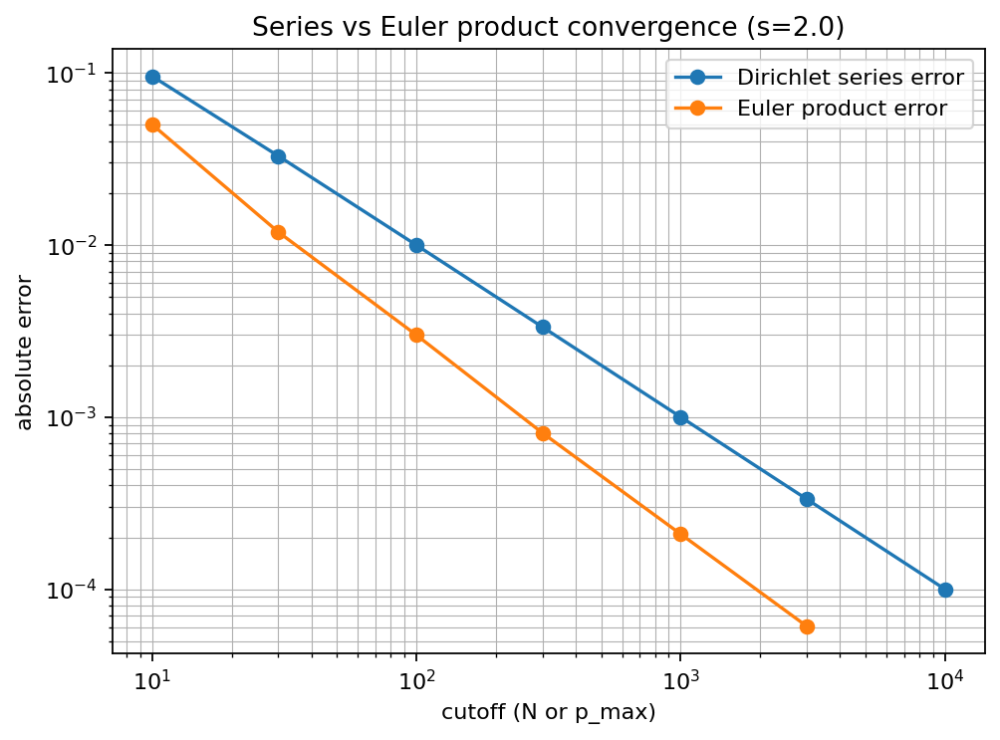
    

      <h3>E083 — Series vs. Euler product (ζ)</h3>
      
Numerically compare ζ(s) via truncated Dirichlet series versus truncated Euler product.

      

        analysis
        quantitative-exploration
        visualization
        riemann-zeta
        numerics
      

    

  </a>

  <a href="e084.html" class="gallery-card" data-title="E084 — |ζ(1/2+it)| growth snapshots" data-tags="analysis,quantitative-exploration,visualization,riemann-zeta,critical-line,numerics" data-desc="Sample magnitudes of ζ(1/2+it) to visualize typical size variations along the critical line.">
    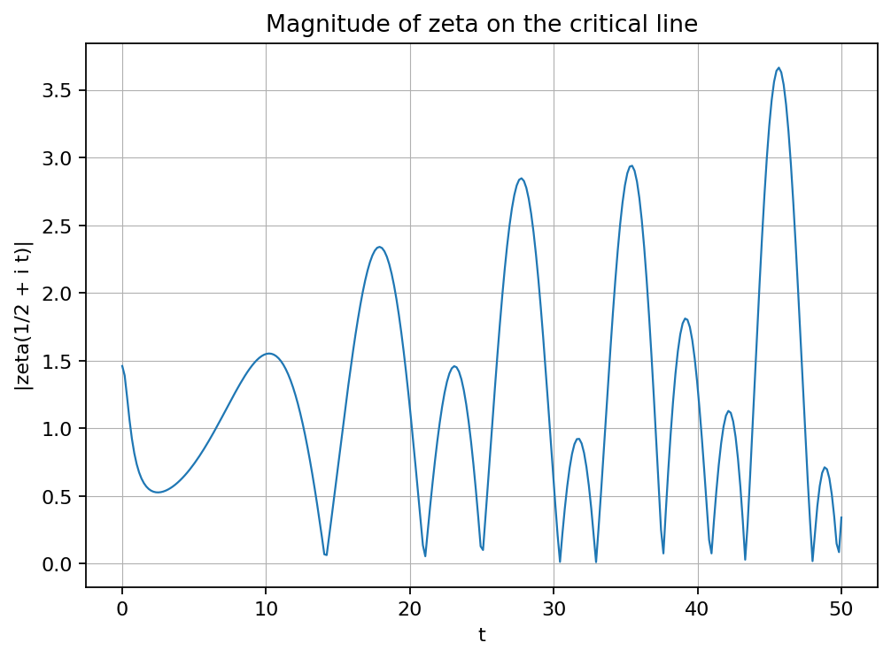
    

      <h3>E084 — |ζ(1/2+it)| growth snapshots</h3>
      
Sample magnitudes of ζ(1/2+it) to visualize typical size variations along the critical line.

      

        analysis
        quantitative-exploration
        visualization
        riemann-zeta
        critical-line
        numerics
      

    

  </a>

  <a href="e085.html" class="gallery-card" data-title="E085 — Dirichlet eta acceleration for ζ(s)" data-tags="analysis,quantitative-exploration,visualization,riemann-zeta,numerics" data-desc="Use the alternating η(s) series to evaluate ζ(s) in Re(s)&gt;0 and compare truncation errors.">
    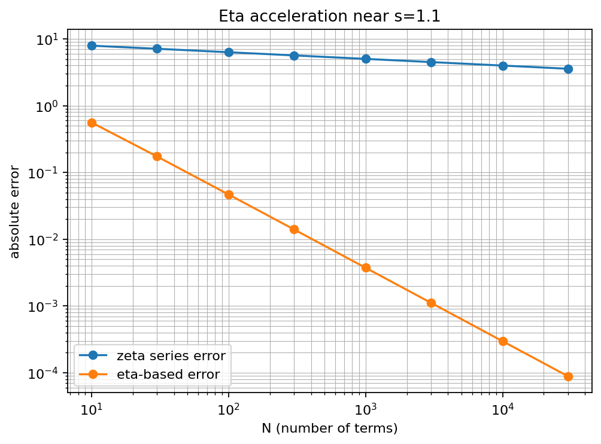
    

      <h3>E085 — Dirichlet eta acceleration for ζ(s)</h3>
      
Use the alternating η(s) series to evaluate ζ(s) in Re(s)&gt;0 and compare truncation errors.

      

        analysis
        quantitative-exploration
        visualization
        riemann-zeta
        numerics
      

    

  </a>

  <a href="e086.html" class="gallery-card" data-title="E086 — Hardy Z(t) near zeros" data-tags="analysis,quantitative-exploration,visualization,riemann-zeta,zeta-zeros,critical-line,numerics" data-desc="Plot Hardy’s Z-function around known zeros and inspect local sign changes and oscillations.">
    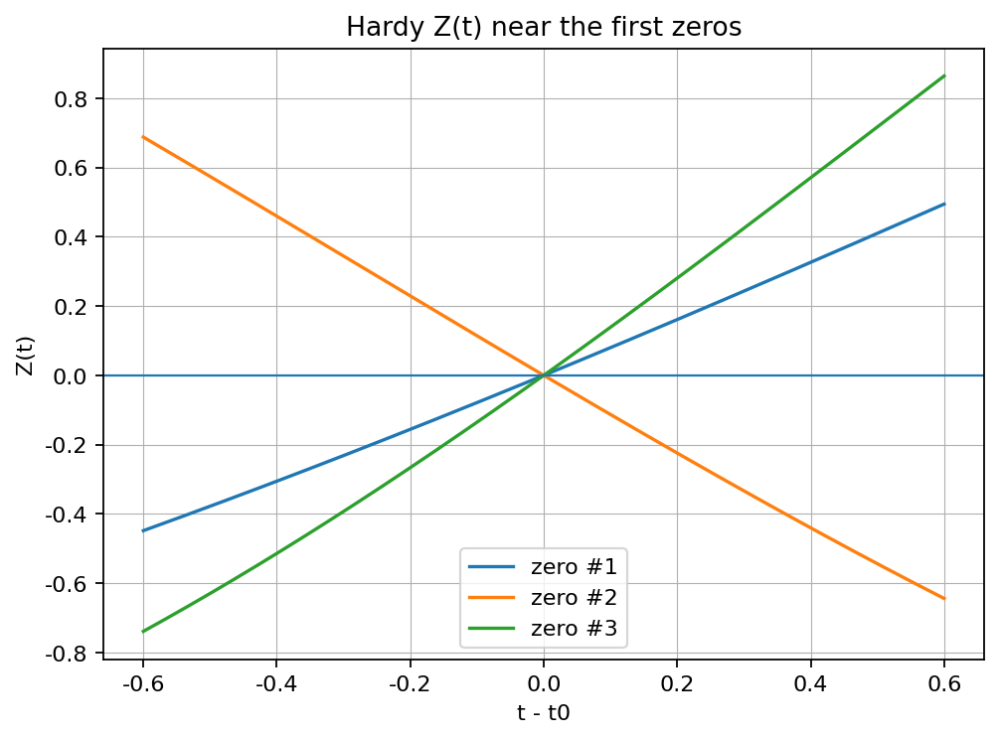
    

      <h3>E086 — Hardy Z(t) near zeros</h3>
      
Plot Hardy’s Z-function around known zeros and inspect local sign changes and oscillations.

      

        analysis
        quantitative-exploration
        visualization
        riemann-zeta
        zeta-zeros
        critical-line
        numerics
      

    

  </a>

  <a href="e087.html" class="gallery-card" data-title="E087 — Gram points and spacing" data-tags="analysis,quantitative-exploration,visualization,riemann-zeta,gram-points,zeta-zeros,numerics" data-desc="Compute Gram points and visualize the spacing and the Gram law heuristic numerically.">
    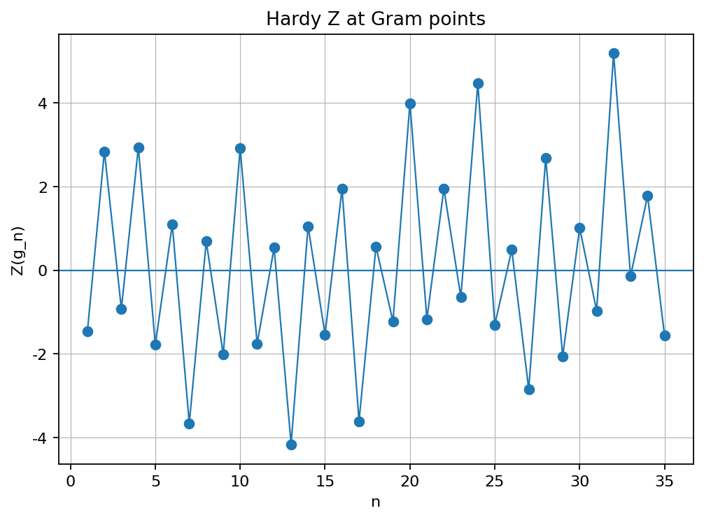
    

      <h3>E087 — Gram points and spacing</h3>
      
Compute Gram points and visualize the spacing and the Gram law heuristic numerically.

      

        analysis
        quantitative-exploration
        visualization
        riemann-zeta
        gram-points
        zeta-zeros
        numerics
      

    

  </a>

  <a href="e088.html" class="gallery-card" data-title="E088 — Zero counting via Riemann–von Mangoldt" data-tags="analysis,quantitative-exploration,visualization,riemann-zeta,zeta-zeros,numerics" data-desc="Compare numerical zero counts with the Riemann–von Mangoldt formula across heights.">
    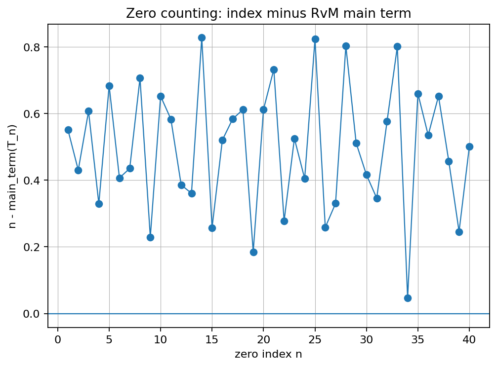
    

      <h3>E088 — Zero counting via Riemann–von Mangoldt</h3>
      
Compare numerical zero counts with the Riemann–von Mangoldt formula across heights.

      

        analysis
        quantitative-exploration
        visualization
        riemann-zeta
        zeta-zeros
        numerics
      

    

  </a>

  <a href="e089.html" class="gallery-card" data-title="E089 — log|ζ(s)| heatmap" data-tags="analysis,quantitative-exploration,visualization,riemann-zeta,numerics" data-desc="Render a heatmap of log|ζ(s)| over a rectangle to reveal poles, zeros, and ridges.">
    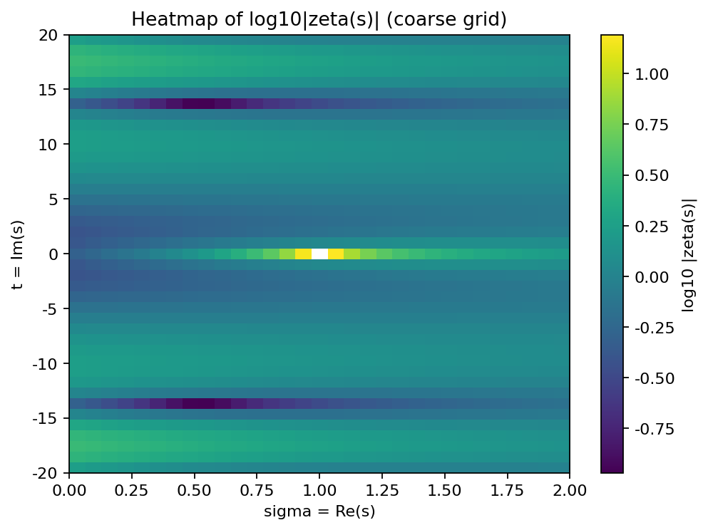
    

      <h3>E089 — log|ζ(s)| heatmap</h3>
      
Render a heatmap of log|ζ(s)| over a rectangle to reveal poles, zeros, and ridges.

      

        analysis
        quantitative-exploration
        visualization
        riemann-zeta
        numerics
      

    

  </a>
  <a href="e090.html" class="gallery-card" data-title="E090 — Funct...ion residual heatmap" data-tags="analysis,quantitative-exploration,visualization,riemann-zeta,numerics" data-desc="Heatmap of the functional-equation residual R(s)=ζ(s)-χ(s)ζ(1−s) on a grid.">
    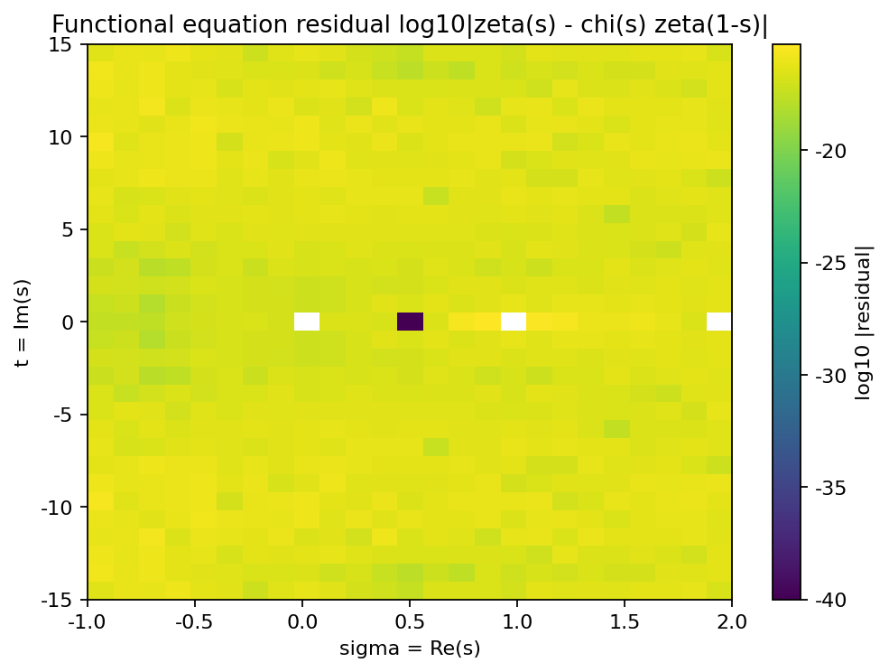
    

      <h3>E090 — Functional equation residual heatmap</h3>
      
Heatmap of the functional-equation residual R(s)=ζ(s)-χ(s)ζ(1−s) on a grid.

      

        analysis
        quantitative-exploration
        visualization
        riemann-zeta
        numerics
      

    

  </a>
  <a href="e091.html" class="gallery-card" data-title="E091 — Parti...on the critical line" data-tags="analysis,quantitative-exploration,visualization,riemann-zeta,dirichlet-series,numerics" data-desc="Compare ζ(1/2+it) to partial Euler products as the prime cutoff grows.">
    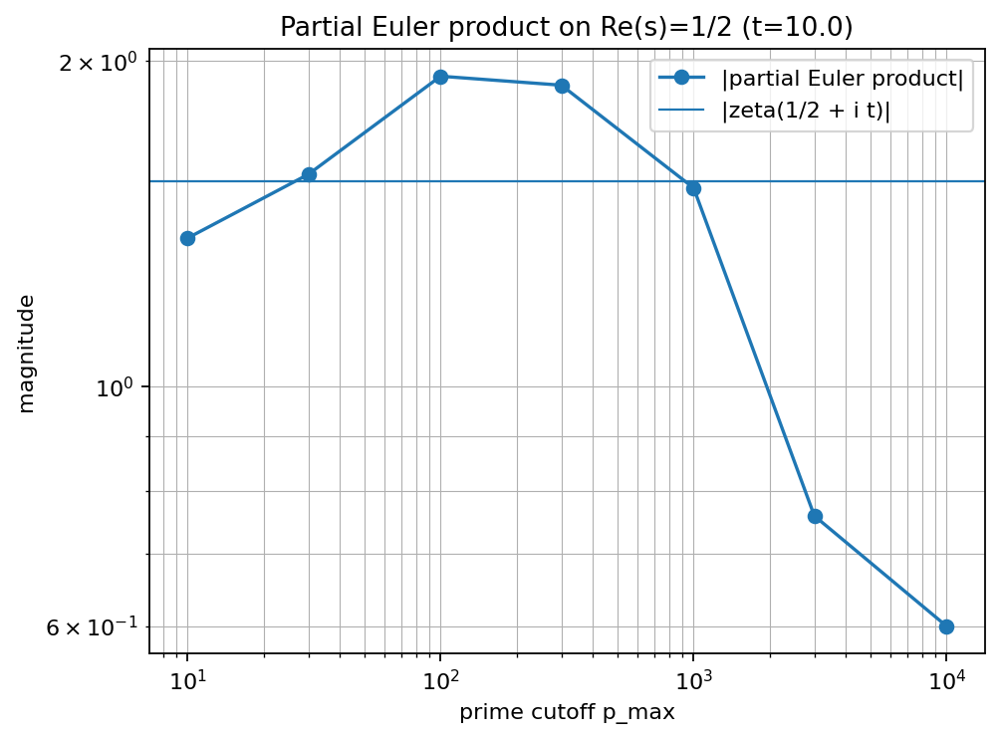
    

      <h3>E091 — Partial Euler products on the critical line</h3>
      
Compare ζ(1/2+it) to partial Euler products as the prime cutoff grows.

      

        analysis
        quantitative-exploration
        visualization
        riemann-zeta
        dirichlet-series
        numerics
      

    

  </a>
  <a href="e092.html" class="gallery-card" data-title="E092 — 1/ζ(s...ius Dirichlet series" data-tags="analysis,quantitative-exploration,visualization,riemann-zeta,mobius,dirichlet-series" data-desc="Compare 1/ζ(s) to partial sums Σ_{n≤N} μ(n)/n^s for Re(s)>1.">
    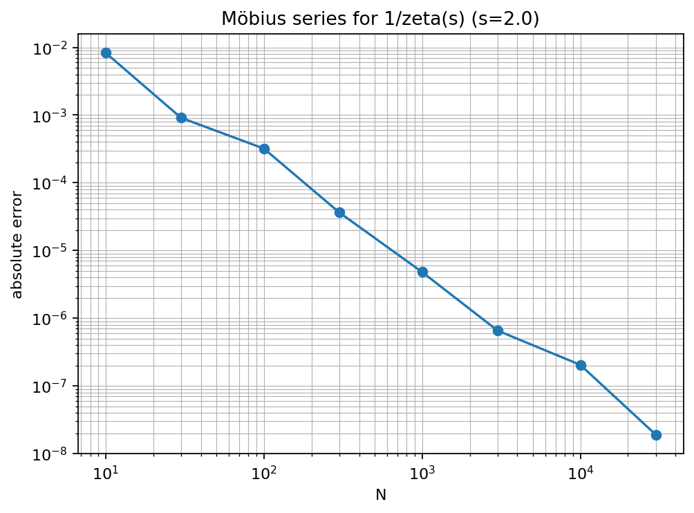
    

      <h3>E092 — 1/ζ(s) via the Möbius Dirichlet series</h3>
      
Compare 1/ζ(s) to partial sums Σ_{n≤N} μ(n)/n^s for Re(s)>1.

      

        analysis
        quantitative-exploration
        visualization
        riemann-zeta
        mobius
        dirichlet-series
      

    

  </a>
  <a href="e093.html" class="gallery-card" data-title="E093 — −ζ′(s... von Mangoldt series" data-tags="analysis,quantitative-exploration,visualization,riemann-zeta,dirichlet-series,numerics" data-desc="Compare −ζ′(s)/ζ(s) to partial sums Σ_{n≤N} Λ(n)/n^s for Re(s)>1.">
    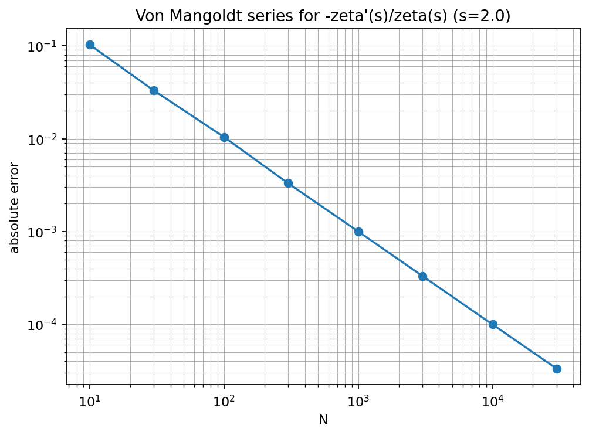
    

      <h3>E093 — −ζ′(s)/ζ(s) via the von Mangoldt series</h3>
      
Compare −ζ′(s)/ζ(s) to partial sums Σ_{n≤N} Λ(n)/n^s for Re(s)>1.

      

        analysis
        quantitative-exploration
        visualization
        riemann-zeta
        dirichlet-series
        numerics
      

    

  </a>
  <a href="e094.html" class="gallery-card" data-title="E094 — ω(n) vs. Ω(n): Erdős–Kac normalization" data-tags="number-theory,quantitative-exploration,visualization,omega,arithmetic-functions,numerics" data-desc="Compare ω(n) and Ω(n) distributions and their Erdős–Kac normalizations.">
    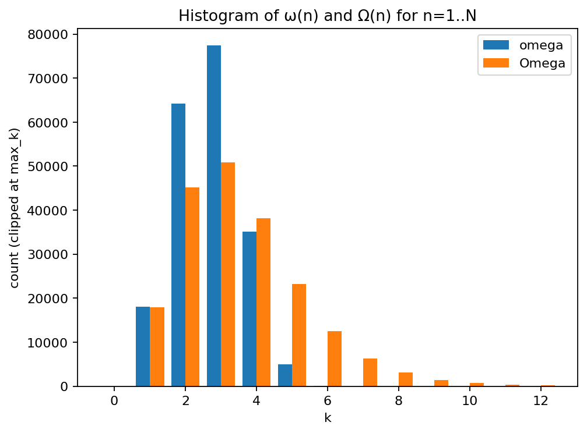
    

      <h3>E094 — ω(n) vs. Ω(n): Erdős–Kac normalization</h3>
      
Compare ω(n) and Ω(n) distributions and their Erdős–Kac normalizations.

      

        number-theory
        quantitative-exploration
        visualization
        omega
        arithmetic-functions
        numerics
      

    

  </a>
  <a href="e095.html" class="gallery-card" data-title="E095 — Squarefree filter: ω(n)=Ω(n) when μ(n)≠0" data-tags="number-theory,model-checking,visualization,mobius,omega,arithmetic-functions" data-desc="Use μ(n) as a squarefree indicator and verify ω(n)=Ω(n) on that subset.">
    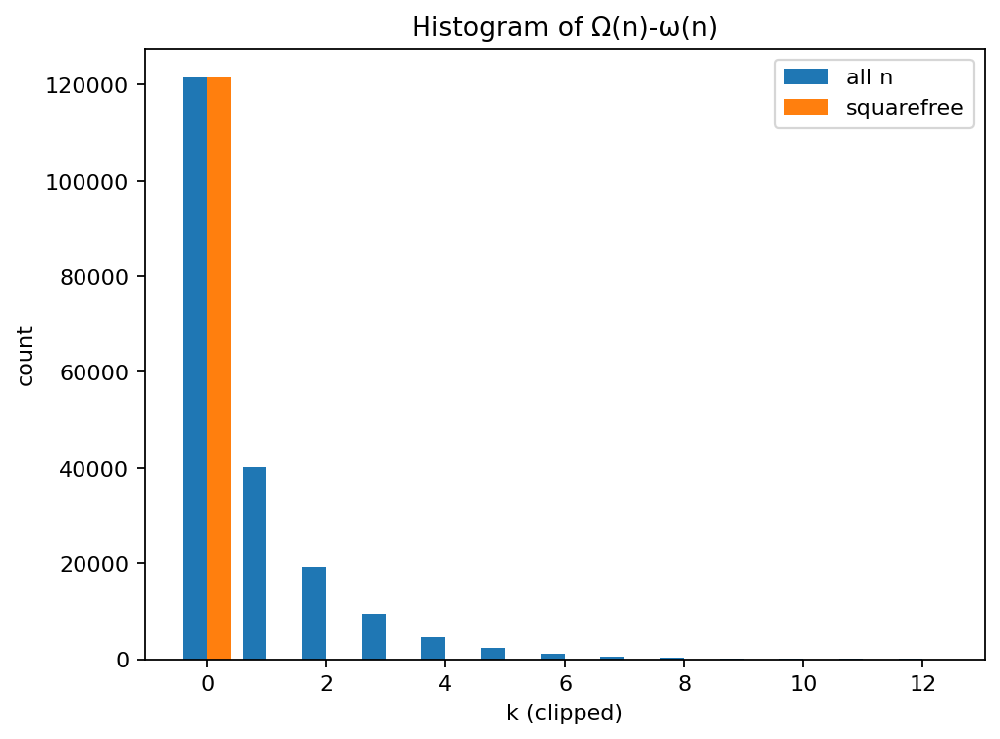
    

      <h3>E095 — Squarefree filter: ω(n)=Ω(n) when μ(n)≠0</h3>
      
Use μ(n) as a squarefree indicator and verify ω(n)=Ω(n) on that subset.

      

        number-theory
        model-checking
        visualization
        mobius
        omega
        arithmetic-functions
      

    

  </a>
  <a href="e096.html" class="gallery-card" data-title="E096 — Record-holders for τ(n)" data-tags="number-theory,quantitative-exploration,visualization,divisor-function,arithmetic-functions" data-desc="Track running maxima of τ(n) up to N and visualize growth of record values.">
    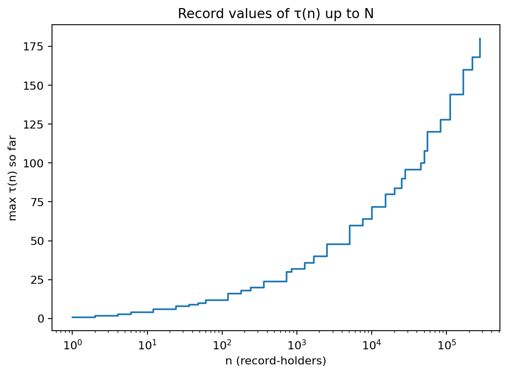
    

      <h3>E096 — Record-holders for τ(n)</h3>
      
Track running maxima of τ(n) up to N and visualize growth of record values.

      

        number-theory
        quantitative-exploration
        visualization
        divisor-function
        arithmetic-functions
      

    

  </a>
  <a href="e097.html" class="gallery-card" data-title="E097 — σ(n)/n landscape: deficient, perfect, abundant" data-tags="number-theory,quantitative-exploration,visualization,sigma,perfect,classification" data-desc="Visualize σ(n)/n and classify integers using σ(n) compared to 2n.">
    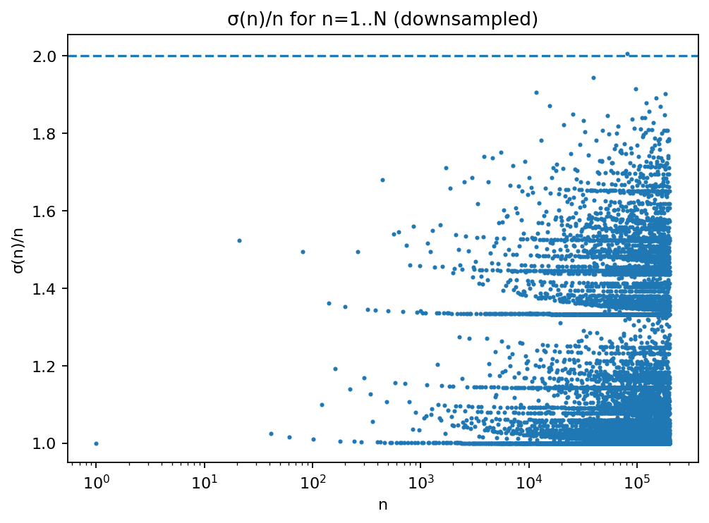
    

      <h3>E097 — σ(n)/n landscape: deficient, perfect, abundant</h3>
      
Visualize σ(n)/n and classify integers using σ(n) compared to 2n.

      

        number-theory
        quantitative-exploration
        visualization
        sigma
        perfect
        classification
      

    

  </a>
  <a href="e098.html" class="gallery-card" data-title="E098 — Maximizers of σ(n)/n^α across α" data-tags="number-theory,quantitative-exploration,visualization,sigma,optimization" data-desc="For α on a grid, find n≤N maximizing σ(n)/n^α and show regime changes.">
    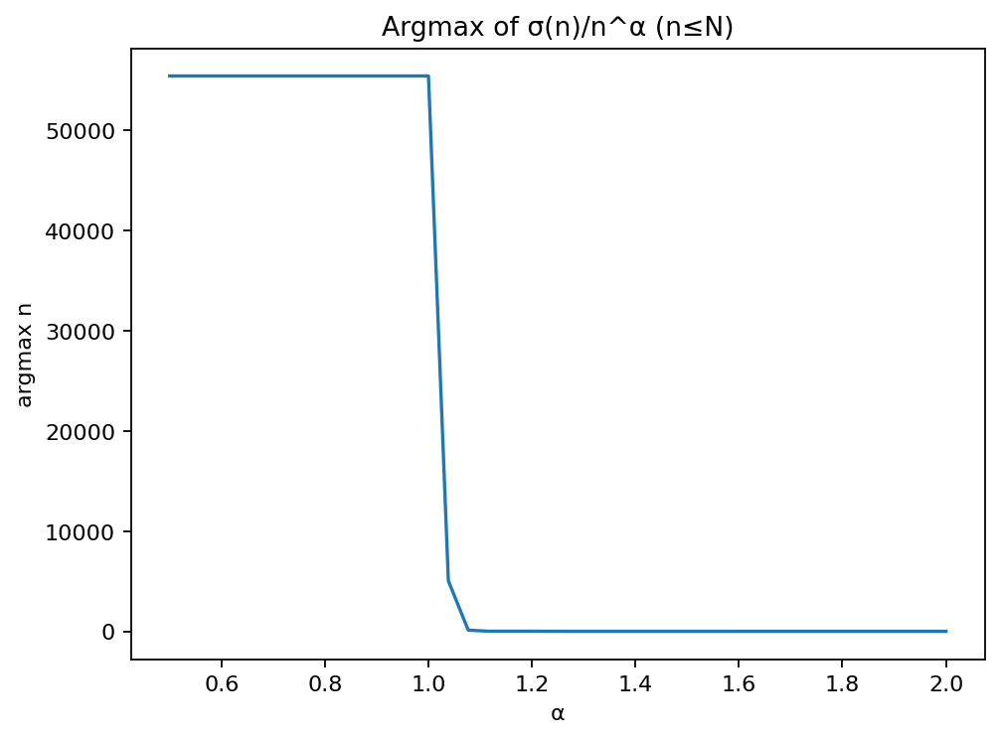
    

      <h3>E098 — Maximizers of σ(n)/n^α across α</h3>
      
For α on a grid, find n≤N maximizing σ(n)/n^α and show regime changes.

      

        number-theory
        quantitative-exploration
        visualization
        sigma
        optimization
      

    

  </a>
  <a href="e099.html" class="gallery-card" data-title="E099 — Jordan totients J_k: identities and ratios" data-tags="number-theory,model-checking,visualization,totient,arithmetic-functions" data-desc="Compute J_k(n), verify J_1=φ, and visualize ratios J_k(n)/n^k.">
    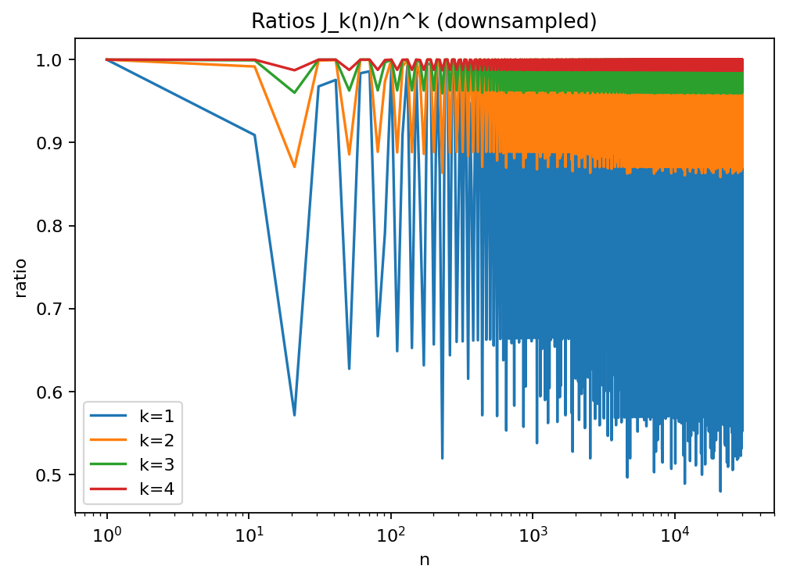
    

      <h3>E099 — Jordan totients J_k: identities and ratios</h3>
      
Compute J_k(n), verify J_1=φ, and visualize ratios J_k(n)/n^k.

      

        number-theory
        model-checking
        visualization
        totient
        arithmetic-functions
      

    

  </a>
  <a href="e100.html" class="gallery-card" data-title="E100 — Carmichael λ(n) vs. Euler φ(n)" data-tags="number-theory,quantitative-exploration,visualization,carmichael-lambda,totient,arithmetic-functions" data-desc="Compare λ(n) and φ(n) and visualize λ(n)/φ(n) over a finite range.">
    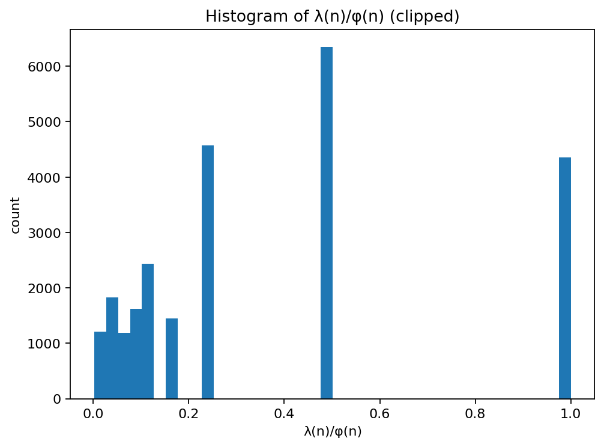
    

      <h3>E100 — Carmichael λ(n) vs. Euler φ(n)</h3>
      
Compare λ(n) and φ(n) and visualize λ(n)/φ(n) over a finite range.

      

        number-theory
        quantitative-exploration
        visualization
        carmichael-lambda
        totient
        arithmetic-functions
      

    

  </a>
  <a href="e101.html" class="gallery-card" data-title="E101 — Reduced residues modulo q: concrete structure" data-tags="number-theory,dirichlet-characters,model-checking,visualization,totient" data-desc="List reduced residues mod q, verify count=φ(q), and summarize simple structure checks.">
    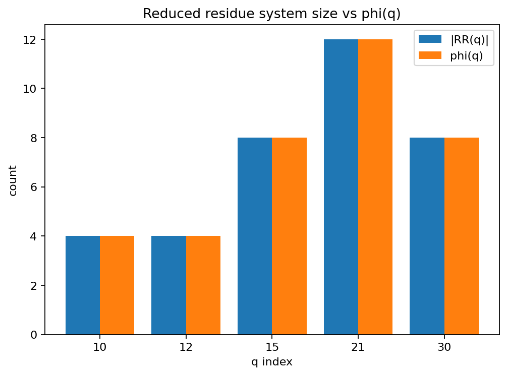
    

      <h3>E101 — Reduced residues modulo q: concrete structure</h3>
      
List reduced residues mod q, verify count=φ(q), and summarize simple structure checks.

      

        number-theory
        dirichlet-characters
        model-checking
        visualization
        totient
      

    

  </a>
  <a href="e102.html" class="gallery-card" data-title="E102 — Dirichlet convolution identity zoo" data-tags="number-theory,model-checking,visualization,dirichlet-convolution,multiplicative,arithmetic-functions" data-desc="Verify classic convolution identities numerically on 1..N (μ*1=ε, φ*1=id, 1*1=τ).">
    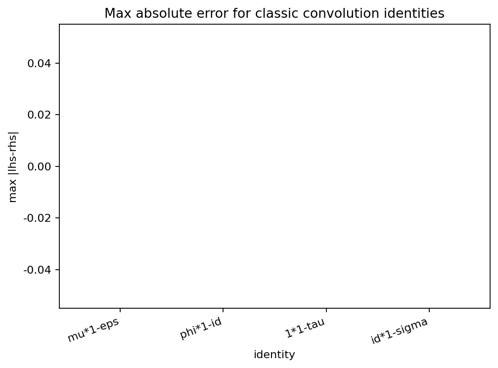
    

      <h3>E102 — Dirichlet convolution identity zoo</h3>
      
Verify classic convolution identities numerically on 1..N (μ*1=ε, φ*1=id, 1*1=τ).

      

        number-theory
        model-checking
        visualization
        dirichlet-convolution
        multiplicative
        arithmetic-functions
      

    

  </a>
  <a href="e103.html" class="gallery-card" data-title="E103 — Chebyshev ψ(x): prime powers drive jumps" data-tags="number-theory,quantitative-exploration,visualization,mangoldt,explicit-formula" data-desc="Plot ψ(x) and highlight jump contributions coming from prime powers.">
    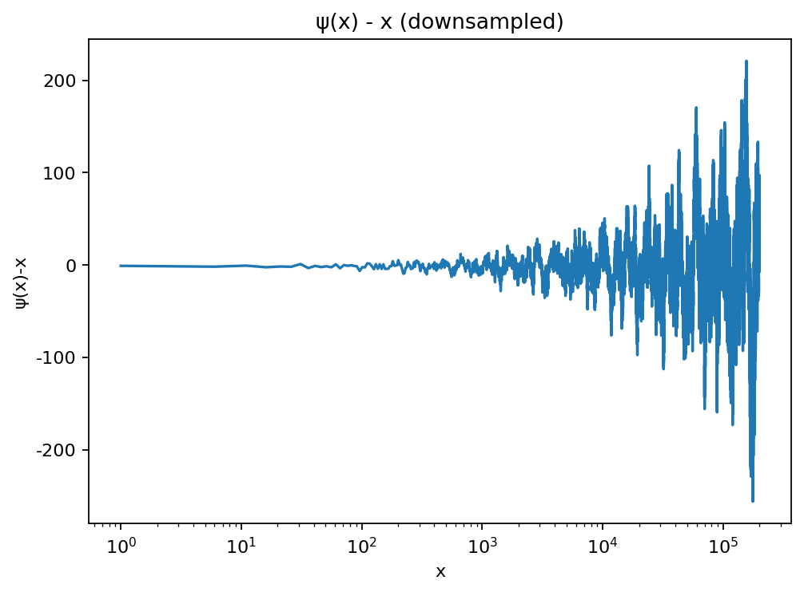
    

      <h3>E103 — Chebyshev ψ(x): prime powers drive jumps</h3>
      
Plot ψ(x) and highlight jump contributions coming from prime powers.

      

        number-theory
        quantitative-exploration
        visualization
        mangoldt
        explicit-formula
      

    

  </a>
  <a href="e104.html" class="gallery-card" data-title="E104 — von Mangoldt Λ(n): support and statistics" data-tags="number-theory,quantitative-exploration,visualization,mangoldt,arithmetic-functions" data-desc="Visualize where Λ(n) is nonzero (prime powers) and summarize basic statistics.">
    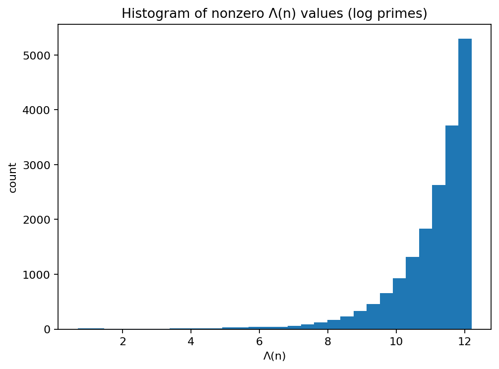
    

      <h3>E104 — von Mangoldt Λ(n): support and statistics</h3>
      
Visualize where Λ(n) is nonzero (prime powers) and summarize basic statistics.

      

        number-theory
        quantitative-exploration
        visualization
        mangoldt
        arithmetic-functions
      

    

  </a>
  <a href="e105.html" class="gallery-card" data-title="E105 — Mertens M(x): scaling views" data-tags="number-theory,quantitative-exploration,visualization,mobius,summatory,open-problems" data-desc="Plot M(x)=∑_{n≤x} μ(n) and rescalings such as M(x)/√x.">
    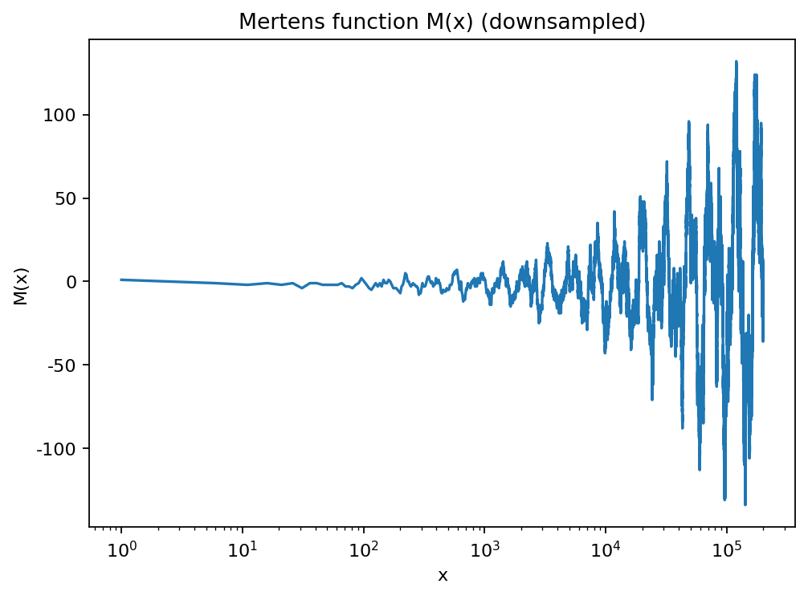
    

      <h3>E105 — Mertens M(x): scaling views</h3>
      
Plot M(x)=∑_{n≤x} μ(n) and rescalings such as M(x)/√x.

      

        number-theory
        quantitative-exploration
        visualization
        mobius
        summatory
        open-problems
      

    

  </a>
  <a href="e106.html" class="gallery-card" data-title="E106 — Character gallery: real vs. complex" data-tags="number-theory,dirichlet-characters,visualization,multiplicative" data-desc="Compare value-sets of Dirichlet characters and count real-valued characters.">
    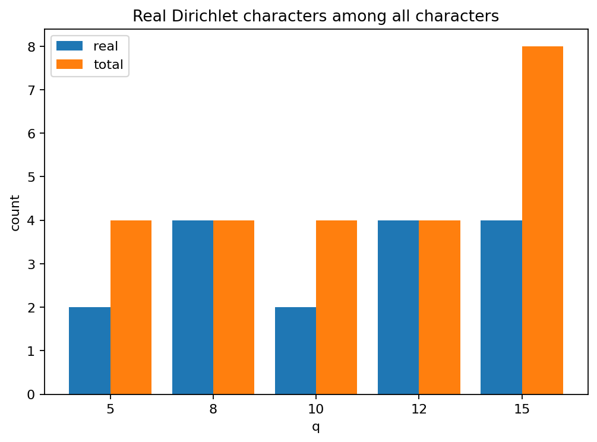
    

      <h3>E106 — Character gallery: real vs. complex</h3>
      
Compare value-sets of Dirichlet characters and count real-valued characters.

      

        number-theory
        dirichlet-characters
        visualization
        multiplicative
      

    

  </a>
  <a href="e107.html" class="gallery-card" data-title="E107 — Conductor: primitive vs. induced characters" data-tags="number-theory,dirichlet-characters,quantitative-exploration,visualization,l-functions" data-desc="Compute conductors and separate primitive from imprimitive characters.">
    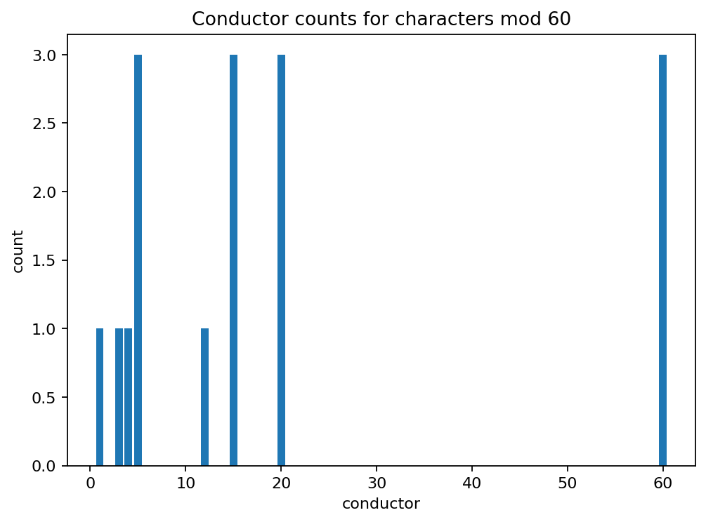
    

      <h3>E107 — Conductor: primitive vs. induced characters</h3>
      
Compute conductors and separate primitive from imprimitive characters.

      

        number-theory
        dirichlet-characters
        quantitative-exploration
        visualization
        l-functions
      

    

  </a>
  <a href="e108.html" class="gallery-card" data-title="E108 — Orthogonality heatmap for characters" data-tags="number-theory,dirichlet-characters,model-checking,visualization,multiplicative" data-desc="Visualize orthogonality relations via inner-product matrices.">
    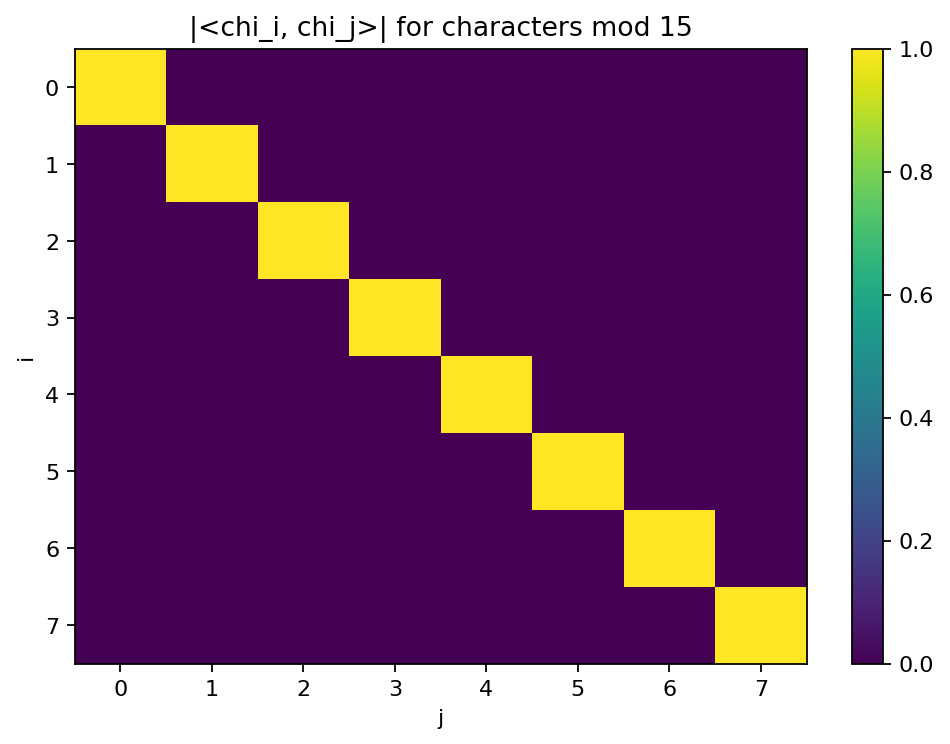
    

      <h3>E108 — Orthogonality heatmap for characters</h3>
      
Visualize orthogonality relations via inner-product matrices.

      

        number-theory
        dirichlet-characters
        model-checking
        visualization
        multiplicative
      

    

  </a>
  <a href="e109.html" class="gallery-card" data-title="E109 — Gauss sums: magnitude patterns" data-tags="number-theory,dirichlet-characters,quantitative-exploration,visualization,numerics" data-desc="Compute Gauss sums τ(χ) and compare |τ(χ)| to √q.">
    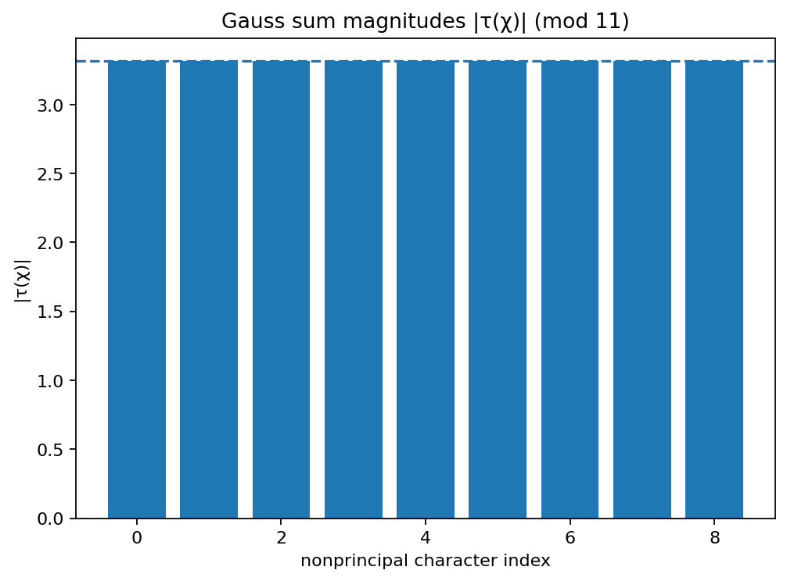
    

      <h3>E109 — Gauss sums: magnitude patterns</h3>
      
Compute Gauss sums τ(χ) and compare |τ(χ)| to √q.

      

        number-theory
        dirichlet-characters
        quantitative-exploration
        visualization
        numerics
      

    

  </a>
  <a href="e110.html" class="gallery-card" data-title="E110 — Dirichlet L-series partial sums at s=1 and s=1/2" data-tags="number-theory,l-functions,quantitative-exploration,visualization,dirichlet-series,numerics" data-desc="Compare partial Dirichlet series behavior near s=1 and on the critical line.">
    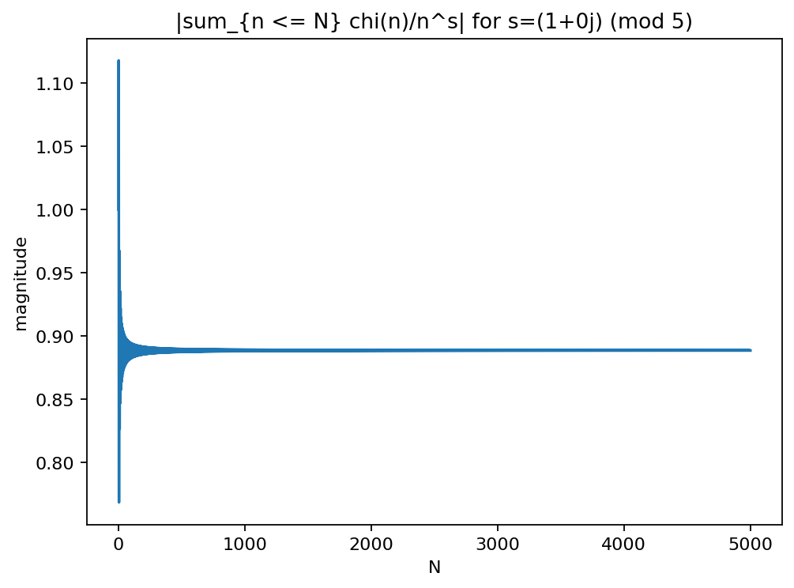
    

      <h3>E110 — Dirichlet L-series partial sums at s=1 and s=1/2</h3>
      
Compare partial Dirichlet series behavior near s=1 and on the critical line.

      

        number-theory
        l-functions
        quantitative-exploration
        visualization
        dirichlet-series
        numerics
      

    

  </a>
  <a href="e111.html" class="gallery-card" data-title="E111 — Euler product vs. Dirichlet series for L(s,χ)" data-tags="number-theory,l-functions,model-checking,visualization,dirichlet-series,numerics" data-desc="Compare truncated Euler products and truncated series for L(s,χ).">
    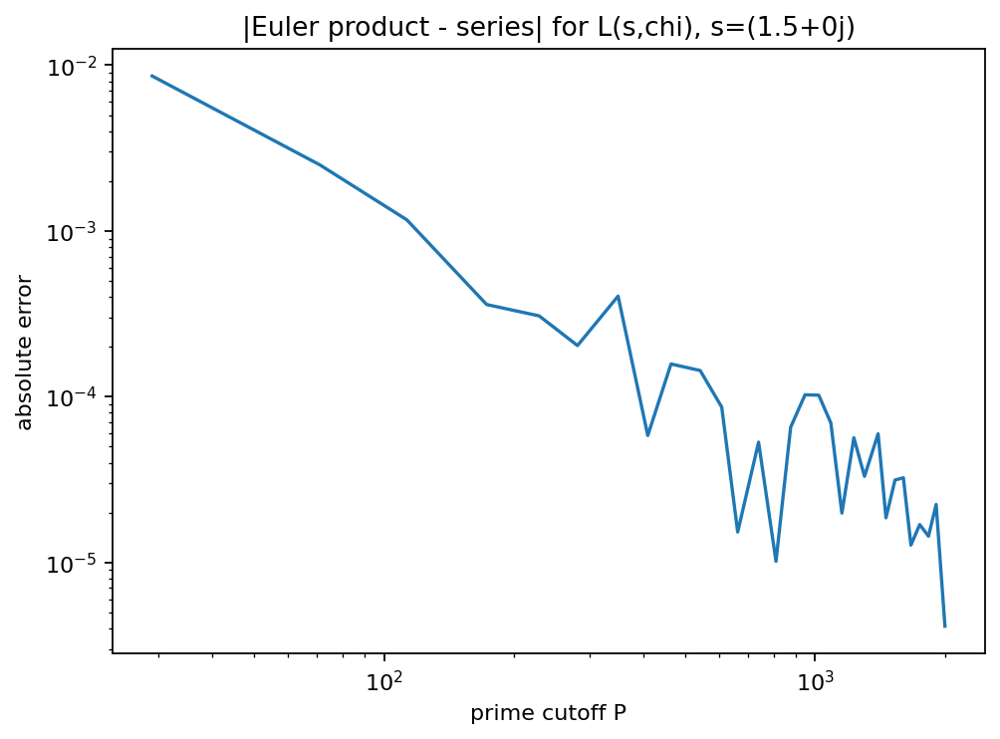
    

      <h3>E111 — Euler product vs. Dirichlet series for L(s,χ)</h3>
      
Compare truncated Euler products and truncated series for L(s,χ).

      

        number-theory
        l-functions
        model-checking
        visualization
        dirichlet-series
        numerics
      

    

  </a>
  <a href="e112.html" class="gallery-card" data-title="E112 — Prime race: π(x;q,a) − π(x;q,b)" data-tags="number-theory,prime-races,visualization,aps,primes" data-desc="Compute prime counts in residue classes and plot difference curves for representative pairs.">
    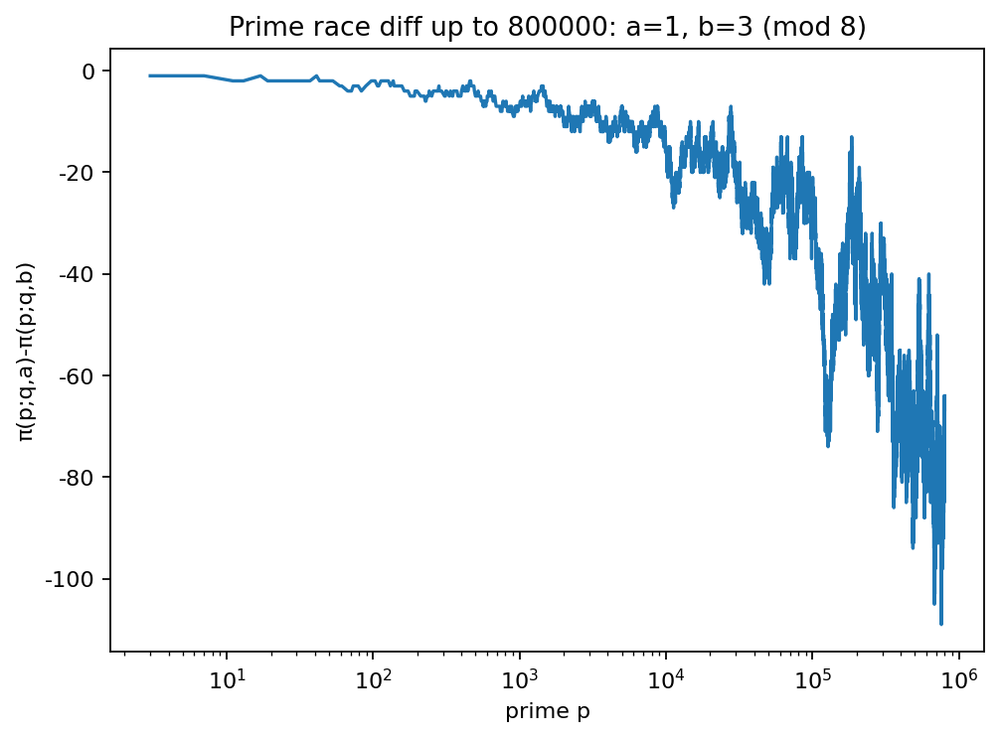
    

      <h3>E112 — Prime race: π(x;q,a) − π(x;q,b)</h3>
      
Compute prime counts in residue classes and plot difference curves for representative pairs.

      

        number-theory
        prime-races
        visualization
        aps
        primes
      

    

  </a>
  <a href="e113.html" class="gallery-card" data-title="E113 — First prime in each residue class" data-tags="number-theory,prime-races,visualization,aps,primes" data-desc="For each reduced residue a (mod q), find the smallest prime p≡a (mod q) and visualize results.">
    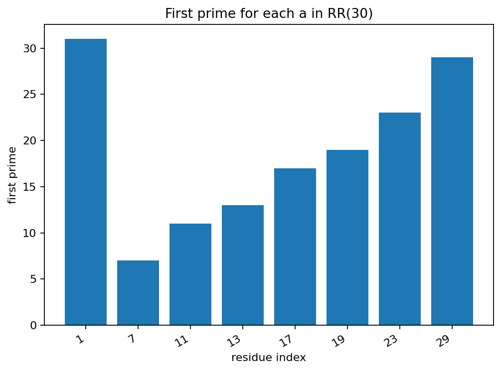
    

      <h3>E113 — First prime in each residue class</h3>
      
For each reduced residue a (mod q), find the smallest prime p≡a (mod q) and visualize results.

      

        number-theory
        prime-races
        visualization
        aps
        primes
      

    

  </a>
  <a href="e114.html" class="gallery-card" data-title="E114 — ζ via η: stability map on the critical line" data-tags="analysis,quantitative-exploration,visualization,riemann-zeta,critical-line,numerics" data-desc="Study stability of ζ(1/2+it) via η-acceleration under truncation changes.">
    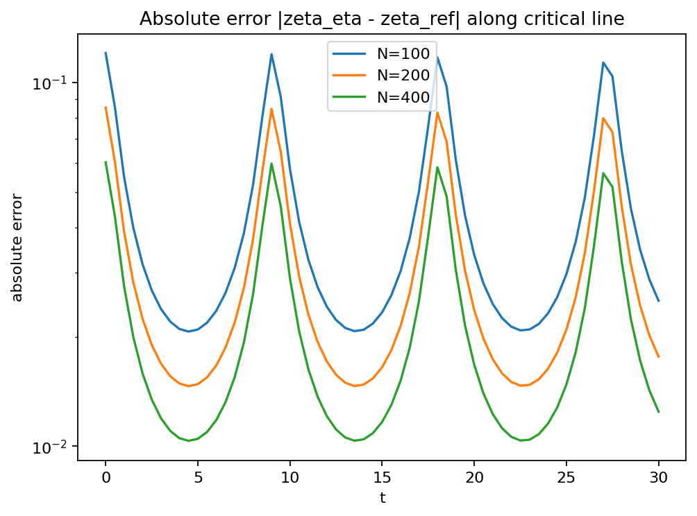
    

      <h3>E114 — ζ via η: stability map on the critical line</h3>
      
Study stability of ζ(1/2+it) via η-acceleration under truncation changes.

      

        analysis
        quantitative-exploration
        visualization
        riemann-zeta
        critical-line
        numerics
      

    

  </a>
  <a href="e115.html" class="gallery-card" data-title="E115 — Hardy Z: sign changes and zero bracketing" data-tags="analysis,quantitative-exploration,visualization,riemann-zeta,hardy-z,zeta-zeros" data-desc="Scan Hardy Z(t), bracket sign changes, and visualize candidate zeros.">
    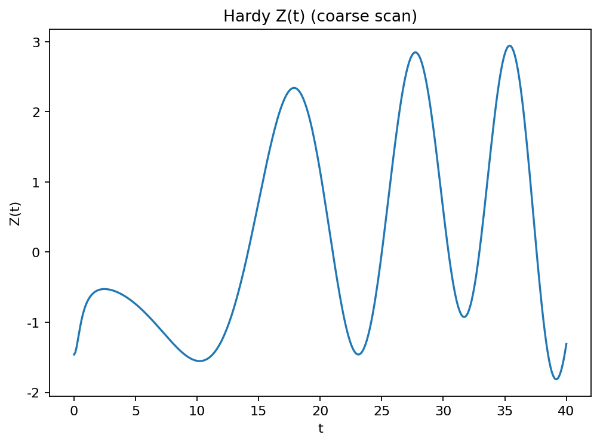
    

      <h3>E115 — Hardy Z: sign changes and zero bracketing</h3>
      
Scan Hardy Z(t), bracket sign changes, and visualize candidate zeros.

      

        analysis
        quantitative-exploration
        visualization
        riemann-zeta
        hardy-z
        zeta-zeros
      

    

  </a>
  <a href="e116.html" class="gallery-card" data-title="E116 — Gram points and zero-counting heuristics" data-tags="analysis,model-checking,visualization,riemann-zeta,gram-points,zeta-zeros" data-desc="Compare Gram-point heuristics and simple zero-counting diagnostics over a finite range.">
    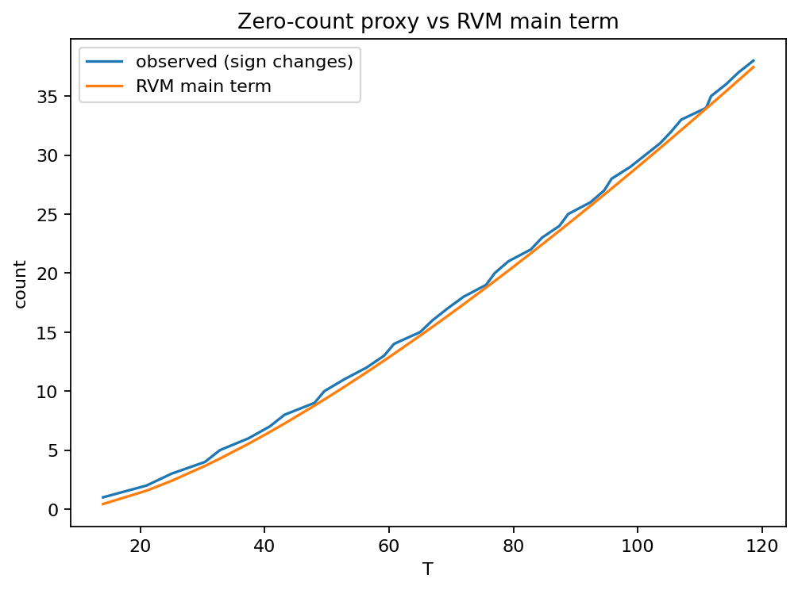
    

      <h3>E116 — Gram points and zero-counting heuristics</h3>
      
Compare Gram-point heuristics and simple zero-counting diagnostics over a finite range.

      

        analysis
        model-checking
        visualization
        riemann-zeta
        gram-points
        zeta-zeros
      

    

  </a>
  <a href="e117.html" class="gallery-card" data-title="E117 — Prime-counting approximations: li(x) and friends" data-tags="number-theory,model-checking,visualization,li-x,pnt,bounds" data-desc="Compare π(x) to li(x) and related approximations and visualize signed error.">
    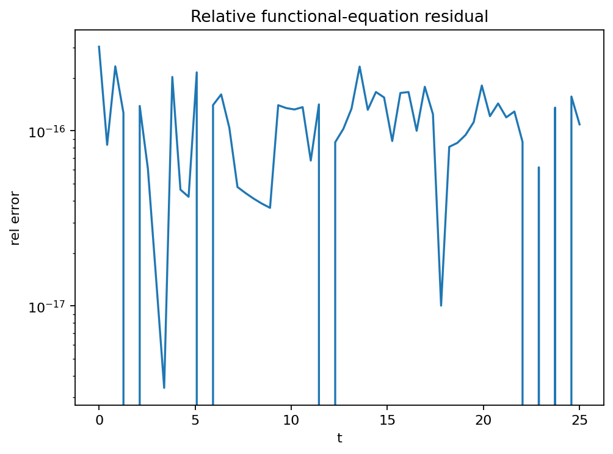
    

      <h3>E117 — Prime-counting approximations: li(x) and friends</h3>
      
Compare π(x) to li(x) and related approximations and visualize signed error.

      

        number-theory
        model-checking
        visualization
        li-x
        pnt
        bounds
      

    

  </a>
  <a href="e118.html" class="gallery-card" data-title="E118 — Chebyshev bias: lead-time statistics" data-tags="number-theory,prime-races,quantitative-exploration,visualization,heuristics" data-desc="Measure how often one residue class leads another and visualize lead-time statistics.">
    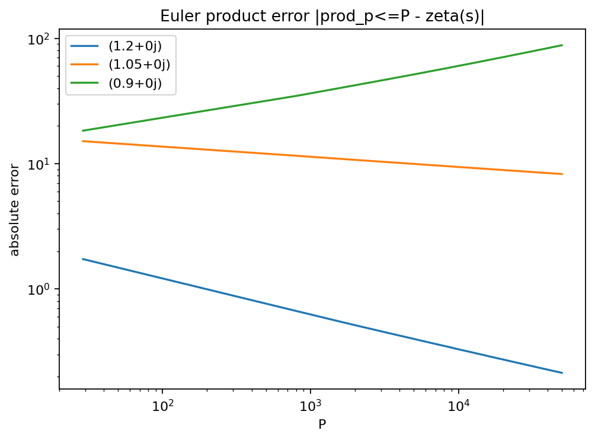
    

      <h3>E118 — Chebyshev bias: lead-time statistics</h3>
      
Measure how often one residue class leads another and visualize lead-time statistics.

      

        number-theory
        prime-races
        quantitative-exploration
        visualization
        heuristics
      

    

  </a>
  <a href="e119.html" class="gallery-card" data-title="E119 — Summatory totient Φ(x) scaling check" data-tags="number-theory,quantitative-exploration,visualization,totient,summatory,bounds" data-desc="Plot Φ(x)=∑_{n≤x} φ(n) and compare to the main-term scaling 3x²/π².">
    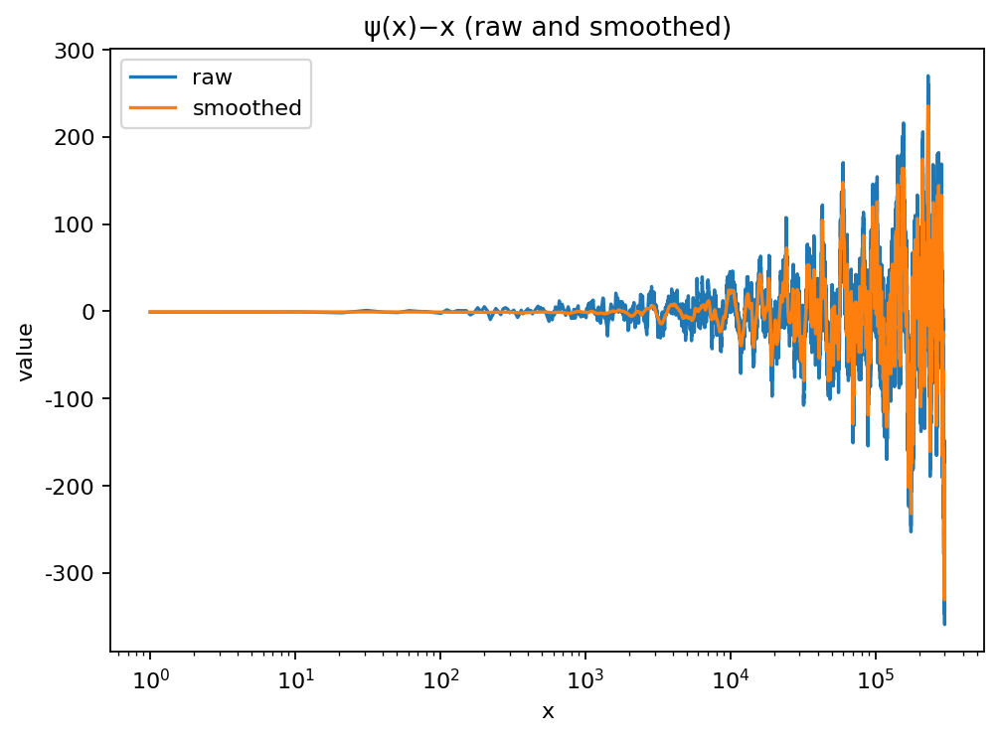
    

      <h3>E119 — Summatory totient Φ(x) scaling check</h3>
      
Plot Φ(x)=∑_{n≤x} φ(n) and compare to the main-term scaling 3x²/π².

      

        number-theory
        quantitative-exploration
        visualization
        totient
        summatory
        bounds
      

    

  </a>
  <a href="e120.html" class="gallery-card" data-title="E120 — Liouville λ(n): partial sums and parity" data-tags="number-theory,quantitative-exploration,visualization,liouville,omega" data-desc="Explore partial sums of the Liouville function and simple parity correlations.">
    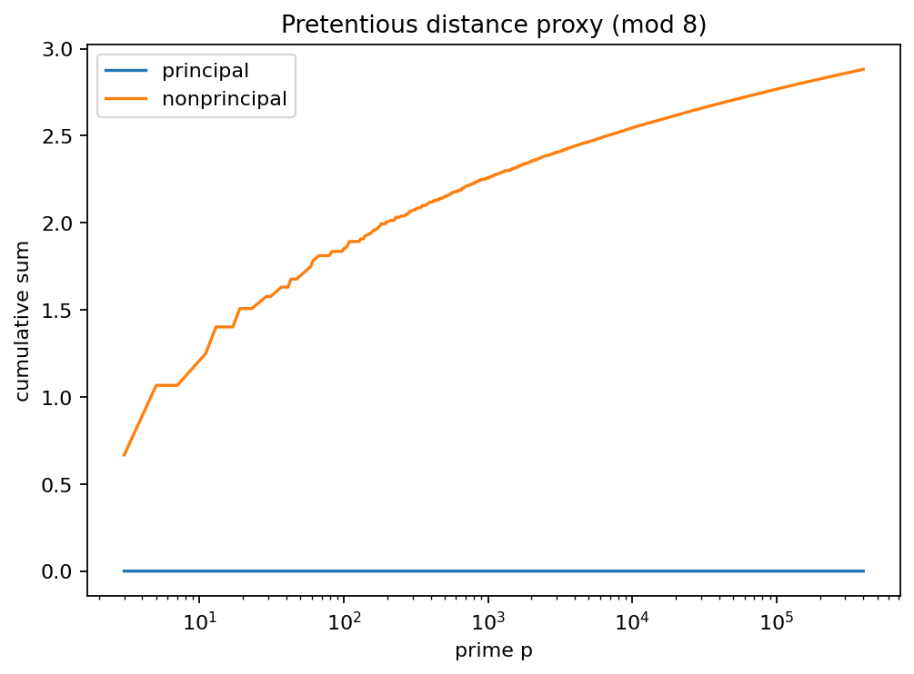
    

      <h3>E120 — Liouville λ(n): partial sums and parity</h3>
      
Explore partial sums of the Liouville function and simple parity correlations.

      

        number-theory
        quantitative-exploration
        visualization
        liouville
        omega
      

    

  </a>
  <a href="e121.html" class="gallery-card" data-title="E121 — Möbius inversion as convolution undo" data-tags="number-theory,model-checking,visualization,dirichlet-convolution,mobius,multiplicative" data-desc="Recover a function from its Dirichlet convolution with 1 via Möbius inversion.">
    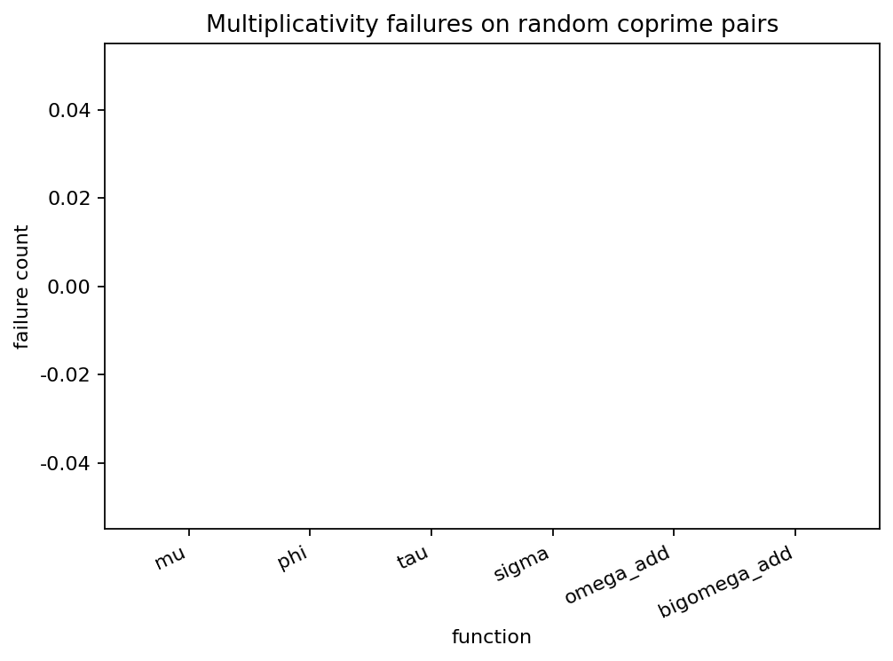
    

      <h3>E121 — Möbius inversion as convolution undo</h3>
      
Recover a function from its Dirichlet convolution with 1 via Möbius inversion.

      

        number-theory
        model-checking
        visualization
        dirichlet-convolution
        mobius
        multiplicative
      

    

  </a>
  <a href="e122.html" class="gallery-card" data-title="E122 — Character averages over primes" data-tags="number-theory,dirichlet-characters,l-functions,quantitative-exploration,visualization,aps" data-desc="Average χ(p) over primes in arithmetic progressions and compare to equidistribution heuristics.">
    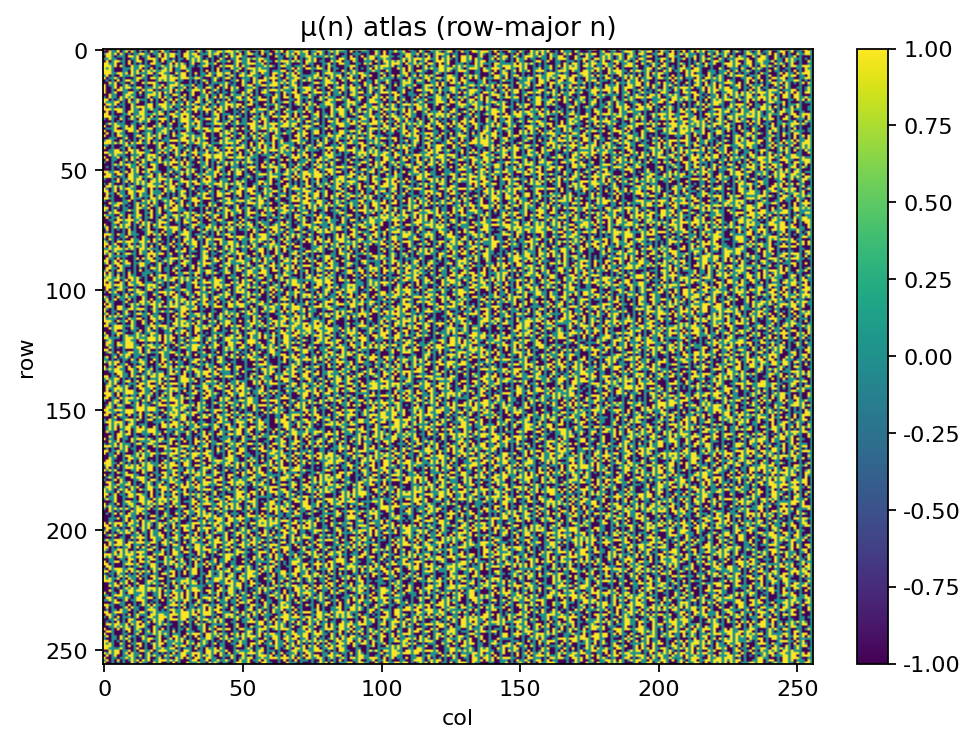
    

      <h3>E122 — Character averages over primes</h3>
      
Average χ(p) over primes in arithmetic progressions and compare to equidistribution heuristics.

      

        number-theory
        dirichlet-characters
        l-functions
        quantitative-exploration
        visualization
        aps
      

    

  </a>
  <a href="e123.html" class="gallery-card" data-title="E123 — π(x;q,a) vs. a simple baseline" data-tags="number-theory,prime-races,model-checking,visualization,aps,bounds" data-desc="Compare π(x;q,a) to a baseline x/(φ(q) log x) and visualize deviations.">
    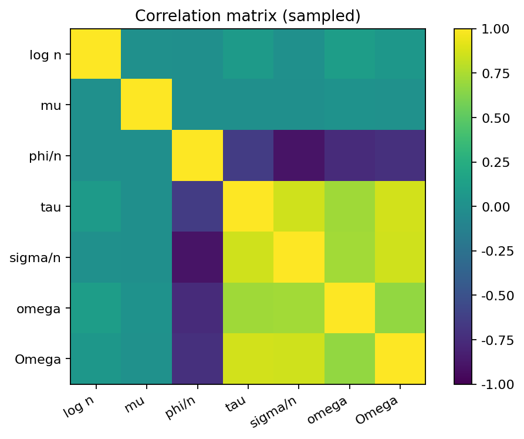
    

      <h3>E123 — π(x;q,a) vs. a simple baseline</h3>
      
Compare π(x;q,a) to a baseline x/(φ(q) log x) and visualize deviations.

      

        number-theory
        prime-races
        model-checking
        visualization
        aps
        bounds
      

    

  </a>

  <a href="e124.html" class="gallery-card" data-title="E124 — Klauber triangle" data-tags="number-theory,quantitative-exploration,visualization,klauber" data-summary="Rows between consecutive squares; highlight primes to reveal vertical streaks.">
    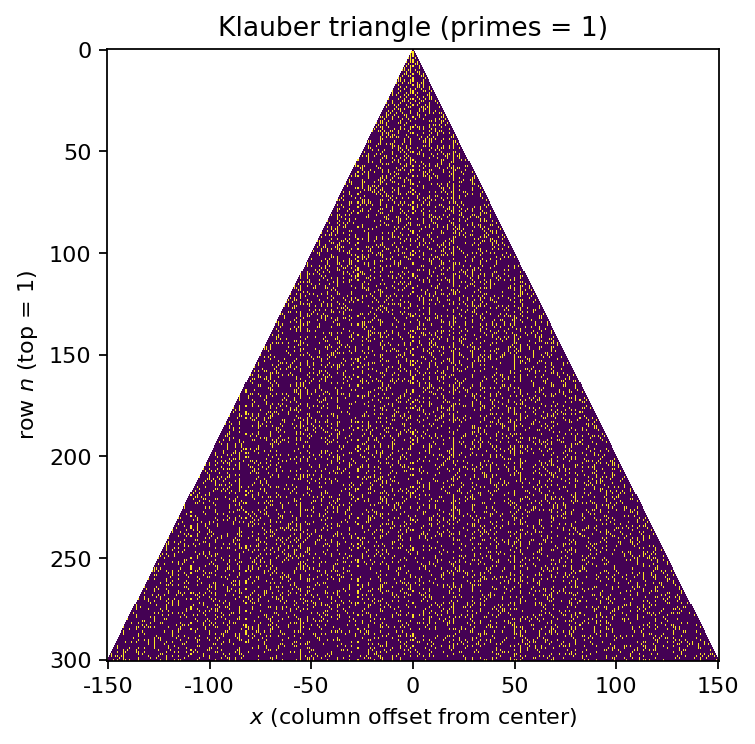
    

      <h3>E124 — Klauber triangle</h3>
      
Rows between consecutive squares; highlight primes to reveal vertical streaks.

      

        number-theory
quantitative-exploration
visualization
klauber
      

    

  </a>
  <a href="e125.html" class="gallery-card" data-title="E125 — Sacks spiral" data-tags="number-theory,quantitative-exploration,visualization,sacks" data-summary="Polar spiral r=√n, θ=2π√n; primes plotted as points often form dense spiral fragments.">
    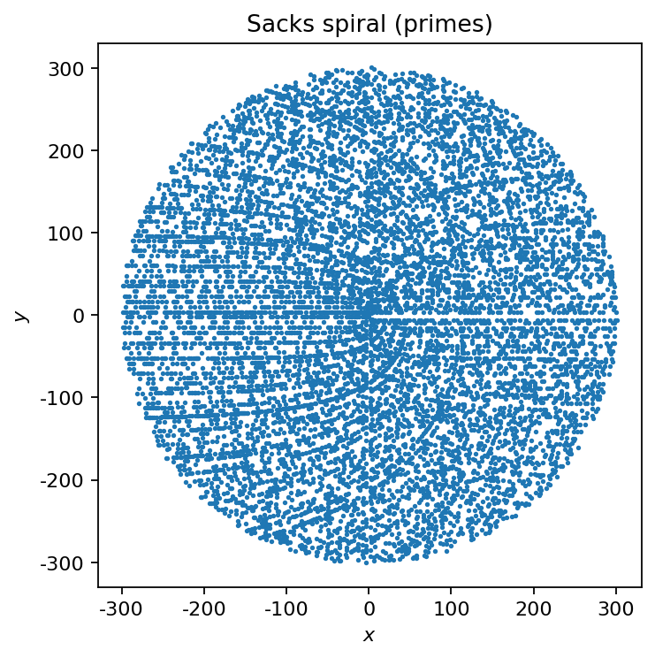
    

      <h3>E125 — Sacks spiral</h3>
      
Polar spiral r=√n, θ=2π√n; primes plotted as points often form dense spiral fragments.

      

        number-theory
quantitative-exploration
visualization
sacks
      

    

  </a>
  <a href="e126.html" class="gallery-card" data-title="E126 — Hexagonal number spiral" data-tags="number-theory,quantitative-exploration,visualization,hex-spiral" data-summary="Centered hex-grid spiral; plot primes only to explore lattice-aligned structure.">
    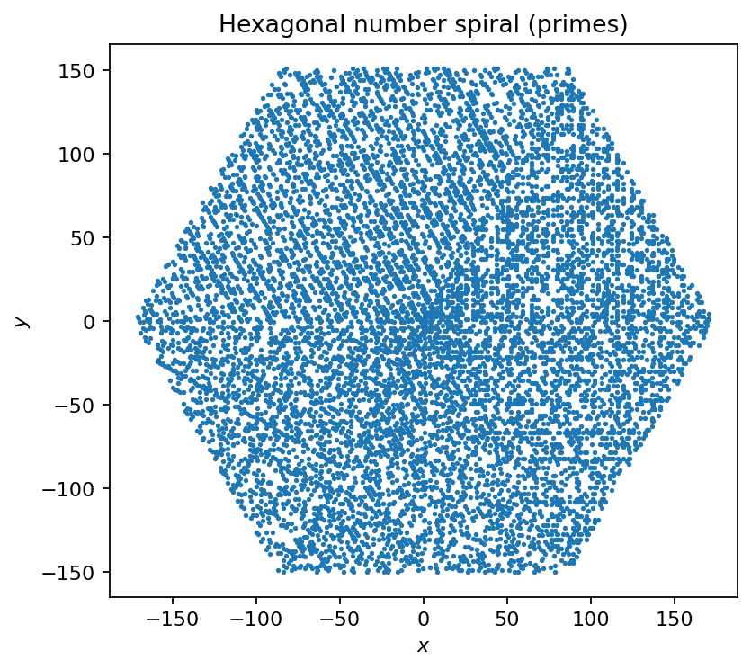
    

      <h3>E126 — Hexagonal number spiral</h3>
      
Centered hex-grid spiral; plot primes only to explore lattice-aligned structure.

      

        number-theory
quantitative-exploration
visualization
hex-spiral
      

    

  </a>

::: {toctree}
:hidden:
:maxdepth: 1

e001
e002
e003
e004
e005
e006
e007
e008
e009
e010
e011
e012
e013
e014
e015
e016
e017
e018
e019
e020
e021
e022
e023
e024
e025
e026
e027
e028
e029
e030
e031
e032
e033
e034
e035
e036
e037
e038
e039
e040
e041
e042
e043
e044
e045
e046
e047
e048
e049
e050
e051
e052
e053
e054
e055
e056
e057
e058
e059
e060
e061
e062
e063
e064
e065
e066
e067
e068
e069
e070
e071
e072
e073
e074
e075
e076
e077
e078
e079
e080
e081
e082
e083
e084
e085
e086
e087
e088
e089
e090
e091
e092
e093
e094
e095
e096
e097
e098
e099
e100
e101
e102
e103
e104
e105
e106
e107
e108
e109
e110
e111
e112
e113
e114
e115
e116
e117
e118
e119
e120
e121
e122
e123
e124
e125
e126
:::
